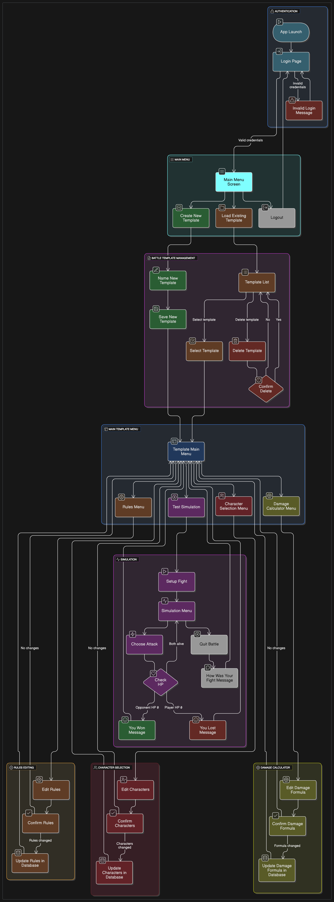
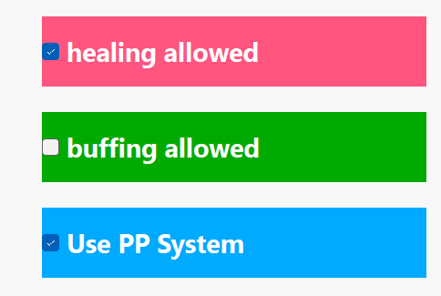
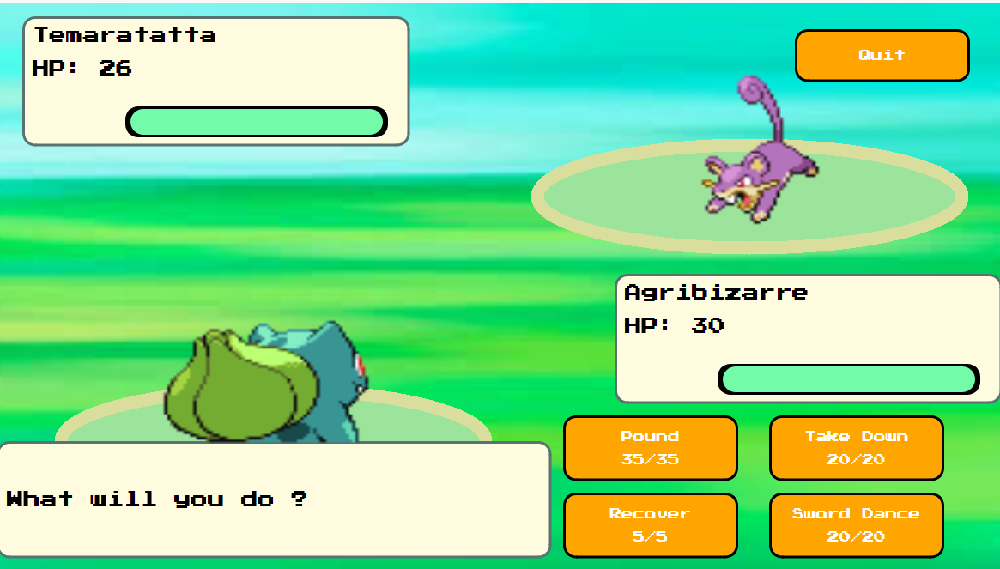

# Moonshot Project: KriticalHit - Functional Specifications

| Author        | Paul NOWAK |
|---------------|------------ |
| Created       | 03/25/2024  |
| Last Modified | 05/31/2025  |

## Table of Contents

Table of Contents

 - [1. Overview](#1-overview)
   - [1.1 Document Purpose](#11-document-purpose)
   - [1.2 Context](#12-context)
   - [1.3 RPG Domain](#13-rpg-domain)
 - [2. Product Goal](#2-product-goal)
   - [2.1 Project Scope](#21-project-scope)
   - [2.2 Constraints](#22-constraints)
   - [2.3 Risks and Assumptions](#23-risks-and-assumptions)
     - [2.3.1 Risks](#231-risks)
     - [2.3.2 Assumptions](#232-assumptions)
 - [3. User Personas](#3-user-personas)
   - [3.1 Henri Hollais](#31-henri-hollais)
   - [3.2 Violet Hitgoh](#32-violet-hitgoh)
   - [3.3 Arun Reddy](#33-arun-reddy)
   - [3.4 Luke Atmadohg](#34-luke-atmadohg)
   - [3.5 Katrina Ladalh](#35-katrina-ladalh)
 - [4. List of Features](#4-list-of-features)
   - [4.1 User-Friendly Application](#41-user-friendly-application)
   - [4.2 Battle Interface and Flow Simulation](#42-battle-interface--flow-simulation)
   - [4.3 Battle Mechanics System](#43-battle-mechanics-system)
   - [4.4 Set Up Battle](#44-set-up-battle)
 - [5. Product Details](#5-product-details)
   - [5.1 Minimum Viable Product](#51-minimum-viable-product)
   - [5.2 Non-Functional Requirements](#52-non-functional-requirements)
   - [5.3 Acceptance Criteria](#53-acceptance-criteria)
   - [5.4 Out of Scope](#54-out-of-scope)
 - [6. Technical Stack & Requirements](#6-technical-stack--requirements)
   - [6.1 Development Environment](#61-development-environment)
   - [6.2 Database Overview](#62-database-overview)
   - [6.3 System Requirements](#63-system-requirements)
 - [7. Testing Strategy Overview](#7-testing-strategy-overview)
   - [7.1 Testing Objectives](#71-testing-objectives)
   - [7.2 Testing Scope](#72-testing-scope)
 - [8. User Interface & User Experience](#8-user-interface--user-experience)
   - [8.1 Importance](#81-importance)
   - [8.2 User Flowchart](#82-user-flowchart)
   - [8.3 UI Elements](#83-ui-elements)
   - [8.4 Accessibility and Responsiveness](#84-accessibility-and-responsiveness)
   - [8.5 Visual Feedback and Error Handling](#85-visual-feedback-and-error-handling)
 - [9. Glossary](#9-glossary)
   - [9.1 RPG Lexical Field](#91-rpg-lexical-field)
   - [9.2 Miscallenous](#92-miscallenous)

# 1. Overview

### 1.1 Document Purpose
This document has been written to provide the functional specification of a Moonshot Project named Kritical Hit. The Moonshot Project is a final evaluation imposed by the ALGOSUP school staff to create our unique and professional project through the whole scolarity and validate our Master's level in Software development.

### 1.2 Context
Video games have long been a cornerstone of the entertainment industry, generating approximately $180 billion annually. The market continues to evolve rapidly, driven by advancements in both hardware and software—particularly through the rise of powerful <a href="#39">[39]</a> game engines. While these engines are also utilized across various industries, they have revolutionized <a href="#38">[38]</a> game design by enabling the creation of more complex and sophisticated interactive experiences.

Despite these innovations, developing a video game remains a time-consuming and detail-oriented task for software engineers. With the rise of new technologies and changing audience expectations, modern games are expected to meet high standards in performance, quality, and depth to remain competitive and marketable.

Among all genres, <a href="#22">[22]</a> role-playing games (RPGs) hold a special place in the industry. They offer immersive storytelling, rich <a href="#5">[5]</a> character progression, and strategic battle systems that attract a wide and loyal audience.

A prime example is the <a href="#20">[20]</a> Pokémon franchise, which exemplifies the global appeal and commercial success of <a href="#22">[22]</a> RPGs. As of 2023, Pokémon is the highest-grossing entertainment media franchise in the world, having earned over 150 billion dollars in total revenue. This includes 30 billion dollars from video games alone and over 100 billion dollars from licensed merchandise. The core games in the Pokémon series follow a classic <a href="#22">[22]</a> RPG structure, where players assume the roles of <a href="#5">[5]</a> characters who captures, trains, and battles Pokémon with the ultimate goal of becoming the Pokémon Champion.

Building such <a href="#22">[22]</a> RPGs often requires dedicated <a href="#38">[38]</a> game design tools, particularly for crafting engaging battle <a href="#43">[43]</a> mechanics and managing complex character systems. However, current <a href="#39">[39]</a> game engine software tools often fall short—they may either lack essential resources or present interfaces that are not welcoming to new developers. Moreover, extending their functionality by adding <a href="#45">[45]</a> plugins can be too time-consuming or technically demanding for amateurs or solo designers.

This highlights a critical gap in the tools available for designing high-quality <a href="#22">[22]</a> RPG systems, especially for developers inspired by franchises like Pokémon but lacking the means or technical expertise to implement similarly rich gameplay experiences.

### 1.3 RPG Domain

An <a href="#22">[22]</a> RPG (Role-Play Game) is a game where the player embodies a fictional <a href="#5">[5]</a> character that will evolve, often alongside other characters, where he will accomplish diverse quests, fight enemies and explore a more or less imaginary world. Indeed, RPGs are based on a point system and experience level that can be increased and allow the player to get stronger and receive new <a href="#0">[0]</a> abilities.

Inspired by several sources like the Dungeon and Dragons pen-and-paper games and fantasy writings by authors like J. R. R. Tolkien, <a href="#22">[22]</a> RPGs bring a whole new concept of entertainment with the success of Franchises like Pokemon, Final Fantasy, and Dragon Quest. Throughout time, they have distinguished themselves in subgenres like Action RPG (including action gameplay) and MMORPG (online role-playing).

Each player chooses a <a href="#5">[5]</a> character, whether completely create him or embodying a defined one (like Cloud from Final Fantasy VII), and have the freedom to change its appearance (clothes, weapons, magic powers) and its <a href="#26">[26]</a> stats (strength, agility, vitality...).

## 2. Product Goal

### 2.1 Project Scope
To support both amateur <a href="#38">[38]</a> game design and professional developers, the goal of this project is to design a desktop application functioning similarly to a lightweight <a href="#39">[39]</a> game engine.

This software will feature an intuitive, user-friendly <a href="#51">[51]</a> UI to help users define and configure battle system rules for <a href="#22">[22]</a> RPGs in development. It aims to foster creativity and give users the flexibility to create a wide variety of RPG battle <a href="#49">[49]</a> templates with ease.

Inspired by iconic titles like <a href="#20">[20]</a> Pokémon, the application will include a <a href="#29">[29]</a> simulation interface that replicates the feel of a classic Pokémon battle, allowing users to test their systems familiarly and engagingly.

The following are the key features envisioned for the final product:

- The software will allow the user to navigate through the different menus with an understandable and colorful interface, similar to the game Super Mario Maker.

- Users will be able to simulate a <a href="#50">[50]</a> turn-based Pokémon-style battle between two sides, each selecting one of four available Pokémon before the fight begins.

- The system will include an integrated battle interface reminiscent of the original Pokémon games, allowing users to interactively test how their fight logic and rules behave in a <a href="#50">[50]</a> turn-based <a href="#29">[29]</a> simulation.

- A rules menu will allow users to enable or disable specific <a href="#43">[43]</a> mechanics—such as turn order logic, <a href="#26">[26]</a> stat caps, or <a href="#6">[6]</a> critical hit chance—before starting a new simulation.

- Battle <a href="#17">[17]</a> moves inspired by Pokémon will be available, including damaging attacks, healing actions, <a href="#3">[3]</a> buffs (<a href="#26">[26]</a> stat increases), and <a href="#18">[18]</a> nerfs (<a href="#26">[26]</a> stat reductions), offering a diverse range of effects to test.

- User can also create and load several many battle <a href="#49">[49]</a> templates in the application's <a href="#35">[35]</a> database to save a variety of battle rules.

### 2.2 Constraints
First and foremost, this project will be developed by a single individual with no prior experience in creating complete software independently. As part of the Moonshot Project, it must be completed alone, without active assistance from other students, teachers, or professionals.

Due to this context, no financial investments are possible. The project will rely entirely on a limited local budget, as well as the available hardware and software tools.

Additionally, the product will be developed under time constraints, as the contributor must balance this project alongside ongoing academic commitments. Although the Moonshot Project is required to validate the contributor’s degree, it does not follow a fixed deadline—task scheduling must therefore remain flexible and adapt to the progression of the contributor’s studies.

Finally, as the project now focuses specifically on implementing gameplay <a href="#43">[43]</a> mechanics inspired by Pokémon battles, this <a href="#38">[38]</a> game design choice inherently limits the versatility and creative freedom users may have when testing other types of combat systems. At least in the planned final version, the <a href="#29">[29]</a> simulation will be tailored to <a href="#50">[50]</a> turn-based, Pokémon-style encounters, potentially reducing support for broader <a href="#22">[22]</a> RPG battle variations.

#### Technical, Database, and Performance Constraints

The development environment being used is unfamiliar to the contributor, who is working with this tool for the first time. As such, the contributor may face difficulties understanding how the environment handles memory, manages technical specifications, and deals with performance and <a href="#35">[35]</a> database interactions. These challenges could impact the stability and efficiency of the application during development.

The project will be developed and tested exclusively on a single computer. Any technical limitations of this machine—including available RAM, processor capability, and storage—may directly influence development speed, build size, and runtime performance. Hardware issues or system-specific bugs may also go unnoticed due to the absence of cross-platform testing or deployment.

Moreover, the contributor lacks experience in designing, configuring, and integrating <a href="#35">[35]</a> databases within applications. This unfamiliarity may lead to inefficient <a href="#34">[34]</a> database schema structures, suboptimal query handling, and potentially poor data management practices. Such issues could hinder the application's performance, especially if real-time data access or scalability becomes necessary during later stages of development.

### 2.3 Risks and Assumptions

#### 2.3.1 Risks 
|   **Risk**  |   **Impact** |  **Mitigation**  |                     
|   :-------  |   :--------- |  :-------------  |
|   **Insufficient app responsive speed**  |   The computer's performance might not be fast enough to allow the user to test the app properly |  Extended research about the app's speed and responsiveness must be performed  |
|  **User-friendly interface bad outcomes**  |   Highlighting the importance of testing <a href="#51">[51]</a> UI <a href="#46">[46]</a> prototypes to balance usability and simplicity   |
|   **Complex UI effects** |   Some planned <a href="#51">[51]</a> UI widgets may be too difficult and complex to implement in the software and could decrease its responsiveness   |  Creation of <a href="#51">[51]</a> UI <a href="#46">[46]</a> prototypes   |
|   **Heavy database** |   The software's response could be slow due to the required amount of <a href="#35">[35]</a> database stored in <a href="#32">[32]</a> backend  |  Further studies of <a href="#35">[35]</a> database app storage   |

#### 2.3.2 Assumptions 
|   **Assumption**  |   **Impact** |  **Mitigation**  |                     
|   :-------  |   :--------- |  :-------------  |
|   **2D character models**  |   To simulate RPG battle, 2D <a href="#48">[48]</a> sprites should be represented as they require less space in the memory than 3D ones |  Finding how to integrate 2D <a href="#48">[48]</a> sprites in an app and make them react  |
|   **Tree representations**  |   It could bring visibility to the user to have a clearer view on certain features such as <a href="#26">[26]</a> stats |  Research on tree-like representation <a href="#51">[51]</a> UI models  |
|   **Interactive tutorial**  |   A tutorial could be added to help the user get familiarized with the product |  Search how to implement a tutorial in an app  |
|   **Battle systems RPG**  |   <a href="#22">[22]</a> RPG battle systems are various and unique, so we need to make sure the user gets enough creativity for his taste|  Several battle systems must be tested out   |

## 3 User Personas

### 3.1 Henri Hollais

### 3.2 Violet Hitgoh

### 3.3 Arun Reddy

### 3.4 Luke Atmadohg

### 3.5 Katrina Ladalh

## 4. List of Features

The software includes a wide range of features, many of which may be difficult to implement during development. 

Therefore, the <a href="#44">[44]</a> MoSCoW matrix method will be used to prioritize each feature and sub-feature based on their likelihood of being implemented.

- **MUST-HAVE**: These features are mandatory and non-negotiable needs for this project.

- *SHOULD-HAVE*: These features are essential to the product, but they don't represent a vital part.

- COULD-HAVE: These features aren't necessary to the core product and have a much smaller impact if left out, but they are considered "nice to have".

### 4.1. User-Friendly Application

These features were designed to ensure the interactive appeal of *Kritical Hit* and allowed users to navigate seamlessly through the various menus.

#### 4.1.1 User Login System

| **Feature**                | **Description**                              | **Priority** |
| :------------------------- | :------------------------------------------- | :----------- |
| **User Login**             | Implement a login system for users           | COULD-HAVE         |
| ↳ **Validate Credentials** | Ensure user credentials are checked properly | COULD-HAVE           |
| ↳ **Error Messages**       | Display error messages when login fails      | COULD-HAVE           |

#### 4.1.2 Main Menu Page

| **Feature**                     | **Description**                                     | **Priority** |
| :------------------------------ | :-------------------------------------------------- | :----------- |
| **Main Menu <a href="#51">[51]</a>UI**                | Build the main menu page                            | **MUST-HAVE**          |
| ↳ **Go to <a href="#29">[29]</a> Simulation Page**     | Allow navigation to the battle <a href="#29">[29]</a> simulation interface | **MUST-HAVE**         |
| ↳ **Go to Rules Menu**          | Allow access to the rules customization menu        | **MUST-HAVE**          |
| ↳ **Go to <a href="#5">[5]</a> Character Selection** | Navigate to Pokémon/<a href="#5">[5]</a> character selection screen      | COULD-HAVE          |
| ↳ **Go to <a href="#7">[7]</a> Damage Calculator** | Navigate to <a href="#7">[7]</a> Damage Calculator editor screen      | COULD-HAVE          |
| ↳ **Logout Button**             | Add a logout option to exit the user session        | COULD-HAVE          |

#### 4.1.3 Responsive Design

| **Feature**           | **Description**                                 | **Priority** |
| :-------------------- | :---------------------------------------------- | :----------- |
| **Full-Screen Mode**  | Enable full-screen display for better immersion | COULD-HAVE           |
| **<a href="#47">[47]</a> Responsive Layout** | Ensure each page adapts to various screen sizes | COULD-HAVE          |

### 4.2. Battle Interface & Flow Simulation

These features focus on delivering a functional and immersive battle experience, simulating <a href="#50">[50]</a> turn-based combat flow with responsive <a href="#51">[51]</a> UI and basic enemy AI.

#### 4.2.1 Battle Interface Design

| **Feature**                      | **Description**                                              | **Priority** |
| :------------------------------- | :----------------------------------------------------------- | :----------- |
| **Design Battle Interface**      | Create the <a href="#51">[51]</a> UI for the battle screen                          | **MUST-HAVE**         |
| ↳ **Show Pokémon & <a href="#12">[12]</a> HP Bars**     | Display both Pokémon on-screen with visual <a href="#12">[12]</a> HP bars           | **MUST-HAVE**         |
| ↳ **Display Battle Text**        | Show relevant messages and narration during battle           | *SHOULD-HAVE*          |
| ↳ ↳ *"What will you do?"* Prompt | Display the classic player <a href="#30">[30]</a> turn prompt                       | *SHOULD-HAVE*          |
| ↳ ↳ *<a href="#17">[17]</a> Move Usage Text*            | Show messages like "Pikachu uses Thunderbolt!"               | *SHOULD-HAVE*          |
| ↳ ↳ *Healing Text*               | Display messages for healing <a href="#17">[17]</a> moves (e.g. "Bulbasaur heals!") | COULD-HAVE          |
| ↳ ↳ *<a href="#3">[3]</a> Buff Text*                  | Display <a href="#26">[26]</a> stat increase messages (e.g. "Attack rose!")         | COULD-HAVE           |
| ↳ ↳ *<a href="#18">[18]</a> Nerf Text*                | Display <a href="#26">[26]</a> stat decrease messages (e.g. "Defense fell!")        | COULD-HAVE           |
| ↳ **Implement <a href="#17">[17]</a> Move Buttons**     | Show four <a href="#17">[17]</a> move buttons the player can click                  | **MUST-HAVE**          |
| ↳ **Update <a href="#51">[51]</a> UI Elements**         | Dynamically update <a href="#12">[12]</a> HP bars, text, and states after actions   | **MUST-HAVE**          |

#### 4.2.2 Enemy AI System

| **Feature**                 | **Description**                                 | **Priority** |
| :-------------------------- | :---------------------------------------------- | :----------- |
| **Enemy AI**                | Automate opponent's decisions during battle     | **MUST-HAVE**          |
| ↳ **Random <a href="#17">[17]</a> Move Selection** | Enemy chooses a <a href="#17">[17]</a> move randomly                   | **MUST-HAVE**          |
| ↳ **Check for <a href="#21">[21]</a> PP**          | Prevent enemy from choosing <a href="#17">[17]</a> moves with 0 <a href="#21">[21]</a> PP     | *SHOULD-HAVE*          |
| ↳ **<a href="#13">[13]</a> HP-Based Decisions**    | Make smarter <a href="#17">[17]</a> move choices based on remaining <a href="#13">[13]</a> HP | COULD-HAVE           |

#### 4.2.3 Quitting the Battle

| **Feature**               | **Description**                               | **Priority** |
| :------------------------ | :-------------------------------------------- | :----------- |
| **Quit Battle Handling**  | Manage quitting mid-battle                    | *SHOULD-HAVE*          |
| ↳ **Confirmation Popup**  | Show confirmation before exiting the battle   | *SHOULD-HAVE*          |
| ↳ **Return to Main Menu** | Navigate back to the main menu after quitting | *SHOULD-HAVE*         |

#### 4.2.4 Battle End Conditions

| **Feature**                   | **Description**                                   | **Priority** |
| :---------------------------- | :------------------------------------------------ | :----------- |
| **Detect Battle End**         | Determine when the battle is over                 | **MUST-HAVE**          |
| ↳ **Pokémon Fainting**        | Detect when a Pokémon's <a href="#13">[13]</a> HP reaches 0              | **MUST-HAVE**          |
| ↳ **Display Outcome Message** | Show win/lose message and return to the main menu | **MUST-HAVE**          |

### 4.3. Battle Mechanics System

This section defines the core logic behind battles, focusing on <a href="#30">[30]</a> turn resolution, <a href="#17">[17]</a> move execution, and <a href="#26">[26]</a> stat-based outcomes to ensure strategic depth.

#### 4.3.1 Combat Turn System

| **Feature**                         | **Description**                                          | **Priority** |
| :---------------------------------- | :------------------------------------------------------- | :----------- |
| **<a href="#50">[50]</a> Turn-Based Combat**               | Two Pokémon engage in a <a href="#50">[50]</a> turn-based fight                 | **MUST-HAVE**          |
| **<a href="#26">[26]</a> Stat-Based Turn Order & Outcome** | Uses <a href="#26">[26]</a> stats (<a href="#13">[13]</a> HP, Attack, Defense, Speed) to resolve turns | **MUST-HAVE**          |

#### 4.3.2 Move Selection & Usage

| **Feature**              | **Description**                                | **Priority** |
| :----------------------- | :--------------------------------------------- | :----------- |
| **List Available <a href="#17">[17]</a> Moves** | Display list of usable <a href="#17">[17]</a> moves for the player's Pokemon  | **MUST-HAVE**          |
| **<a href="#21">[21]</a> PP System**            | Manages <a href="#17">[17]</a> move usage based on remaining <a href="#21">[21]</a> PP       | *SHOULD-HAVE*          |
| ↳ Reduce <a href="#21">[21]</a> PP on Use       | Deducts 1 <a href="#21">[21]</a> PP when a <a href="#17">[17]</a> move is used               | *SHOULD-HAVE*          |
| ↳ Block When <a href="#21">[21]</a> PP = 0      | Prevents using <a href="#17">[17]</a> moves that have no <a href="#21">[21]</a> PP remaining | *SHOULD-HAVE*          |
| ↳ Trigger Game Over      | Ends game if no available <a href="#17">[17]</a> moves remain         | COULD-HAVE           |
| **<a href="#1">[1]</a> Accuracy and <a href="#11">[11]</a> Evasion**    | Uses an algorithm to determine how likely each <a href="#17">[17]</a> move can succeed in hitting the target, depending on the user's <a href="#1">[1]</a> accuracy and the target's <a href="#11">[11]</a> evasiveness.         | *SHOULD-HAVE*          |
| ↳ Setting <a href="#17">[17]</a> move <a href="#1">[1]</a> accuracy      | Set an <a href="#1">[1]</a> accuracy for each <a href="#17">[17]</a> move and deals with <a href="#17">[17]</a> move failure. | *SHOULD-HAVE*            |
| ↳ Boosting <a href="#1">[1]</a> Accuracy/<a href="#11">[11]</a> Evasiveness     | Creates <a href="#17">[17]</a> moves allowing to <a href="#3">[3]</a> buff and/or <a href="#18">[18]</a> nerf the general <a href="#1">[1]</a> Accuracy and <a href="#11">[11]</a> Evasion of a Pokemon       | COULD-HAVE           |

#### 4.3.3 Move Effects System

| **Feature**                 | **Description**                                                     | **Priority** |
| :-------------------------- | :------------------------------------------------------------------ | :----------- |
| **<a href="#17">[17]</a> Move Effects System**     | Handles the outcome of <a href="#17">[17]</a> moves used in battle                         | **MUST-HAVE**          |
| **<a href="#7">[7]</a> Damage-Dealing <a href="#17">[17]</a> Moves**    | Executes <a href="#7">[7]</a> damage-based calculations during combat                    | **MUST-HAVE**          |
| ↳ Apply Base <a href="#7">[7]</a> Damage Formula | Uses a formula to compute base <a href="#7">[7]</a> damage output                        | **MUST-HAVE**          |
| ↳ <a href="#6">[6]</a> Critical Hit Mechanic     | Applies <a href="#6">[6]</a> critical hit chance and multiplier                          | COULD-HAVE           |
| ↳ <a href="#28">[28]</a> STAB Bonus                | Applies Same-Type Attack Bonus if <a href="#17">[17]</a> move type matches user's type     | COULD-HAVE          |
| ↳ Type <a href="#10">[10]</a> Effectiveness        | Adjusts <a href="#7">[7]</a> damage based on <a href="#17">[17]</a> move vs. opponent type (e.g., fire > grass) | COULD-HAVE           |
| ↳ Implement Limited Types   | Includes at least 4 basic types: Fire, Water, Grass, Electric                  | COULD-HAVE           |
| **Healing <a href="#17">[17]</a> Move**            | Heals 50% of user's base <a href="#13">[13]</a> HP                                         | *SHOULD-HAVE*          |
| **Buffing <a href="#26">[26]</a> Stat <a href="#17">[17]</a> Move**       | Increases a selected <a href="#26">[26]</a> stat (e.g., Attack, Defense)                   | *SHOULD-HAVE*          |
| **Nerfing <a href="#26">[26]</a> Stat <a href="#17">[17]</a> Move**       | Decreases opponent's <a href="#26">[26]</a> stat (e.g., Speed, Defense)                    | *SHOULD-HAVE*          |

### 4.4. Set Up Battle

This section covers how players configure battles by selecting <a href="#20">[20]</a> Pokémon, assigning <a href="#17">[17]</a> moves, defining rules, and customizing <a href="#49">[49]</a> templates or calculation systems.

#### 4.4.1 Set Up Characters

| **Feature**                   | **Description**                             | **Priority** |
| :---------------------------- | :------------------------------------------ | :----------- |
| **Create Selectable Pokémon** | List of 6 available Pokémon to choose from  | *SHOULD-HAVE*         |
| **Load/Select Pokémon**       | Load data from <a href="#35">[35]</a> database or list             | *SHOULD-HAVE*         |
| **Display Pokémon Data**      | Show name, <a href="#26">[26]</a> stats, and types of each Pokémon | COULD-HAVE           |

#### 4.4.2 Assign Capacities (Movesets)

| **Feature**                    | **Description**                                                 | **Priority** |
| :----------------------------- | :-------------------------------------------------------------- | :----------- |
| **Set Up <a href="#4">[4]</a> Capacities <a href="#35">[35]</a> Database** | Create a list/<a href="#35">[35]</a> database of all possible <a href="#17">[17]</a> moves                    | **MUST-HAVE**          |
| **Assign Moveset to Pokémon**  | Assign 4 <a href="#17">[17]</a> moves to each Pokémon                                  | **MUST-HAVE**          |
| ↳ Same Moveset for All         | All Pokémon share the same 4 <a href="#17">[17]</a> moves                              | **MUST-HAVE**          |
| ↳ Different Movesets           | Each Pokémon has unique <a href="#17">[17]</a> moves                                   | *SHOULD-HAVE*          |
| **Assign Move Types**          | Ensure each <a href="#17">[17]</a> move has a type (e.g., Fire, Water, Electric, etc.) | COULD-HAVE           |

#### 4.4.3 Choose Rules

| **Feature**                  | **Description**                                 | **Priority** |
| :--------------------------- | :---------------------------------------------- | :----------- |
| **Select Ruleset**           | Choose which special rules will apply in battle | **MUST-HAVE**          |
| ↳ No Healing Move Rule       | Prevents healing <a href="#17">[17]</a> moves from being used          | **MUST-HAVE**         |
| ↳ No Buffing Move Rule       | Disables <a href="#26">[26]</a> stat-increasing <a href="#17">[17]</a> moves                  | **MUST-HAVE**         |
| ↳ No Nerfing Move Rule       | Disables <a href="#26">[26]</a> stat-decreasing <a href="#17">[17]</a> moves                  | *SHOULD-HAVE*          |
| ↳ No <a href="#21">[21]</a> PP System Rule          | Turns off <a href="#21">[21]</a> PP management                         | *SHOULD-HAVE*         |
| ↳ No Type Table Rule         | Disables type <a href="#10">[10]</a> effectiveness system              | COULD-HAVE           |
| ↳ Different <a href="#6">[6]</a> Critical Hit Coefficient | Adjusts multiplier for <a href="#6">[6]</a> Critical Hit Bonus   | COULD-HAVE           |
| ↳ Different <a href="#28">[28]</a> STAB Coefficient | Adjusts multiplier for Same-Type Attack Bonus   | COULD-HAVE           |
| **Save Ruleset**             | Store selected rules for use during the battle  | **MUST-HAVE**          |

#### 4.4.4 Choose Characters for Battle

| **Feature**                 | **Description**                              | **Priority** |
| :-------------------------- | :------------------------------------------- | :----------- |
| **Select Player Pokémon**   | Choose which Pokémon the player will use     | *SHOULD-HAVE*         |
| **Select Opponent Pokémon** | Choose which Pokémon the opponent will use   | *SHOULD-HAVE*         |
| **Confirm Selection**       | Display final choice and prompt confirmation | *SHOULD-HAVE*          |

#### 4.4.5 Setting Up Battle Template

| **Feature**                    | **Description**                                                             | **Priority** |
| :----------------------------- | :-------------------------------------------------------------------------- | :----------- |
| **Create New Battle <a href="#49">[49]</a> Template** | Generate a new battle <a href="#49">[49]</a> template that adds a custom rule set to the <a href="#35">[35]</a> database. | COULD-HAVE   |
| **Load Battle <a href="#49">[49]</a> Template**       | Retrieve and use an existing battle <a href="#49">[49]</a> template from the <a href="#35">[35]</a> database.             | COULD-HAVE   |
| **Delete Battle <a href="#49">[49]</a> Template**     | Remove a selected battle <a href="#49">[49]</a> template from the <a href="#35">[35]</a> database.                        | COULD-HAVE   |

#### 4.4.6 Changing Damage Calculator

| **Feature**                | **Description**                                     | **Priority** |
| :------------------------- | :-------------------------------------------------- | :----------- |
| **Edit <a href="#7">[7]</a> Damage Calculator** | Open and edit the logic behind <a href="#7">[7]</a> damage calculations. | COULD-HAVE   |
| ↳ **Adjust Coefficients**  | Modify individual calculation values.               | COULD-HAVE   |
| ↳ **Replace Formula**      | Overwrite the entire calculation formula.           | COULD-HAVE   |

## 5. Product Details

### 5.1 Minimum Viable Product

The project will be developed progressively through a Minimum Viable Product (MVP) approach, organized into distinct phases. In other words, each phase corresponds to a specific stage of development based on the features implemented and the version released. Furthermore, every phase is expected to be functional and designed with a user-friendly interface.

| **Phase**   | **Added Features**                                                                                          | **Performance Benchmarks**                                                                                                                                               | **Version** |
| ----------- | ----------------------------------------------------------------------------------------------------------- | ------------------------------------------------------------------------------------------------------------------------------------------------------------------------ | ----------- |
| **Phase 1** | App skeleton, login menu, main template menu, basic simulation with 2 preset Pokémon (same attacks & stats) | Simulation loads in under 1 second; attacks execute within 100 ms and update both HP bars.                                                                               | 0.2         |
| **Phase 2** | Custom Pokémon stats, attack order system, classic-style damage calculator, attack delay system             | Delay between attacks below 2 seconds; each character’s HP bar updates within 100 ms of their turn.                                                                      | 0.5         |
| **Phase 3** | Rules menu, healing and buffing moves, PP system, support for 4 attacks per Pokémon                         | Rules menu opens in under 1 second; updates occur with a 100 ms interval; exiting menu takes less than 200 ms, even after multiple updates.                              | 1.0         |
| **Phase 4** | Nerfing moves, critical hits, 4-type system with effectiveness chart, custom movesets                       | Simulation menu loads in under 1 second, even with 8 capacity objects saved in the database.                                                                             | 1.5         |
| **Phase 5** | Character selection menu, expanded stats (evasion, accuracy), support for 6 types                           | Character selection opens in under 1 second; interface updates occur every 100 ms; exiting takes less than 200 ms.                                                       | 2.0         |
| **Phase 6** | Save/load custom battle templates, 8-type system with immunities, damage calculator menu                    | Calculator menu opens in under 1 second; updates every 100 ms; exiting within 200 ms; app remains responsive with 5 battle templates saved; new template loads < 500 ms. | 2.5         |

Two specific versions of the Kritical Hit project will be presented to the jury: version 1.0 during the first oral exam scheduled for June 24th, 2025, and version 2.0 — or possibly 2.5 — during the second oral presentation (date TBD).

#### Data Migration and Backward Compatibility

As new features are introduced across MVP phases, particular attention will be paid to ensuring that saved data, configurations, and battle templates remain functional and forward-compatible. Specific strategies include:

- **Phase 3 → Phase 4**: Entity objects, Capacity objects, and their classes will be updated to integrate new type attributes without breaking existing data.

- **Phase 4 → Phase 5**: The transition from a 4-type to a 6-type system will be handled by updating the effectiveness structure. Existing custom moves and Pokémon will adapt to new type definitions.

- **Phase 5 → Phase 6**: Templates created in previous versions (including pre-save/load support) will remain usable. The system will support legacy loading with internal migration logic to upgrade their data format silently.

- Across versions, older configurations will not require user intervention to remain usable in newer versions unless critical incompatibilities are detected.

### 5.2 Non-Functional Requirements

- **Accessibility**: The User Interface of this product must be accessible to users unfamiliar with RPG games or software. Kritical Hit’s design must maintain an intuitive experience, ensuring that at least 95% of users report satisfaction during usability testing.

- **Configurability**: The software must allow customizable settings for all available features. Users should be able to tailor configurations (e.g., battle parameters, UI layout) to suit personal or project needs.

- **Flexibility**: The software must support the easy integration of new features to enable creative expansion of battle systems. Updates to core functionalities should not require significant rework or refactoring by the development team.

- **Responsiveness**: Interface feedback must be fast. Button clicks should respond within 100 ms, menu navigation should not exceed 200 ms, and loading a new battle template must occur within 500 ms. The simulation menu — the application's core — must support real-time updates and quick interface reactions to maintain usability.

- **Re-usability**: The software’s interface design should be modular and well-structured, allowing it to be reused in future software projects requiring accessible and intuitive system creation interfaces.

- **Scalability**: The software must be capable of handling a growing collection of battle system templates with stable performance. While exact data size thresholds are to be determined, the system must remain responsive as data accumulates.

- **Security**: Any personal data saved by the user must be protected from unauthorized access or tampering. Template files must be safeguarded from unintended overwrites, deletion, or corruption.

- **Usability**: The interface must be easy to understand and visually appealing, enabling users to navigate menus and complete tasks without extensive documentation. Visual feedback (e.g., hover effects) must enhance clarity without clutter.

- **Reliability**: Users must always be able to load their most recently saved battle templates. While automated backup isn’t a current priority, manual saves should be fully reliable and restorable.

- **Compatibility**: The application is primarily developed for Windows desktop systems. It must remain operable on typical Windows school/university computers and should support future testing on alternative platforms (e.g., Mac OS). 

### 5.3 Acceptance Criteria

To be considered functionally complete and successful, **Kritical Hit** must meet the following **acceptance criteria**:

- **UI Responsiveness**: All user interface actions must respond within strict thresholds:
  - **Button interactions** (click, hover, selection): under **100 ms**
  - **Menu navigation**: under **100 ms**, or **200 ms** when loading user data or applying internal settings
  - **Visual feedback effects** (hover glow, color change): perceived as **instantaneous**

- **Startup Time**: The application must **fully launch and display the login menu within 2 seconds** of execution on a standard desktop system.

- **Simulation Experience**: The built-in simulator must respond fluidly and offer the feel of a real-time RPG combat system.  
  - **Battle logs** must update progressively with **no freeze or lag** during execution  
  - Visual transitions such as **HP bar decreases** must feel natural  
  - A **minimum effective refresh rate** (approx. **30–60 Hz**) should be maintained to ensure clarity and consistency, especially if progressive UI animations (e.g., log updates or stat effects) are implemented

- **Data Persistence**: All user-created battle system templates must be **accurately saved and fully restored** after application restarts  
  - A saved project must be **reloaded identically** upon reopening the app  
  - **No data loss or corruption** is acceptable during normal use  
  - Crashes or shutdowns must not erase the **latest saved state**

- **Crash Tolerance**: The application must **not crash** during:
  - Navigation between menus, especially transitions into the **simulation interface**
  - Execution of simulations with any template configuration  
  - Normal editing and saving of **custom battle rules**

- **Bug Tolerance**: Minor, **non-blocking UI visual glitches** (e.g., misplaced button, flicker) are acceptable as long as they:
  - Do **not prevent functional use** of the affected feature  
  - Do **not interfere with user comprehension** or smooth navigation

- **Cross-Platform Consistency**: On supported platforms (e.g., **Windows**, **macOS**), the software must:
  - **Maintain the same structure and functionality**
  - **Tolerate minor layout or visual differences**, provided they do not affect usability or access to any feature

### 5.4 Out of Scope
The following features were originally considered but will not be part of the final product:

- **General-purpose 2D game simulation**: including a level editor, event manager, and support for various gameplay modes beyond RPG.

- **Advanced RPG systems**: such as real-time battle mechanics, combo attack linking, and versatile simulation styles similar to games like Final Fantasy or EarthBound.

- **Complex customization tools**:

  - Stat editors, creating new stats and updating existing ones.

  - Skill and ability creators with emblem and element tagging.

  - Status effect and hazard systems (e.g., weather effects).

  - Equipment and inventory management, including bonuses/maluses, item crafting, and achievement trees.

- **Additional utilities**:

  - Experience point calculators.

  - In-app simulation video recording and saving.

These were excluded to maintain a clear scope focused on creating a functional, user-friendly turn-based RPG battle simulator.

## 6. Technical Stack & Requirements

### **6.1 Development Environment**

The development of this desktop application relies primarily on **Qt Creator** as the main integrated development environment. It enables the complete design and implementation of both the application's logic and its graphical interface. **Qt Creator** provides built-in tools to manage project structure, integrate interface elements, preview layouts, test functionality, and deploy executable versions using appropriate development kits.

The project is developed using the **C++ programming language**, supported natively by Qt Creator for building responsive and visually structured desktop applications. 

For version control and progress tracking, the project is maintained through **GitHub**, using both the GitHub web platform and its dedicated **GitHub Desktop** application to manage changes, synchronize versions, and ensure code history is safely stored.

Other supporting tools are occasionally used:
- **Visual Studio Code**: for drafting technical documentation.
- **Microsoft Office Suite**: for writing monthly reports and documenting progress.
- **DB Browser for SQLite**: to manually manage and inspect database tables used within the app.
- **ChatGPT**: as a support assistant for rewriting documentation segments and resolving technical uncertainties.

When a version of the app is packaged for testing, end users simply download the release archive, extract it, and launch the application via the included executable — **no installation of additional tools or libraries is required**.

The choice of **Qt Creator** was guided by its strong support for building visually structured interfaces, its integration with **C++**, and its practical suite of tools for managing, debugging, and deploying desktop applications.

### 6.2 Database Overview

The application currently uses a local relational database (SQLite) to support core data management. SQLite was chosen for its ease of use, low setup overhead, and compatibility with tutorial material used during development. It allows for straightforward handling of simple data types like strings and numbers.

Although SQLite is sufficient for the current single-user structure, the system remains open to migrating to more scalable solutions (e.g., PostgreSQL or MySQL) in future versions if features like user accounts or shared data become necessary.

#### Type of Database
- **SQLite (Relational)**
- Optimized for small-scale, local applications
- Easy to manage within Qt Creator integration
- May be upgraded later if larger or concurrent data handling is needed

#### Main Data Entities to Store

The application revolves around a few fundamental types of gameplay data:

- **Entities**: Characters with stats and attributes, created specifically for one Battle Template
- **Capacities**: Skills or abilities used by Entities during battles (e.g., "Tackle", "Sword Dance")
- **Battle Templates**: Defined setups that include two selected Entities and their four associated Capacities

*Entities are currently stored in the code and are tied to their specific battle template. Capacities are more flexible — they can be reused or remain in a "library" without being linked.*

#### Basic Relationships Between Data

- Each **Battle Template** contains **two Entities**
- Each **Entity** has **four Capacities**
- **Capacities** may be shared across multiple Entities
- A **Capacity** can exist independently (i.e., not yet assigned)
- **Entities** are **not shared** across Battle Templates — they are unique to the template

#### Estimated Data Volume

| Data Type        | Expected Quantity (per user) | Notes                                               |
|------------------|-----------------------------|-----------------------------------------------------|
| **Battle Templates** | 2–5                          | Most users will only create a few test templates    |
| **Entities**         | 2 per template               | Created fresh for each template                    |
| **Capacities**       | Shared pool of 10–20         | Some may be unlinked ("library" style)             |
| **Simulation Logs**  | 0                            | No logs are stored in this version                 |
| **Media Assets**     | Few dozen images/fonts       | Stored externally, not in the database             |

*Large media files like sounds or images are handled outside the database system. Future updates may consider audio support, but this is out of scope for now.*

### 6.3 System Requirements

This section outlines the system requirements for running the application in its current development phase. Since the project is still under development, some specifications are subject to change as features evolve or performance is optimized.

#### Minimum Hardware Requirements

- **Target Platform**: Standard university-issued laptop computers.
- **Tested Hardware Example**:
  - **CPU**: Intel® Core™ i7-1065G7 @ 1.30GHz (up to 1.50 GHz)
  - **RAM**: 16 GB installed (6 GB used during app tests)
  - **Operating System**: Windows 11 Pro (64-bit)
- **Recommended RAM**: 6 GB minimum for stable use, 8 GB or more for headroom.
- **Graphics**: No dedicated GPU required. The application uses 2D pixel graphics with minimal animation and does not rely on GPU acceleration.
- **Storage**: ~100–200 MB estimated for application binaries and assets.

#### Operating System Compatibility

- **Primary OS Tested**: Windows 11 Pro (64-bit)
- **Compatibility**: May be compatible with other Windows versions and macOS, though not yet tested.
- **Architecture**: 64-bit systems recommended.

#### Display Requirements

- **Display Scaling**: Developed and tested at **150%** display scaling (Windows default for many laptops).
- **UI Style**: Considered **compact**, featuring a clean background, large buttons, and user-friendly navigation similar to *Super Mario Maker*.
- **Minimum Resolution**: Not formally defined. The current version runs in a windowed mode. Tentative recommendation: **1280×720** minimum for future fullscreen support.

#### Performance Considerations

- **Stability**: No slowdowns, crashes, or freezing observed in the current Phase 3 version.
- **Known Issues**: A prior crash occurred during simulation testing with excessive static `Capacity` object creation in `.h` files. This issue is under investigation and does not affect the current version.
- **Multi-App Use**: No noticeable performance issues when used alongside apps such as Chrome, VSCode, or GitHub Desktop. Not yet tested alongside media players or heavy background processes.

#### Storage Requirements

- **Installation Footprint**: Lightweight. Primary space used for image assets and font files.
- **Asset Handling**:
  - Images are stored in an external folder within the project directory and loaded at runtime.
  - Fonts are stored in the build folder and referenced accordingly.
- **Data Import/Export**: Not currently supported. Templates are internally managed and may be stored in a database in future versions.

#### Network Requirements

- **Connectivity**: No internet or local network is required for current functionality.
- **Future Plans**: Potential for online template sharing or remote battle functionality in later development phases.

## 7. Testing Strategy Overview

### 7.1 Testing Objectives

The primary objective of the testing process is to ensure that the application meets its defined requirements, behaves reliably across common scenarios, and delivers a smooth and satisfying user experience. The testing approach includes both functional and non-functional goals.

#### **User Acceptance Criteria**

- The user can navigate the application without critical bugs or crashes.
- All major features (battle system setup, simulation menu, and user interface) must behave as expected under normal use.
- Templates created by users must be retrievable, modifiable, and saved correctly.
- The interface must be user-friendly, intuitive, and provide clear visual feedback when interacted with.
- External users must be able to test the application with minimal instruction and complete core tasks (e.g., simulate a battle, configure a set of rules).
- Testing participants will complete a feedback form to assess satisfaction and usability.
- The final version must be stable enough to allow informal external testing.

#### **Performance Goals**

- **Application launch time**: under 2 seconds on a typical test machine.
- **UI responsiveness**: under 100 ms for button interactions and 200 ms for menu transitions.
- **Simulation behavior**: runs without freezing or crashing during battle processing.
- **Database operations**: retrieving, updating, and deleting battle templates must be completed under 500 ms from the user’s point of view.
- The app must remain usable even when other standard software (browser, text editor, etc.) is running in the background.

#### **Compatibility Requirements**

- The application must run on **Windows 11 Pro** systems (primary target).
- Future testing on **macOS** is planned to ensure compatibility and layout consistency.
- Basic testing should be done at **150% display scaling**, with UI elements readable and accessible.
- A mouse-based interface is assumed; no touchscreen or special hardware is required.
- The application must function correctly in offline mode with no network dependency.

### 7.2 Testing Scope

The purpose of this testing scope is to define the functional areas and system behaviors that will be evaluated during the testing process. Testing will focus on ensuring a smooth user experience, correct battle mechanics, and stable data handling across core features.

#### **Core Features Requiring Testing**

- **Simulation Menu**: The most critical component of the application. The simulation must run without crashes, bugs, or severe slowdowns. The player must be able to execute a full battle scenario under different rule settings.
- **Battle Configuration (Rules Menu)**: Must allow users to set up valid battle conditions before launching a simulation. Includes testing default rule sets and user-defined rule configurations.
- **Character Menu**: Must allow for entity selection and association with capacities for simulation.
- **Damage Calculator Menu**: If integrated, must retrieve and apply correct damage values based on user selections and settings.
- **Battle Template System**: Must support creating, saving, loading, and updating templates. Functionality must work correctly with both predefined and user-customized values.
- All components depending on **database interaction** must be tested with insertion, modification, and deletion operations to ensure data integrity.

#### **User Interface Testing**

- **Buttons and Menus**: All interactive UI components (e.g., buttons, tabs, and navigation menus) must respond correctly to user input.
- **Navigation**: Users must be able to switch between menus and pages easily without confusion or error.
- **Simulation Interface**: Must be clear, intuitive, and capable of displaying battle progress in real-time.
- **Visual Feedback**: Basic visual effects such as hover and click animations will be tested for completeness but are not prioritized over core functionality.
- **Fullscreen Display**: Will be tested as an optional enhancement if implemented.

#### **Battle System Validation**

- **Win/Loss Conditions**:
  - A battle ends when one entity’s HP reaches 0.
  - If both entities are unable to attack due to depleted PP, the winner is determined by who has the higher remaining HP.
  - A turn limit may be introduced as a configurable rule (e.g., 10 or 20 turns), though it is not required by default.

- **Edge Cases**:
  - Entities with extremely high stat values (e.g., up to 999) will be tested for correct handling.
  - Entities must always have at least one capacity assigned. Configurations with fewer than 4 capacities may be allowed but must be tested to prevent simulation crashes.
  - Invalid setups (e.g., entities with 0 in any stat) are considered out of scope and must be prevented by input validation.

- **Battle Log Accuracy**:
  - Battle progress must be displayed clearly during simulation using a real-time text log.
  - Each log entry must correctly describe which entity is acting, which move is being used, and the resulting outcome.

## 8. User Interface & User Experience

### 8.1. Importance

One of the most essential features of **Kritical Hit** is the possibility to appeal to a wide range of users—whether they are experienced with software tools, familiar with Pokémon games, or completely new to video games in general.

Traditional game engines often come with powerful but complex user interfaces designed for maximum flexibility. While these interfaces allow developers to create virtually any kind of game, they typically have a steep learning curve. Mastering them can be time-consuming, and only a limited number of users manage to do so fully.

By focusing specifically on the **battle system** aspect of RPGs, **Kritical Hit** has the opportunity to adopt a more game-inspired user interface. This approach can take cues from Nintendo titles such as *Super Mario Maker* and *Super Smash Bros. Ultimate*. For instance, *Super Mario Maker* is often praised for its intuitive UX design, which empowers users to build levels creatively using tools that are simple, visual, and easy to understand.

Similarly, the **Pokémon** series provides a great example of effective UI/UX in action. The battle interface in Pokémon games is distinct from the overworld and serves as the franchise’s core gameplay component. Despite being rooted in traditional RPG mechanics, Pokémon stands out for its streamlined and accessible interface—most notably the use of a four-move menu. This clear, concise system ensures that players have all the critical information they need at a glance, enabling them to focus on strategy without feeling overwhelmed.

**Kritical Hit** can replicate this level of UI flexibility and clarity thanks to **Qt Creator’s built-in UI design tools**, which allow for the creation of clean, modular, and intuitive interfaces without requiring extensive UI programming knowledge. This empowers designers to prototype and build user-friendly layouts that reflect familiar gaming interfaces while maintaining high usability across a wide audience.

### 8.2. User Flowchart

The User Flowchart, created using the *AI Flowchart Generator* tool, illustrates the various paths a user must follow to test different features while navigating through the application.

*Note*: This flowchart is based on the 2.5 version of the Kritical Hit project.

### 8.3. UI Elements

Thanks to Qt Creator’s built-in UI tools, we can easily integrate essential interface elements that help users set up and simulate a Pokémon battle. These elements are not only simple to add but also fully customizable through stylesheets—allowing adjustments to colors, sizes, font families, and more—to ensure they remain visually distinct and intuitive to use.

#### **Core Components**

- **PushButtons**: Styled with rounded shapes and sometimes icons, these enable user actions and app navigation.

- **Checkboxes**: Allow users to toggle rules or conditions during battle setup.

Here's the simulation interface that also contains important UI components:

- **Battle Sprites**: 2D characters placed on elliptical battle platforms to separate them from the background.
- **Pokémon Info Panels**: Display entity names and dynamic HP bars that update during battle.
- **Battle Log**: Turn-by-turn summary of the ongoing battle (e.g., actions taken, HP changes).

### 8.4. Accessibility and Responsiveness

- The application targets a **general audience**, including casual players and developers. Its interface design emphasizes **clarity, large buttons**, and familiar gaming structures.
- **Keyboard navigation** may be supported in some screens. Mouse-based interaction is prioritized.
- While the app is desktop-focused, future consideration may be given to **touchscreens or tablets**. No minimum touch target size is currently defined.
- Display scaling at **150%** is supported and tested under Windows 11.

### 8.5. Visual Feedback and Error Handling

The app is designed to provide clear, simple messages and transitions that help the user understand what’s happening:

- **Error messages** guide users when input is missing or incorrect:
  - *“Wrong email or password. Please try again.”*
  - *“Please, write a valid email/password.”*
- **End-of-battle feedback** offers a personalized, game-inspired experience:
  - *“Congratulations! You won the battle! What were your thoughts on this fight?”*
  - *“Game Over! What were your thoughts on this fight?”*
- **Quit confirmation**:
  - *“Are you sure you want to leave?”*
  - *“What were your thoughts on this fight?”*

A **loading indicator** may be added to visualize progress during processes such as simulation startup or data loading.

## 9. Glossary

### 9.1. RPG Lexical Field

| **Terms**                         | **Definitions**                                                                                                                                                                                                                          |
| --------------------------------- | ---------------------------------------------------------------------------------------------------------------------------------------------------------------------------------------------------------------------------------------- |
| **Ability**                       | Also called "Trait", it's a specific characteristic of a character, generally allowing him to provide advantages during certain situations in battle.                                                                                    |
| **Accuracy**                      | A stat that determines how likely a move is to hit the target. Can be affected by buffs or debuffs.                                                                                                                                      |
| **Battle Template**               | A predefined configuration in the application that includes two characters, their movesets, and battle rules. Used to simulate a custom RPG battle scenario.                                                                             |
| **Buff**                          | A skill, ability or other game mechanic that improves a character’s capabilities to increase his effectiveness.                                                                                                                          |
| **Capacity**                      | Another term for “Move” or “Skill” used in battle. Each character has up to four capacities they can use during a simulation.                                                                                                            |
| **Character**                     | Persona created with characteristics embodied by a player within the context of the game.                                                                                                                                                |
| **Critical Hit**                  | Successful attack dealing greater damage than a normal attack which occurs generally depending on the player's luck. Also nicknamed "Crit".                                                                                              |
| **Damage**                        | In game, any form of pain that decreases a character’s life due to an attack is expressed as damage.                                                                                                                                     |
| **Defend**                        | Also called "Guard", action performed by a character to protect himself from an oncoming attack, generally to reduce the damage received.                                                                                                |
| **Element**                       | An attribute is given to a character that refers to a type of attribute that can be applied to a skill, an effect, or a character itself. Several can be used to create strengths and weaknesses for the different actors of the RPG battle. |
| **Effectiveness**                 | A mechanic that determines how effective a move is based on the types of the user and the opponent. For example, water moves are more effective against fire types.                                                                      |
| **Evasion**                       | A stat that represents a character’s ability to avoid being hit. Higher evasion means a lower chance of receiving an attack.                                                                                                             |
| **HP Bar**                        | A visual UI element representing a character’s remaining health points. It updates in real-time during battles.                                                                                                                          |
| **H.P.**                          | Abbreviation for "Hit Points", represents how much damage a character can take before being knocked out.                                                                                                                                 |
| **Hazard**                        | Passive effect affecting the entire battlefield in a fight that can hinder (or benefit) all characters.                                                                                                                                  |
| **K.O.**                          | Abbreviation for "Knocked Out", state when a character has lost all of their HPs and is unable to fight.                                                                                                                                 |
| **Modifiers**                     | Factors influencing a battle that allow the calculation of several attributes, like the total damage, or a specific stat.                                                                                                                |
| **Move**                          | An action executed during battle that can deal damage, heal, or apply effects like buffs or debuffs. Equivalent to Pokémon’s “attack” or “ability”.                                                                                      |
| **Nerf**                          | Also called "debuff", it’s a skill, ability, or another game mechanic that decreases a character’s capabilities to reduce his effectiveness.                                                                                                |
| **Party**                         | Group of characters teaming up during various adventures in a role-playing game.                                                                                                                                                            |
| **Pokemon**                       | Refers either to the Pokémon franchise—a series of games centered around capturing, training, and battling creatures—or to the individual fictional creatures themselves, each with unique abilities, types, and evolutions.                                                         |
| **PP (Power Points)**             | The number of times a move can be used in a battle. Decreases with each use and is restored outside of battle.                                                                                                                           |
| **RPG (Role-Playing Game)**   | A genre of game where players assume the roles of characters in a fictional setting, often involving story-driven quests, character progression, turn-based or real-time combat, and decision-making that influences the game world or narrative. |
| **S.P.**                          | Abbreviation for "Skill Points" and also called "mana", a limited quantity of points possessed by a character allowing him to use a particular skill at the cost of a few of them.                                                       |
| **Skill**                         | Particular action performed by a character during a battle. It allows one to attack the enemy, provide an effect or both, sometimes at the cost of a few SPs.                                                                         |
| **Special Ability**               | Abilities that are characterized as game mechanics that provide a passive effect to a character in battle, like immunity to an element.                                                                                                       |
| **Stat**                          | Numerical value that applies to a character’s ability (Attack, Defense, Speed...).                                                                                                                                                       |
| **Status**                        | Specific state affected to a character, generally negative, causing effects such as losing HPs each turn (poison) or being slowed down (paralysis).                                                                                      |
| **STAB (Same-Type Attack Bonus)** | A damage bonus is applied when a move’s type matches the type of the character using it.                                                                                                                                                    |
| **Simulation**                    | A test battle within the application that replicates the flow of a turn-based RPG encounter based on selected rules and configurations.                                                                                                  |
| **Turn**                          | A cycle of actions where each combatant performs one move. The order is determined by stats such as Speed.                                                                                                                               |
                                                                           |

### 9.2. Miscellaneous

| **Terms**                  | **Definitions**                                                                                                                                             |
| -------------------------- | ----------------------------------------------------------------------------------------------------------------------------------------------------------- |
| **API**                    | Application Programming Interface – A set of rules and protocols that allows different software applications to communicate with each other.                |
| **Backend**                | The server-side portion of an application that handles data processing, business logic, and database operations.                                            |
| **Bar**                    | A graphical element in a user interface used to display information or provide controls (e.g., health bar, menu bar, progress bar).                         |
| **Database Schema**        | The structure that represents the logical configuration of all or part of a relational database.                                                            |
| **Database**               | A structured system for storing and managing data used by the application, such as characters, moves, and templates.                                        |
| **Frontend**               | The client-side portion of an application that users interact with directly.                                                                                |
| **Framework**              | A platform for developing software applications that provide a foundation on which software developers can build programs.                                 |
| **Game Design**            | The process of creating the structure, rules, content, and gameplay systems of a video game.                                                                |
| **Game Engine**            | A software framework used for the creation and development of video games, offering tools such as rendering, physics, scripting, and asset management.      |
| **GUI**                    | Graphical User Interface – The visual elements through which users interact with electronic devices.                                                        |
| **Layout**                 | The arrangement of visual elements and interface components in a screen or scene, contributes to usability and aesthetics.                                 |
| **Log**                    | A record of events, actions, or errors that occur during the execution of a game or application, used for debugging and analysis.                           |
| **Mechanics**              | The rules and systems that define the gameplay, including how players interact with the game and how the game responds.                                     |
| **MoSCoW**                 | A prioritization method used in project management that categorizes requirements into Must have, Should have, Could have, and Won’t have.                   |
| **Plugin**                 | A software component designed to add specific features or functionality to an existing application through a defined interface.                             |
| **Prototype**              | An early sample, model, or simulation of a game or application used to test and refine ideas before full development.                                       |
| **Responsive Design**      | A design approach that makes applications render well on different devices and screen sizes.                                                                |
| **Sprite**                 | A 2D image or animation integrated into a game scene, typically representing characters, objects, or effects.                                               |
| **Template**               | A pre-designed structure or format used as a starting point for creating consistent content or features in a game or application. See also Battle Template. |
| **Turn-based**             | A game system where players take alternating turns when playing.                                                                                            |
| **U.I. (User Interface)**  | The set of visual elements (buttons, menus, icons, etc.) that allow the player to interact with a game or software.                                         |
| **U.X. (User Experience)** | The overall experience and satisfaction a user has when interacting with a game or application, including usability, accessibility, and enjoyment.          |
| **Unit Testing**           | A software testing method where individual units or components of software are tested.                                                                      |
| **Version Control**        | A system that records changes to a file or set of files over time so that specific versions can be recalled later.                                          |
| **Qt Creator**             | The main development environment used to build this project, supporting C++ programming and UI design.                                                      |
| **SQLite**                  | A lightweight relational database engine used to store characters, capacities, and templates.                                                               |

