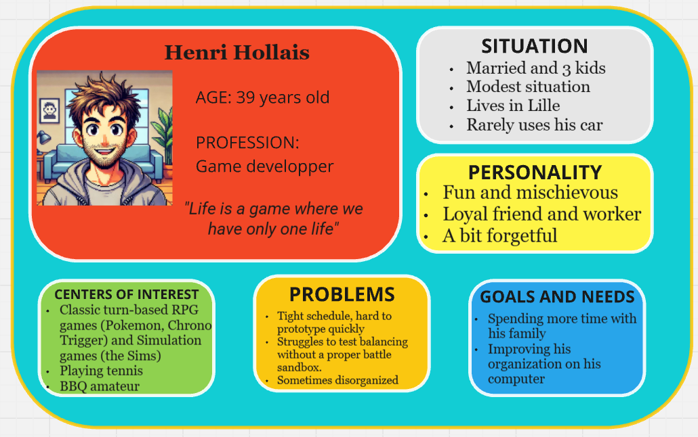

# Moonshot Project: KriticalHit - Functional Specifications

| Author        | Paul NOWAK |
|---------------|------------ |
| Created       | 03/25/2024  |
| Last Modified | 05/17/2025  |

## Table of Contents

Table of Contents

 - [1. Overview](#1-overview)
   - [1.1 Document Purpose](#11-document-purpose)
   - [1.2 Context](#12-context)
   - [1.3 RPG Domain](#13-rpg-domain)
 - [2. Product Goal](#2-product-goal)
   - [2.1 Project Scope](#21-project-scope)
   - [2.2 Constraints](#22-constraints)
   - [2.3 Risks and Assumptions](#23-risks-and-assumptions)
 - [3. Audience study](#3-audience-study)
   - [3.1 User Personas](#31-user-personas)
     - [3.1.1 Henri Hollais](#311-henri-hollais)
     - [3.1.2 Violet Hitgoh](#312-violet-hitgoh)
     - [3.1.3 Arun Reddy](#313-arun-reddy)
     - [3.1.4 Luke Atmadohg](#314-luke-atmadohg)
     - [3.1.5 Katrina Ladalh](#315-katrina-ladalh)
   - [3.2 Survey](#32-survey)
 - [4. List of features](#4-list-of-features)
   - [4.1 Must-Have](#41-must-have)
   - [4.2 Should-Have](#42-should-have)
   - [4.3 Could-Have](#43-could-have)
 - [5. Product Details](#5-product-details)
   - [5.1 Minimum Viable Product](#51-minimum-viable-product)
   - [5.2 Non-Functional Requirements](#52-non-functional-requirements)
   - [5.3 Acceptance Criterias](#53-acceptance-criterias)
   - [5.4 Out of Scope](#54-out-of-scope)
 - [6. User Interface & User Experience](#6-user-interface-&-user-experience)
   - [6.1 Importance](#61-importance)
   - [6.2 Mock-Ups](#62-mock-ups)
   - [6.3 UI Elements](#63-ui-elements)
   - [6.4 Colors](#64-colors)
   - [6.5 Prototype](#65-prototype)
 - [7. Glossary](#7-glossary)
   - [7.1 RPG Lexical Field](#71-rpg-lexical-field)
   - [7.2 Miscallenous](#72-miscallenous)
 - [8. Sources](#8-sources)

# 1. Overview

### 1.1 Document Purpose
This document has been written to provide the functional specification of a Moonshot Project named Kritical Hit. In fact, the Moonshot Project is a final evaluation imposed by the ALGOSUP school to create our own unique and professional project through the whole scolarity and to validate our Master level in Software development.

### 1.2 Context
Video games have long been a cornerstone of the entertainment industry, generating approximately $180 billion annually. The market continues to evolve rapidly, driven by advancements in both hardware and software—particularly through the rise of powerful game engines. While these engines are also utilized across various industries, they have revolutionized game development by enabling the creation of more complex and sophisticated interactive experiences.

Despite these innovations, developing a video game remains a time-consuming and detail-oriented task for software engineers. With the rise of new technologies and changing audience expectations, modern games are expected to meet high standards in performance, quality, and depth to remain competitive and marketable.

Among all genres, role-playing games (RPGs) hold a special place in the industry. They offer immersive storytelling, rich character progression, and strategic battle systems that attract a wide and loyal audience. 

A prime example is the Pokémon franchise, which exemplifies the global appeal and commercial success of RPGs. As of 2023, Pokémon is the highest-grossing entertainment media franchise in the world, having earned over 150 billion dollars in total revenue. This includes 30 billion dollars from video games alone and over 100 billion dollars from licensed merchandise. The core games in the Pokémon series follow a classic RPG structure, where players assume the role of a customizable trainer who captures, trains, and battles Pokémon with the ultimate goal of becoming the Pokémon Champion.

Building such RPGs often requires dedicated game design tools, particularly for crafting engaging battle mechanics and managing complex character systems. However, current game design software tools often fall short—they may either lack essential resources or present interfaces that are not welcoming to new developers. Moreover, extending their functionality by adding plugins can be too time-consuming or technically demanding for amateurs or solo designers.

This highlights a critical gap in the tools available for designing high-quality RPG systems, especially for developers inspired by franchises like Pokémon but lacking the means or technical expertise to implement similarly rich gameplay experiences.

### 1.3 RPG Domain

An RPG (Role-Play Game) is a game where the player embodies a fictional character that will evolve, often alongside other characters, where he will accomplish diverse quests, fight enemies and explore a more or less imaginary world. Indeed, RPGs are based on a point system and experience level that can be increased and allow the player to get stronger and receive new abilities. 

Inspired by several sources like the Dungeon and Dragons pen-and-paper games and fantasy writings authors like J. R. R. Tolkien, RPGs bring a whole new concept of entertainment with the success of Franchises like Pokemon, Final Fantasy, and Dragon Quest. Throughout time, they differienced themselves in subgenres like Action RPG (including action gameplay) and MMORPG (online role-playing).

Each player chooses a character, whether completely create him or emboding a defined one (like Cloud from Final Fantasy VII), and have the freedom to change its appearance (clothes, weapons, magic powers) and its statistics (strength, agility, vitality...).

## 2. Product Goal

### 2.1 Project Scope
To support both amateur game designers and professional developers, the goal of this project is to design a desktop application functioning similarly to a lightweight game engine.

This software will feature an intuitive, user-friendly interface to help users define and configure battle system rules for RPGs in development. It aims to foster creativity and give users the flexibility to create a wide variety of RPG battle templates with ease.

Inspired by iconic titles like Pokémon, the application will include a simulation interface that replicates the feel of a classic Pokémon battle, allowing users to test their systems in a familiar and engaging way.

The following are the key features envisioned for the final product:

- The software will allow the user to navigate through the different menus with an understandable and colorful interface, similar to the game Super Mario Maker.

- Users will be able to simulate a turn-based Pokémon-style battle between two sides, each selecting one of four available Pokémon before the fight begins.

- The system will include an integrated battle interface reminiscent of the original Pokémon games, allowing users to interactively test how their fight logic and rules behave in a turn-based simulation.

- A rules menu will allow users to enable or disable specific mechanics—such as turn order logic, stat caps, or critical hit chance—before starting a new simulation.

- Battle moves inspired by Pokémon will be available, including damaging attacks, healing actions, buffs (stat increases), and debuffs (stat reductions), offering a diverse range of effects to test.

### 2.2 Constraints
First and foremost, this project will be developed by a single individual with no prior experience in creating complete software independently. As part of the Moonshot Project, it must be completed alone, without active assistance from other students, teachers, or professionals.

Due to this context, no financial investments are possible. The project will rely entirely on a limited local budget, as well as the available hardware and software tools.

Additionally, the product will be developed under time constraints, as the contributor must balance this project alongside ongoing academic commitments. Although the Moonshot Project is required to validate the contributor’s degree, it does not follow a fixed deadline—task scheduling must therefore remain flexible and adapt to the progression of the contributor’s studies.

Finally, as the project now focuses specifically on implementing gameplay mechanics inspired by Pokémon battles, this design choice inherently limits the versatility and creative freedom users may have when testing other types of combat systems. At least in the planned final version, the simulation will be tailored to turn-based, Pokémon-style encounters, potentially reducing support for broader RPG battle variations.

### 2.3 Risks and Assumptions

### 2.3.1 Risks 
|   **Risk**  |   **Impact** |  **Mitigation**  |                     
|   :-------  |   :--------- |  :-------------  |
|   **Insuffisant app responsive speed**  |   The computer's performance might not be fast enough to allow the user to test the app properly |  Extended researches about app's speed and responsiveness must be performed  |
|  **User-friendly interface bad outcomes**  |   Focusing on a simplified interactivity with the software can create limits of its potential and functionality  |  Highlighting the importance of testing UI prototypes to balance usability and simplicity   |
|   **Complex UI effects** |   Some planned UI widgets may be too difficult and complex to implement in the software and could decrease its responsiveness   |  Creation of UI prototypes   |
|   **Heavy database** |   The software's response could be slow due to the required amount of database stored in back-end  |  Further studies of database app storage   |

### 2.3.2 Assumptions 
|   **Assumption**  |   **Impact** |  **Mitigation**  |                     
|   :-------  |   :--------- |  :-------------  |
|   **2D character models**  |   To simulate RPG battle, 2D characters should be represented as they required less space in the memory than 3D ones |  Finding how to integrate 2D sprites in an app and make them react  |
|   **Tree representations**  |   It could bring visibility to the user to have a clearier view on certain features such as stats |  Research on tree-like representation UI models  |
|   **Interactive tutorial**  |   A tutorial could be added to help the user get familiarized with the product |  Search how to implement a tutorial in an app  |
|   **Battle systems RPG**  |   RPG battle systems are various and unique, so we need to make sure the user gets enough creativity for his own taste|  Several battle systems must be tested out   |

## 3. Audience study

### 3.1 User Personas

#### 3.1.1 Henri Hollais

#### 3.1.2 Violet Hitgoh

#### 3.1.3 Arun Reddy

#### 3.1.4 Luke Atmadohg

#### 3.1.5 Katrina Ladalh

#### 3.2 Survey
AAA

## 4. List of Features

The software includes a wide range of features, many of which may be difficult to implement during development. 

Therefore, the MoSCoW matrix method will be used to prioritize each feature and sub-feature based on their likelihood of being implemented.

- **MUST-HAVE**: These features are mandatory and non-negotiable needs for this project.

- *SHOULD-HAVE*: These features are essential to the product, but they don't represent a vital part.

- COULD-HAVE: These features aren't necessary to the core product and have a much smaller impact if left out, but they are considered as "nice-to-have".

### 4.1. User-Friendly Application
#### 4.1.1 User Login System

| **Feature**                | **Description**                              | **Priority** |
| :------------------------- | :------------------------------------------- | :----------- |
| **User Login**             | Implement a login system for users           | COULD-HAVE         |
| ↳ **Validate Credentials** | Ensure user credentials are checked properly | COULD-HAVE           |
| ↳ **Error Messages**       | Display error messages when login fails      | COULD-HAVE           |

#### 4.1.2 Main Menu Page

| **Feature**                     | **Description**                                     | **Priority** |
| :------------------------------ | :-------------------------------------------------- | :----------- |
| **Main Menu UI**                | Build the main menu page                            | **MUST-HAVE**          |
| ↳ **Go to Simulation Page**     | Allow navigation to the battle simulation interface | **MUST-HAVE**         |
| ↳ **Go to Rules Menu**          | Allow access to the rules customization menu        | **MUST-HAVE**          |
| ↳ **Go to Character Selection** | Navigate to Pokémon/character selection screen      | COULD-HAVE          |
| ↳ **Logout Button**             | Add a logout option to exit the user session        | COULD-HAVE          |

#### 4.1.3 Responsive Design

| **Feature**           | **Description**                                 | **Priority** |
| :-------------------- | :---------------------------------------------- | :----------- |
| **Full-Screen Mode**  | Enable full-screen display for better immersion | COULD-HAVE           |
| **Responsive Layout** | Ensure each page adapts to various screen sizes | COULD-HAVE          |

### 4.2. Battle Interface & Flow Simulation

#### 4.2.1 Battle Interface Design

| **Feature**                      | **Description**                                              | **Priority** |
| :------------------------------- | :----------------------------------------------------------- | :----------- |
| **Design Battle Interface**      | Create the UI for the battle screen                          | **MUST-HAVE**         |
| ↳ **Show Pokémon & HP Bars**     | Display both Pokémon on screen with visual HP bars           | **MUST-HAVE**         |
| ↳ **Display Battle Text**        | Show relevant messages and narration during battle           | *SHOULD-HAVE*          |
| ↳ ↳ *"What will you do?"* Prompt | Display the classic player turn prompt                       | *SHOULD-HAVE*          |
| ↳ ↳ *Move Usage Text*            | Show messages like "Pikachu uses Thunderbolt!"               | *SHOULD-HAVE*          |
| ↳ ↳ *Healing Text*               | Display messages for healing moves (e.g. "Bulbasaur heals!") | COULD-HAVE          |
| ↳ ↳ *Buff Text*                  | Display stat increase messages (e.g. "Attack rose!")         | COULD-HAVE           |
| ↳ ↳ *Debuff Text*                | Display stat decrease messages (e.g. "Defense fell!")        | COULD-HAVE           |
| ↳ **Implement Move Buttons**     | Show four move buttons the player can click                  | **MUST-HAVE**          |
| ↳ **Update UI Elements**         | Dynamically update HP bars, text, and states after actions   | **MUST-HAVE**          |

#### 4.2.2 Enemy AI System

| **Feature**                 | **Description**                                 | **Priority** |
| :-------------------------- | :---------------------------------------------- | :----------- |
| **Enemy AI**                | Automate opponent's decisions during battle     | **MUST-HAVE**          |
| ↳ **Random Move Selection** | Enemy chooses a move randomly                   | **MUST-HAVE**          |
| ↳ **Check for PP**          | Prevent enemy from choosing moves with 0 PP     | *SHOULD-HAVE*          |
| ↳ **HP-Based Decisions**    | Make smarter move choices based on remaining HP | COULD-HAVE           |

#### 4.2.3 Quitting the Battle

| **Feature**               | **Description**                               | **Priority** |
| :------------------------ | :-------------------------------------------- | :----------- |
| **Quit Battle Handling**  | Manage quitting mid-battle                    | *SHOULD-HAVE*          |
| ↳ **Confirmation Popup**  | Show confirmation before exiting the battle   | *SHOULD-HAVE*          |
| ↳ **Return to Main Menu** | Navigate back to the main menu after quitting | *SHOULD-HAVE*         |

#### 4.2.4 Battle End Conditions

| **Feature**                   | **Description**                                   | **Priority** |
| :---------------------------- | :------------------------------------------------ | :----------- |
| **Detect Battle End**         | Determine when the battle is over                 | **MUST-HAVE**          |
| ↳ **Pokémon Fainting**        | Detect when a Pokémon’s HP reaches 0              | **MUST-HAVE**          |
| ↳ **Display Outcome Message** | Show win/lose message and return to the main menu | **MUST-HAVE**          |

### 4.3. Battle Mechanics System

#### 4.3.1 Combat Turn System

| **Feature**                         | **Description**                                          | **Priority** |
| :---------------------------------- | :------------------------------------------------------- | :----------- |
| **Turn-Based Combat**               | Two Pokémon engage in a turn-based fight                 | **MUST-HAVE**          |
| **Stat-Based Turn Order & Outcome** | Uses stats (HP, Attack, Defense, Speed) to resolve turns | **MUST-HAVE**          |

#### 4.3.2 Move Selection & Usage

| **Feature**              | **Description**                                | **Priority** |
| :----------------------- | :--------------------------------------------- | :----------- |
| **List Available Moves** | Display list of usable moves for the player's Pokemon  | **MUST-HAVE**          |
| **PP System**            | Manages move usage based on remaining PP       | *SHOULD-HAVE*          |
| ↳ Reduce PP on Use       | Deducts 1 PP when a move is used               | *SHOULD-HAVE*          |
| ↳ Block When PP = 0      | Prevents using moves that have no PP remaining | *SHOULD-HAVE*          |
| ↳ Trigger Game Over      | Ends game if no available moves remain         | COULD-HAVE           |

#### 4.3.3 Move Effects System

| **Feature**                 | **Description**                                                     | **Priority** |
| :-------------------------- | :------------------------------------------------------------------ | :----------- |
| **Move Effects System**     | Handles the outcome of moves used in battle                         | **MUST-HAVE**          |
| **Damage-Dealing Moves**    | Executes damage-based calculations during combat                    | **MUST-HAVE**          |
| ↳ Apply Base Damage Formula | Uses a formula to compute base damage output                        | **MUST-HAVE**          |
| ↳ Critical Hit Mechanic     | Applies critical hit chance and multiplier                          | COULD-HAVE           |
| ↳ STAB Bonus                | Applies Same-Type Attack Bonus if move type matches user’s type     | COULD-HAVE          |
| ↳ Type Effectiveness        | Adjusts damage based on move vs. opponent type (e.g., fire > grass) | COULD-HAVE           |
| ↳ Implement Limited Types   | Includes basic types: Fire, Water, Grass, Electric                  | COULD-HAVE           |
| **Healing Move**            | Heals 50% of user’s base HP                                         | *SHOULD-HAVE*          |
| **Buffing Stat Move**       | Increases a selected stat (e.g., Attack, Defense)                   | *SHOULD-HAVE*          |
| **Nerfing Stat Move**       | Decreases opponent’s stat (e.g., Speed, Defense)                    | *SHOULD-HAVE*          |

### 4.4. Set Up Battle

#### 4.4.1 Set Up Characters

| **Feature**                   | **Description**                             | **Priority** |
| :---------------------------- | :------------------------------------------ | :----------- |
| **Create Selectable Pokémon** | List of 6 available Pokémon to choose from  | *SHOULD-HAVE*         |
| **Load/Select Pokémon**       | Load data from database or list             | *SHOULD-HAVE*         |
| **Display Pokémon Data**      | Show name, stats, and types of each Pokémon | COULD-HAVE           |

#### 4.4.2 Assign Capacities (Movesets)

| **Feature**                    | **Description**                                                 | **Priority** |
| :----------------------------- | :-------------------------------------------------------------- | :----------- |
| **Set Up Capacities Database** | Create a list/database of all possible moves                    | **MUST-HAVE**          |
| **Assign Moveset to Pokémon**  | Assign 4 moves to each Pokémon                                  | **MUST-HAVE**          |
| ↳ Same Moveset for All         | All Pokémon share the same 4 moves                              | **MUST-HAVE**          |
| ↳ Different Movesets           | Each Pokémon has unique moves                                   | *SHOULD-HAVE*          |
| **Assign Move Types**          | Ensure each move has a type (e.g., Fire, Water, Electric, etc.) | COULD-HAVE           |

#### 4.4.3 Choose Rules

| **Feature**                  | **Description**                                 | **Priority** |
| :--------------------------- | :---------------------------------------------- | :----------- |
| **Select Ruleset**           | Choose which special rules will apply in battle | **MUST-HAVE**          |
| ↳ No Healing Move Rule       | Prevents healing moves from being used          | **MUST-HAVE**         |
| ↳ No Buffing Move Rule       | Disables stat-increasing moves                  | **MUST-HAVE**         |
| ↳ No Nerfing Move Rule       | Disables stat-decreasing moves                  | *SHOULD-HAVE*          |
| ↳ No PP System Rule          | Turns off PP management                         | *SHOULD-HAVE*         |
| ↳ No Type Table Rule         | Disables type effectiveness system              | COULD-HAVE           |
| ↳ Different Critical Hit Coefficient | Adjusts multiplier for Critical Hit Bonus   | COULD-HAVE           |
| ↳ Different STAB Coefficient | Adjusts multiplier for Same-Type Attack Bonus   | COULD-HAVE           |
| **Save Ruleset**             | Store selected rules for use during the battle  | **MUST-HAVE**          |

#### 4.4.4 Choose Characters for Battle

| **Feature**                 | **Description**                              | **Priority** |
| :-------------------------- | :------------------------------------------- | :----------- |
| **Select Player Pokémon**   | Choose which Pokémon the player will use     | *SHOULD-HAVE*         |
| **Select Opponent Pokémon** | Choose which Pokémon the opponent will use   | *SHOULD-HAVE*         |
| **Confirm Selection**       | Display final choice and prompt confirmation | *SHOULD-HAVE*          |

## 5. Product Details

### 5.1 Minimum Viable Product

The project will be developed progressively through a Minimum Viable Product (MVP) approach, organized into distinct phases. In other words, each phase corresponds to a specific stage of development based on the features implemented and the version released. Furthermore, every phase is expected to be functional and designed with a user-friendly interface.

| **Phase**   | **Added Features**                                                                                          | **Version** |
| ----------- | ----------------------------------------------------------------------------------------------------------- | ----------- |
| **Phase 1** | App skeleton, login menu, main template menu, basic simulation with 2 preset Pokémon (same attacks & stats) | 0.2         |
| **Phase 2** | Custom Pokémon stats, attack order system, classic-style damage calculator, attack delay system             | 0.5         |
| **Phase 3** | Rules menu, healing and buffing moves, PP system, support for 4 attacks per Pokémon                         | 1.0         |
| **Phase 4** | Nerfing moves, critical hits, 4-type system with effectiveness chart, custom movesets                       | 1.5         |
| **Phase 5** | Character selection menu, expanded stats (evasion, accuracy), support for 6 types                           | 2.0         |

### 5.2 Non-Functional Requirements

- **Accessibility**: The User Interface of this product must be accessible to people unfamiliar with RPG games or computer software in general. Indeed, Kritical Hit’s range of capacities must bring a satisfaction rate around 95% of users. 

- **Configurability**: The software must allow different settings that could be freely personalized by the user when he uses any feature. 

- **Flexibility**: The software must have room to add new potential features to improve the creativity of the battle systems. Indeed, any update of the application shouldn’t require too much effort for the software engineer. 

- **Responsiveness**: Most user inputs (button, selection) and interactions effects (button growing when mouse hovering, etc...) must be fast. The maximum response time for them should be 100ms to ensure user-friendly interactivity.  

- **Re-usability**: The software’s interface could be reused as a model for any future software requiring a user-friendly interface. 

- **Scalability**: The software must be able to contain a large database of battle system templates, and its performance shouldn’t be too highly impacted by the amount of data used. 

- **Security**: The user’s personal data must be protected from any cyberattack when he is logged in. Furthermore, the software should prevent any leak from the template’s database. 

- **Usability**: The software’s interface must be simple to understand and appealing enough to encourage people to use it. 

### 5.3 Acceptance Criterias
In order to determine this IT project as successful, Kritical Hit must meet all the following criterias:

- The user can seamlessly navigate the application and interact with all UI components without experiencing significant lag or input delay.
- Users are able to create their own custom battle rules using the provided tools and test them within the built-in simulator.
- The application runs without crashing and does not exhibit any critical bugs that would negatively impact the user experience.
- The app launches cleanly without throwing errors, regardless of the platform or device used.
- The simulator offers a responsive, fluid experience where users testing their templates perceive it as playing an actual game, with no noticeable latency.

### 5.4 Out of Scope
Severals features were considered but they won't be implemented in the product:

- An Equipment creation menu: it would allow the user to set up an equipment menu which will create slots for objects to give bonuses/maluses for a character while using a certain battle system. Indeed, it would also the possibility to create objects (potions, weapons), and to set up trees of achievements.
- 2 other types of RPG style: real-time battle (every character select and perform their action whenever and wherever) and phase battle (2 factions of enemies are fighting, and each faction perform their action when it's their phase turn).
- Possibility to save videos of simulation within the app's database.
- Connection of different attacks, where the user create links between certain skills and set up potential combos and bonuses.
- Creation of an XP calculator, similar to the damage calculator, and useful to calculate the experience earned by the player when defeating a certain enemy.

- **Stats Creation**: The features to create and modify the stats for a particular battle system and its characters.

- **Skills Creation**: The features to set up the different skills and abilities of a battle system and its characters.

- **Status Creation**: The features to set up new status effects which will influence the gameplay of the battle system and its character.

## 6. User Interface & User Experience

### 6.1. Importance

One of the most expected features of Kritical Hit must be his ability to draw any kind of users, whether they are familiar with softwares and video games or not.

In fact, a Game Engine is often provided with a complete yet complex User Interface to allow developpers to conceive any type of game. 

However, focusing on the Battle System aspect of RPG games would require a most game-inspired UI, taking inspiration on menus of games developped by Nintendo like Super Mario Maker or Super Smash Brothers Ultimate. 

According to a study, the first game would be ideal to introduce User Experience to players as the different in-game tools showcase creative way to build up Super Mario levels alongside a simple and understandable design.

### 6.2. Mock-Ups

The following link show the Concept Arts for each menu of the software made by Figma:

[Kritical Hit's Concept Arts](https://www.figma.com/design/tOh9vWgijZAMVSdAd2oILU/KriticalHit-Concept-Arts?node-id=0-3&t=zXnhpB73msD4rEtD-1) 

The User Flowchart map show the different paths the user must take to test the different features while navigating through the app:

### 6.3. UI Elements

Some UI Elements will be commonly used through the different menus of Kritical Hit to assist the user in the making of a Battle Template. This includes:

- Buttons: Often provided with an oval form and accompanied by a small symbol, this classic UI element draws the attention of the user who can clik on it to navigate through the app and make various choices.

- Galleries: Used to store database of Battle Templates, Characters, Stats Trees, and more. The user can scroll up and down (or from left to right) to find the element of his choice and load it.

- Pop-Up menu: Appears as a window that can be small or big depending on its content. Indeed, the small sized versions are used to display valuable information for the user, like an advice or a warning, while the large pop-ups take most of the screen and incite the user to spend his times choosing settings, like the rules for a Battle Template for example.

- Checkboxes: Enables the user to focus their attention on them, so they could make selections for various settings, like the rules of a Battle Template, or other specific conditions. 

- Range Sliders: Used occasionally to help fix a precise value, like a bonus given by a Skill, or make range of values, like the minimum and maximum values of a Stat for example. 

- Damage Calculator: Takes the form of a customizable mathematical formula that will be used to calculate damages depending of various inputs (Characters Stats, Bonuses, Maluses, fixed values...).

- Tree: As its name implies, this UI element takes the form of a tree. Indeed, it will be used to represent a Stats Trees like an actual tree, and its branches and leaves represent the different involved Stats used to complete a Battle Template.

- Simulation Screen: Represents a small window with 2 characters: the playable character and an enemy. When the simulation is activated, a fight will occur between the 2 characters where the user can view a menu for the hero's possible actions, and the remaining HPs and SPs of each entity.

### 6.4. Colors

In order to make the interface easier to understand for the user, I decided to implement a color code to differentiate each section of the code. Furthermore, each menu of KriticalHit has a backkground with a representative color.

Here are each main colors used in the software:

- Green (#09BC71): represents the main menu of the software. Also used for the main background of the Battle Template screen, and for buttons to confirm a choice and create a new feature.
- Red (#FF0000): represents the Template Creation menu, but it's also used for a button to unconfirm a choice.
- Orange(#FF9900): represents the Characters Creation menu.
- Yellow(#EAE340): represents the Stats Creation menu.
- Blue(#407AEA): represents the Skills Creation menu.
- Purple(#EA40E3): represents the Statuses Creation menu.

### 6.5. Prototype

Before building the app, a prototype of app which goal is to test the proposed interface has been created. Indeed, we can just navigate through the different pages of the app but it provides an interesting preview about what users will expect:

[PROTOTYPE 1](TBD)  

### 6.6. Changes made
TBD

## 7. Glossary

### 7.1. RPG Lexical Field

|         Term         |                  Definition                   |  
| :------------------: | :------------------------------------------: | 
| **Ability** |   Also called "Trait", it's a specific characteristic of a character, generally allowing him to provide advantages during certain situations in battle.    |
| **Buff** |   A skill, ability or other game mechanic that improves a character's capabilities to increase his effectiveness.    |
| **Character** |   Persona created with characteristics embodied by a player within the context of the game.    |
| **Critical Hit** |   Successful attack dealing greater damage than a normal attack which occurs generally depending on the player's luck. Also nicknamed "Crit".    |
| **Damage** |   In game, any form of pain that decrease a character's life due to an attack is expressed as a damage.    |
|**Defend** |   Also called "Guard", action performed by a character to protect himself from an oncoming attack, generally to reduce the damage received.    |
| **Element** |   An attribute given to a character that refers to a type of attribute that can be applied to a skill, an effect or a character itself. Several can be used to create strengths and weaknesses for the different actors of the RPG battle. |
| **H.P.** |   Abbreviation for "Hit Points", represents how much damage a character can take before being knocked out.     |
| **Hazard** |   Passive effect affecting the entire battlefield in a fight that can hinders (or benefit) all characters.    |
| **K.O.** |   Abbreviation for "Knocked Out", state when a character have lost all of his HPs and is unable to fight.    |
| **Modifiers** |   Factors influencing a battle that allow the calculation of several attributes, like the total damage, or a specific stat.   |
| **Nerf** |    Also called "debuff", it's a skill, ability or other game mechanic that decrease a character's capabilities to reduce his effectiveness.    |
| **Party** |    Group of characters teaming up during various adventures in a role-play game.    |
| **S.P.** |   Abbreviation for "Skill Points" and also called "mana", a limited quantity of points possessed by a character allowing him to uses a particular skill at the cost of a few of them.     |
| **Skill** |   Particular action performed by a character during a battle. It allows to either attack the enemy, provides an effect or both, sometimes at the cost of a few SPs.   |
| **Special Ability** |   Abilities characterized as game mechanics which provide a passive effect to a character in battle, like an immunity to an element.    |
| **Stat** |   Numerical value that applies to a character's ability (Attack, Defense, Speed...).    |
| **Status** |   Specific state affected to a character, generally negative, causing effects such as losing HPs each turn (poison) or being slowed down (paralyzis).    |

### 7.2. Miscallenous

|         Term         |                  Definition                   |  
| :------------------: | :------------------------------------------: | 
| **Game Design** |   Processus of creation and development of rules and other constituent elements of a video game.    |
| **Plugin** |   Software conceived to be implemented in another software through an interface and bringing new features to the latter.    |
| **Prototype** |   Trial version and/or simulation of a software product made to provide a preview before its final version.    |

