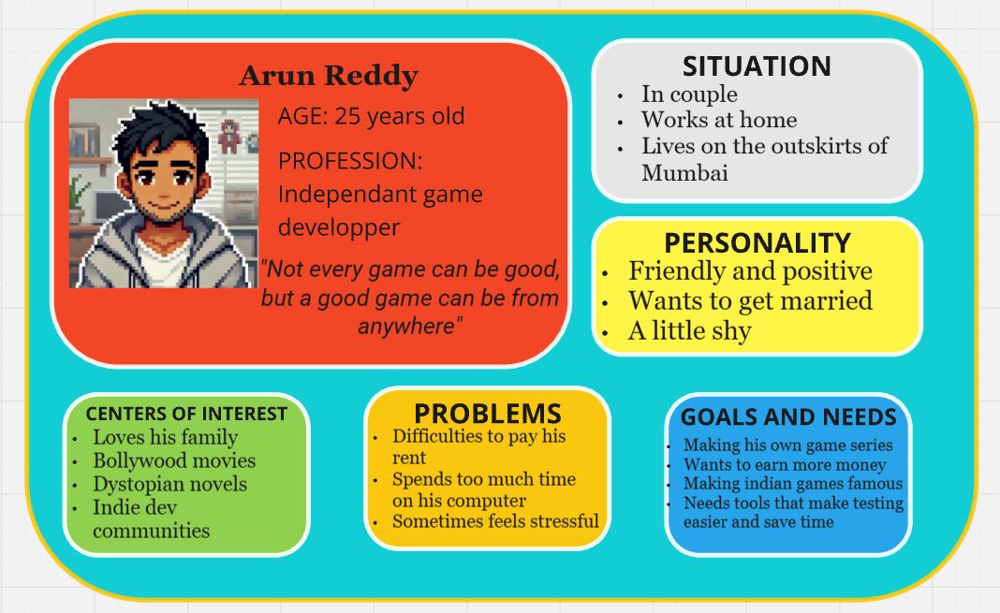
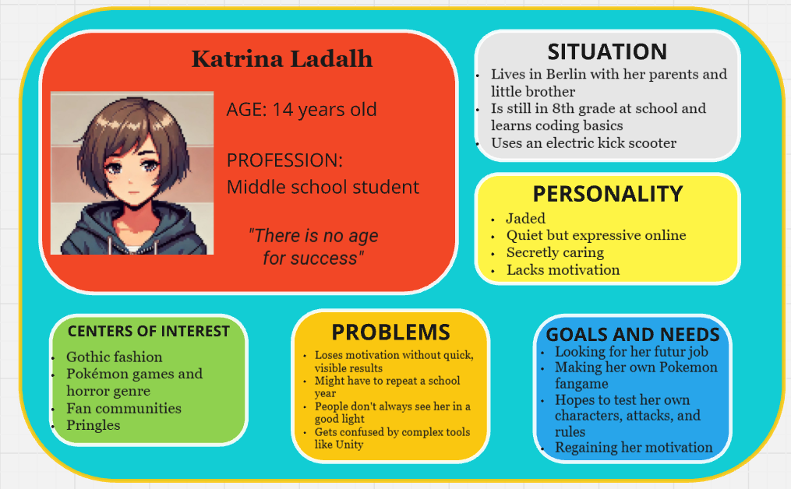

# Moonshot Project: KriticalHit - Functional Specifications

// Consider adding:
- Version history table at the beginning
- Document approval section
- Reference section for related documents
- List of stakeholders
- Change management process

| Author        | Paul NOWAK |
|---------------|------------ |
| Created       | 03/25/2024  |
| Last Modified | 05/27/2025  |

## Table of Contents

Table of Contents

 - [1. Overview](#1-overview)
   - [1.1 Document Purpose](#11-document-purpose)
   - [1.2 Context](#12-context)
   - [1.3 RPG Domain](#13-rpg-domain)
 - [2. Product Goal](#2-product-goal)
   - [2.1 Project Scope](#21-project-scope)
   - [2.2 Constraints](#22-constraints)
   - [2.3 Risks and Assumptions](#23-risks-and-assumptions)
 - [3. User Personas](#31-user-personas)
   - [3.1 Henri Hollais](#311-henri-hollais)
   - [3.2 Violet Hitgoh](#312-violet-hitgoh)
   - [3.3 Arun Reddy](#313-arun-reddy)
   - [3.4 Luke Atmadohg](#314-luke-atmadohg)
   - [3.5 Katrina Ladalh](#315-katrina-ladalh)
 - [4. List of features](#4-list-of-features)
   - [4.1 User-Friendly Application](#41-must-have)
   - [4.2 Battle Inteface and flow simulation](#42-should-have)
   - [4.3 Battle Mechanics System](#43-could-have)
   - [4.4 Set Up Battle](#43-could-have)
 - [5. Product Details](#5-product-details)
   - [5.1 Minimum Viable Product](#51-minimum-viable-product)
   - [5.2 Non-Functional Requirements](#52-non-functional-requirements)
   - [5.3 Acceptance Criterias](#53-acceptance-criterias)
   - [5.4 Out of Scope](#54-out-of-scope)
 - [6. Technical Stack & Requirements](#6-technical-stack--requirements) // NEW: Brief overview of technical needs
   - [6.1 Development Environment](#61-development-environment)
   - [6.2 Database Overview](#62-database-overview)
   - [6.3 System Requirements](#63-system-requirements)
 - [7. Testing Strategy Overview](#7-testing-strategy-overview) // NEW: High-level testing approach
   - [7.1 Testing Objectives](#71-testing-objectives)
   - [7.2 Testing Scope](#72-testing-scope)
 - [8. User Interface & User Experience](#8-user-interface--user-experience) // Previously section 6
   - [8.1 Importance](#61-importance)
   - [8.2 Mock-Ups](#62-mock-ups)
   - [8.3 UI Elements](#63-ui-elements)
   - [8.4 Prototypes](#64-prototypes)
 - [9. Glossary](#7-glossary)
   - [9.1 RPG Lexical Field](#71-rpg-lexical-field)
   - [9.2 Miscallenous](#72-miscallenous)

# 1. Overview

### 1.1 Document Purpose
This document has been written to provide the functional specification of a Moonshot Project named Kritical Hit. In fact, the Moonshot Project is a final evaluation imposed by the ALGOSUP school to create our own unique and professional project through the whole scolarity and to validate our Master level in Software development.

### 1.2 Context
Video games have long been a cornerstone of the entertainment industry, generating approximately $180 billion annually. The market continues to evolve rapidly, driven by advancements in both hardware and software—particularly through the rise of powerful game engines. While these engines are also utilized across various industries, they have revolutionized game development by enabling the creation of more complex and sophisticated interactive experiences.

Despite these innovations, developing a video game remains a time-consuming and detail-oriented task for software engineers. With the rise of new technologies and changing audience expectations, modern games are expected to meet high standards in performance, quality, and depth to remain competitive and marketable.

Among all genres, role-playing games (RPGs) hold a special place in the industry. They offer immersive storytelling, rich character progression, and strategic battle systems that attract a wide and loyal audience. 

A prime example is the Pokémon franchise, which exemplifies the global appeal and commercial success of RPGs. As of 2023, Pokémon is the highest-grossing entertainment media franchise in the world, having earned over 150 billion dollars in total revenue. This includes 30 billion dollars from video games alone and over 100 billion dollars from licensed merchandise. The core games in the Pokémon series follow a classic RPG structure, where players assume the role of a customizable trainer who captures, trains, and battles Pokémon with the ultimate goal of becoming the Pokémon Champion.

Building such RPGs often requires dedicated game design tools, particularly for crafting engaging battle mechanics and managing complex character systems. However, current game design software tools often fall short—they may either lack essential resources or present interfaces that are not welcoming to new developers. Moreover, extending their functionality by adding plugins can be too time-consuming or technically demanding for amateurs or solo designers.

This highlights a critical gap in the tools available for designing high-quality RPG systems, especially for developers inspired by franchises like Pokémon but lacking the means or technical expertise to implement similarly rich gameplay experiences.

### 1.3 RPG Domain

An RPG (Role-Play Game) is a game where the player embodies a fictional character that will evolve, often alongside other characters, where he will accomplish diverse quests, fight enemies and explore a more or less imaginary world. Indeed, RPGs are based on a point system and experience level that can be increased and allow the player to get stronger and receive new abilities. 

Inspired by several sources like the Dungeon and Dragons pen-and-paper games and fantasy writings authors like J. R. R. Tolkien, RPGs bring a whole new concept of entertainment with the success of Franchises like Pokemon, Final Fantasy, and Dragon Quest. Throughout time, they differienced themselves in subgenres like Action RPG (including action gameplay) and MMORPG (online role-playing).

Each player chooses a character, whether completely create him or emboding a defined one (like Cloud from Final Fantasy VII), and have the freedom to change its appearance (clothes, weapons, magic powers) and its statistics (strength, agility, vitality...).

## 2. Product Goal

### 2.1 Project Scope
To support both amateur game designers and professional developers, the goal of this project is to design a desktop application functioning similarly to a lightweight game engine.

This software will feature an intuitive, user-friendly interface to help users define and configure battle system rules for RPGs in development. It aims to foster creativity and give users the flexibility to create a wide variety of RPG battle templates with ease.

Inspired by iconic titles like Pokémon, the application will include a simulation interface that replicates the feel of a classic Pokémon battle, allowing users to test their systems in a familiar and engaging way.

The following are the key features envisioned for the final product:

- The software will allow the user to navigate through the different menus with an understandable and colorful interface, similar to the game Super Mario Maker.

- Users will be able to simulate a turn-based Pokémon-style battle between two sides, each selecting one of four available Pokémon before the fight begins.

- The system will include an integrated battle interface reminiscent of the original Pokémon games, allowing users to interactively test how their fight logic and rules behave in a turn-based simulation.

- A rules menu will allow users to enable or disable specific mechanics—such as turn order logic, stat caps, or critical hit chance—before starting a new simulation.

- Battle moves inspired by Pokémon will be available, including damaging attacks, healing actions, buffs (stat increases), and debuffs (stat reductions), offering a diverse range of effects to test.

- User can also create and load several many battle templates in the application's database to save a variety of battle rules.

### 2.2 Constraints
First and foremost, this project will be developed by a single individual with no prior experience in creating complete software independently. As part of the Moonshot Project, it must be completed alone, without active assistance from other students, teachers, or professionals.

Due to this context, no financial investments are possible. The project will rely entirely on a limited local budget, as well as the available hardware and software tools.

Additionally, the product will be developed under time constraints, as the contributor must balance this project alongside ongoing academic commitments. Although the Moonshot Project is required to validate the contributor’s degree, it does not follow a fixed deadline—task scheduling must therefore remain flexible and adapt to the progression of the contributor’s studies.

Finally, as the project now focuses specifically on implementing gameplay mechanics inspired by Pokémon battles, this design choice inherently limits the versatility and creative freedom users may have when testing other types of combat systems. At least in the planned final version, the simulation will be tailored to turn-based, Pokémon-style encounters, potentially reducing support for broader RPG battle variations.

#### Technical, Database, and Performance Constraints

The development environment being used is unfamiliar to the contributor, who is working with this tool for the first time. As such, the contributor may face difficulties understanding how the environment handles memory, manages technical specifications, and deals with performance and database interactions. These challenges could impact the stability and efficiency of the application during development.

The project will be developed and tested exclusively on a single computer. Any technical limitations of this machine—including available RAM, processor capability, and storage—may directly influence development speed, build size, and runtime performance. Hardware issues or system-specific bugs may also go unnoticed due to the absence of cross-platform testing or deployment.

Moreover, the contributor lacks experience in designing, configuring, and integrating databases within applications. This unfamiliarity may lead to inefficient database structures, suboptimal query handling, and potentially poor data management practices. Such issues could hinder the application's performance, especially if real-time data access or scalability becomes necessary during later stages of development.

### 2.3 Risks and Assumptions

### 2.3.1 Risks 
|   **Risk**  |   **Impact** |  **Mitigation**  |                     
|   :-------  |   :--------- |  :-------------  |
|   **Insuffisant app responsive speed**  |   The computer's performance might not be fast enough to allow the user to test the app properly |  Extended researches about app's speed and responsiveness must be performed  |
|  **User-friendly interface bad outcomes**  |   Focusing on a simplified interactivity with the software can create limits of its potential and functionality  |  Highlighting the importance of testing UI prototypes to balance usability and simplicity   |
|   **Complex UI effects** |   Some planned UI widgets may be too difficult and complex to implement in the software and could decrease its responsiveness   |  Creation of UI prototypes   |
|   **Heavy database** |   The software's response could be slow due to the required amount of database stored in back-end  |  Further studies of database app storage   |

### 2.3.2 Assumptions 
|   **Assumption**  |   **Impact** |  **Mitigation**  |                     
|   :-------  |   :--------- |  :-------------  |
|   **2D character models**  |   To simulate RPG battle, 2D characters should be represented as they required less space in the memory than 3D ones |  Finding how to integrate 2D sprites in an app and make them react  |
|   **Tree representations**  |   It could bring visibility to the user to have a clearier view on certain features such as stats |  Research on tree-like representation UI models  |
|   **Interactive tutorial**  |   A tutorial could be added to help the user get familiarized with the product |  Search how to implement a tutorial in an app  |
|   **Battle systems RPG**  |   RPG battle systems are various and unique, so we need to make sure the user gets enough creativity for his own taste|  Several battle systems must be tested out   |

## 3 User Personas

### 3.1 Henri Hollais

### 3.2 Violet Hitgoh

### 3.3 Arun Reddy

### 3.4 Luke Atmadohg

### 3.5 Katrina Ladalh

## 4. List of Features

The software includes a wide range of features, many of which may be difficult to implement during development. 

Therefore, the MoSCoW matrix method will be used to prioritize each feature and sub-feature based on their likelihood of being implemented.

- **MUST-HAVE**: These features are mandatory and non-negotiable needs for this project.

- *SHOULD-HAVE*: These features are essential to the product, but they don't represent a vital part.

- COULD-HAVE: These features aren't necessary to the core product and have a much smaller impact if left out, but they are considered as "nice-to-have".

### 4.1. User-Friendly Application

These features were designed to ensure the interactive appeal of *Kritical Hit* and allowed users to navigate seamlessly through the various menus.

#### 4.1.1 User Login System

| **Feature**                | **Description**                              | **Priority** |
| :------------------------- | :------------------------------------------- | :----------- |
| **User Login**             | Implement a login system for users           | COULD-HAVE         |
| ↳ **Validate Credentials** | Ensure user credentials are checked properly | COULD-HAVE           |
| ↳ **Error Messages**       | Display error messages when login fails      | COULD-HAVE           |

#### 4.1.2 Main Menu Page

| **Feature**                     | **Description**                                     | **Priority** |
| :------------------------------ | :-------------------------------------------------- | :----------- |
| **Main Menu UI**                | Build the main menu page                            | **MUST-HAVE**          |
| ↳ **Go to Simulation Page**     | Allow navigation to the battle simulation interface | **MUST-HAVE**         |
| ↳ **Go to Rules Menu**          | Allow access to the rules customization menu        | **MUST-HAVE**          |
| ↳ **Go to Character Selection** | Navigate to Pokémon/character selection screen      | COULD-HAVE          |
| ↳ **Go to Damage Calculator** | Navigate to Damage Calculator editor screen      | COULD-HAVE          |
| ↳ **Logout Button**             | Add a logout option to exit the user session        | COULD-HAVE          |

#### 4.1.3 Responsive Design

| **Feature**           | **Description**                                 | **Priority** |
| :-------------------- | :---------------------------------------------- | :----------- |
| **Full-Screen Mode**  | Enable full-screen display for better immersion | COULD-HAVE           |
| **Responsive Layout** | Ensure each page adapts to various screen sizes | COULD-HAVE          |

### 4.2. Battle Interface & Flow Simulation

These features focus on delivering a functional and immersive battle experience, simulating turn-based combat flow with responsive UI and basic enemy AI.

#### 4.2.1 Battle Interface Design

| **Feature**                      | **Description**                                              | **Priority** |
| :------------------------------- | :----------------------------------------------------------- | :----------- |
| **Design Battle Interface**      | Create the UI for the battle screen                          | **MUST-HAVE**         |
| ↳ **Show Pokémon & HP Bars**     | Display both Pokémon on screen with visual HP bars           | **MUST-HAVE**         |
| ↳ **Display Battle Text**        | Show relevant messages and narration during battle           | *SHOULD-HAVE*          |
| ↳ ↳ *"What will you do?"* Prompt | Display the classic player turn prompt                       | *SHOULD-HAVE*          |
| ↳ ↳ *Move Usage Text*            | Show messages like "Pikachu uses Thunderbolt!"               | *SHOULD-HAVE*          |
| ↳ ↳ *Healing Text*               | Display messages for healing moves (e.g. "Bulbasaur heals!") | COULD-HAVE          |
| ↳ ↳ *Buff Text*                  | Display stat increase messages (e.g. "Attack rose!")         | COULD-HAVE           |
| ↳ ↳ *Debuff Text*                | Display stat decrease messages (e.g. "Defense fell!")        | COULD-HAVE           |
| ↳ **Implement Move Buttons**     | Show four move buttons the player can click                  | **MUST-HAVE**          |
| ↳ **Update UI Elements**         | Dynamically update HP bars, text, and states after actions   | **MUST-HAVE**          |

#### 4.2.2 Enemy AI System

| **Feature**                 | **Description**                                 | **Priority** |
| :-------------------------- | :---------------------------------------------- | :----------- |
| **Enemy AI**                | Automate opponent's decisions during battle     | **MUST-HAVE**          |
| ↳ **Random Move Selection** | Enemy chooses a move randomly                   | **MUST-HAVE**          |
| ↳ **Check for PP**          | Prevent enemy from choosing moves with 0 PP     | *SHOULD-HAVE*          |
| ↳ **HP-Based Decisions**    | Make smarter move choices based on remaining HP | COULD-HAVE           |

#### 4.2.3 Quitting the Battle

| **Feature**               | **Description**                               | **Priority** |
| :------------------------ | :-------------------------------------------- | :----------- |
| **Quit Battle Handling**  | Manage quitting mid-battle                    | *SHOULD-HAVE*          |
| ↳ **Confirmation Popup**  | Show confirmation before exiting the battle   | *SHOULD-HAVE*          |
| ↳ **Return to Main Menu** | Navigate back to the main menu after quitting | *SHOULD-HAVE*         |

#### 4.2.4 Battle End Conditions

| **Feature**                   | **Description**                                   | **Priority** |
| :---------------------------- | :------------------------------------------------ | :----------- |
| **Detect Battle End**         | Determine when the battle is over                 | **MUST-HAVE**          |
| ↳ **Pokémon Fainting**        | Detect when a Pokémon’s HP reaches 0              | **MUST-HAVE**          |
| ↳ **Display Outcome Message** | Show win/lose message and return to the main menu | **MUST-HAVE**          |

### 4.3. Battle Mechanics System

This section defines the core logic behind battles, focusing on turn resolution, move execution, and stat-based outcomes to ensure strategic depth.

#### 4.3.1 Combat Turn System

| **Feature**                         | **Description**                                          | **Priority** |
| :---------------------------------- | :------------------------------------------------------- | :----------- |
| **Turn-Based Combat**               | Two Pokémon engage in a turn-based fight                 | **MUST-HAVE**          |
| **Stat-Based Turn Order & Outcome** | Uses stats (HP, Attack, Defense, Speed) to resolve turns | **MUST-HAVE**          |

#### 4.3.2 Move Selection & Usage

| **Feature**              | **Description**                                | **Priority** |
| :----------------------- | :--------------------------------------------- | :----------- |
| **List Available Moves** | Display list of usable moves for the player's Pokemon  | **MUST-HAVE**          |
| **PP System**            | Manages move usage based on remaining PP       | *SHOULD-HAVE*          |
| ↳ Reduce PP on Use       | Deducts 1 PP when a move is used               | *SHOULD-HAVE*          |
| ↳ Block When PP = 0      | Prevents using moves that have no PP remaining | *SHOULD-HAVE*          |
| ↳ Trigger Game Over      | Ends game if no available moves remain         | COULD-HAVE           |
| **Accuracy and Evasion**    | Uses an algorithm to determine how likely each move can succeed in hitting the target, depending on the user's accuracy and the target's evasiveness.         | *SHOULD-HAVE*          |
| ↳ Setting move accuracy      | Set an accuracy for each move and deals with move failure. | *SHOULD-HAVE*            |
| ↳ Boosting Accuracy/Evasiveness     | Creates moves allowing to buff and/or nerf the general Accuracy and Evasion of a Pokemon       | COULD-HAVE           |

#### 4.3.3 Move Effects System

| **Feature**                 | **Description**                                                     | **Priority** |
| :-------------------------- | :------------------------------------------------------------------ | :----------- |
| **Move Effects System**     | Handles the outcome of moves used in battle                         | **MUST-HAVE**          |
| **Damage-Dealing Moves**    | Executes damage-based calculations during combat                    | **MUST-HAVE**          |
| ↳ Apply Base Damage Formula | Uses a formula to compute base damage output                        | **MUST-HAVE**          |
| ↳ Critical Hit Mechanic     | Applies critical hit chance and multiplier                          | COULD-HAVE           |
| ↳ STAB Bonus                | Applies Same-Type Attack Bonus if move type matches user’s type     | COULD-HAVE          |
| ↳ Type Effectiveness        | Adjusts damage based on move vs. opponent type (e.g., fire > grass) | COULD-HAVE           |
| ↳ Implement Limited Types   | Includes at least 4 basic types: Fire, Water, Grass, Electric                  | COULD-HAVE           |
| **Healing Move**            | Heals 50% of user’s base HP                                         | *SHOULD-HAVE*          |
| **Buffing Stat Move**       | Increases a selected stat (e.g., Attack, Defense)                   | *SHOULD-HAVE*          |
| **Nerfing Stat Move**       | Decreases opponent’s stat (e.g., Speed, Defense)                    | *SHOULD-HAVE*          |

### 4.4. Set Up Battle

This section covers how players configure battles by selecting Pokémon, assigning moves, defining rules, and customizing templates or calculation systems.

#### 4.4.1 Set Up Characters

| **Feature**                   | **Description**                             | **Priority** |
| :---------------------------- | :------------------------------------------ | :----------- |
| **Create Selectable Pokémon** | List of 6 available Pokémon to choose from  | *SHOULD-HAVE*         |
| **Load/Select Pokémon**       | Load data from database or list             | *SHOULD-HAVE*         |
| **Display Pokémon Data**      | Show name, stats, and types of each Pokémon | COULD-HAVE           |

#### 4.4.2 Assign Capacities (Movesets)

| **Feature**                    | **Description**                                                 | **Priority** |
| :----------------------------- | :-------------------------------------------------------------- | :----------- |
| **Set Up Capacities Database** | Create a list/database of all possible moves                    | **MUST-HAVE**          |
| **Assign Moveset to Pokémon**  | Assign 4 moves to each Pokémon                                  | **MUST-HAVE**          |
| ↳ Same Moveset for All         | All Pokémon share the same 4 moves                              | **MUST-HAVE**          |
| ↳ Different Movesets           | Each Pokémon has unique moves                                   | *SHOULD-HAVE*          |
| **Assign Move Types**          | Ensure each move has a type (e.g., Fire, Water, Electric, etc.) | COULD-HAVE           |

#### 4.4.3 Choose Rules

| **Feature**                  | **Description**                                 | **Priority** |
| :--------------------------- | :---------------------------------------------- | :----------- |
| **Select Ruleset**           | Choose which special rules will apply in battle | **MUST-HAVE**          |
| ↳ No Healing Move Rule       | Prevents healing moves from being used          | **MUST-HAVE**         |
| ↳ No Buffing Move Rule       | Disables stat-increasing moves                  | **MUST-HAVE**         |
| ↳ No Nerfing Move Rule       | Disables stat-decreasing moves                  | *SHOULD-HAVE*          |
| ↳ No PP System Rule          | Turns off PP management                         | *SHOULD-HAVE*         |
| ↳ No Type Table Rule         | Disables type effectiveness system              | COULD-HAVE           |
| ↳ Different Critical Hit Coefficient | Adjusts multiplier for Critical Hit Bonus   | COULD-HAVE           |
| ↳ Different STAB Coefficient | Adjusts multiplier for Same-Type Attack Bonus   | COULD-HAVE           |
| **Save Ruleset**             | Store selected rules for use during the battle  | **MUST-HAVE**          |

#### 4.4.4 Choose Characters for Battle

| **Feature**                 | **Description**                              | **Priority** |
| :-------------------------- | :------------------------------------------- | :----------- |
| **Select Player Pokémon**   | Choose which Pokémon the player will use     | *SHOULD-HAVE*         |
| **Select Opponent Pokémon** | Choose which Pokémon the opponent will use   | *SHOULD-HAVE*         |
| **Confirm Selection**       | Display final choice and prompt confirmation | *SHOULD-HAVE*          |

#### 4.4.5 Setting Up Battle Template

| **Feature**                    | **Description**                                                             | **Priority** |
| :----------------------------- | :-------------------------------------------------------------------------- | :----------- |
| **Create New Battle Template** | Generate a new battle template that adds a custom rule set to the database. | COULD-HAVE   |
| **Load Battle Template**       | Retrieve and use an existing battle template from the database.             | COULD-HAVE   |
| **Delete Battle Template**     | Remove a selected battle template from the database.                        | COULD-HAVE   |

#### 4.4.6 Changing Damage Calculator

| **Feature**                | **Description**                                     | **Priority** |
| :------------------------- | :-------------------------------------------------- | :----------- |
| **Edit Damage Calculator** | Open and edit the logic behind damage calculations. | COULD-HAVE   |
| ↳ **Adjust Coefficients**  | Modify individual calculation values.               | COULD-HAVE   |
| ↳ **Replace Formula**      | Overwrite the entire calculation formula.           | COULD-HAVE   |

## 5. Product Details

### 5.1 Minimum Viable Product

The project will be developed progressively through a Minimum Viable Product (MVP) approach, organized into distinct phases. In other words, each phase corresponds to a specific stage of development based on the features implemented and the version released. Furthermore, every phase is expected to be functional and designed with a user-friendly interface.

| **Phase**   | **Added Features**                                                                                          | **Performance Benchmarks**                                                                                                                                               | **Version** |
| ----------- | ----------------------------------------------------------------------------------------------------------- | ------------------------------------------------------------------------------------------------------------------------------------------------------------------------ | ----------- |
| **Phase 1** | App skeleton, login menu, main template menu, basic simulation with 2 preset Pokémon (same attacks & stats) | Simulation loads in under 1 second; attacks execute within 100 ms and update both HP bars.                                                                               | 0.2         |
| **Phase 2** | Custom Pokémon stats, attack order system, classic-style damage calculator, attack delay system             | Delay between attacks below 2 seconds; each character’s HP bar updates within 100 ms of their turn.                                                                      | 0.5         |
| **Phase 3** | Rules menu, healing and buffing moves, PP system, support for 4 attacks per Pokémon                         | Rules menu opens in under 1 second; updates occur with a 100 ms interval; exiting menu takes less than 200 ms, even after multiple updates.                              | 1.0         |
| **Phase 4** | Nerfing moves, critical hits, 4-type system with effectiveness chart, custom movesets                       | Simulation menu loads in under 1 second, even with 8 capacity objects saved in the database.                                                                             | 1.5         |
| **Phase 5** | Character selection menu, expanded stats (evasion, accuracy), support for 6 types                           | Character selection opens in under 1 second; interface updates occur every 100 ms; exiting takes less than 200 ms.                                                       | 2.0         |
| **Phase 6** | Save/load custom battle templates, 8-type system with immunities, damage calculator menu                    | Calculator menu opens in under 1 second; updates every 100 ms; exiting within 200 ms; app remains responsive with 5 battle templates saved; new template loads < 500 ms. | 2.5         |

Two specific versions of the Kritical Hit project will be presented to the jury: version 1.0 during the first oral exam scheduled for June 24th, 2025, and version 2.0 — or possibly 2.5 — during the second oral presentation (date TBD).

### 5.2 Non-Functional Requirements

// Consider adding:
- Performance metrics (specific response times)
- Data backup frequency
- Maximum concurrent users supported
- Memory usage limits
- Browser/device compatibility details

- **Accessibility**: The User Interface of this product must be accessible to people unfamiliar with RPG games or computer software in general. Indeed, Kritical Hit’s range of capacities must bring a satisfaction rate around 95% of users. 

- **Configurability**: The software must allow different settings that could be freely personalized by the user when he uses any feature. 

- **Flexibility**: The software must have room to add new potential features to improve the creativity of the battle systems. Indeed, any update of the application shouldn’t require too much effort for the software engineer. 

- **Responsiveness**: Most user inputs (button, selection) and interactions effects (button growing when mouse hovering, etc...) must be fast. The maximum response time for them should be 100ms to ensure user-friendly interactivity.  

- **Re-usability**: The software’s interface could be reused as a model for any future software requiring a user-friendly interface. 

- **Scalability**: The software must be able to contain a large database of battle system templates, and its performance shouldn’t be too highly impacted by the amount of data used. 

- **Security**: The user’s personal data must be protected from any cyberattack when he is logged in. Furthermore, the software should prevent any leak from the template’s database. 

- **Usability**: The software’s interface must be simple to understand and appealing enough to encourage people to use it. 

### 5.3 Acceptance Criterias

// Add specific criteria for:
- Load time thresholds
- Error rate tolerances
- Data consistency checks
- UI responsiveness metrics

In order to determine this IT project as successful, Kritical Hit must meet all the following criterias:

- The user can seamlessly navigate the application and interact with all UI components without experiencing significant lag or input delay.
- Users are able to create their own custom battle rules using the provided tools and test them within the built-in simulator.
- The application runs without crashing and does not exhibit any critical bugs that would negatively impact the user experience.
- The app launches cleanly without throwing errors, regardless of the platform or device used.
- The simulator offers a responsive, fluid experience where users testing their templates perceive it as playing an actual game, with no noticeable latency.

### 5.4 Out of Scope
The following features were originally considered but will not be part of the final product:

- **General-purpose 2D game simulation**: including a level editor, event manager, and support for various gameplay modes beyond RPG.

- **Advanced RPG systems**: such as real-time battle mechanics, combo attack linking, and versatile simulation styles similar to games like Final Fantasy or EarthBound.

- **Complex customization tools**:

  - Stat editors, creating new stats and updating existing ones.

  - Skill and ability creators with emblem and element tagging.

  - Status effect and hazard systems (e.g., weather effects).

  - Equipment and inventory management, including bonuses/maluses, item crafting, and achievement trees.

- **Additional utilities**:

  - Experience point calculators.

  - In-app simulation video recording and saving.

These were excluded to maintain a clear scope focused on creating a functional, user-friendly turn-based RPG battle simulator.

## 6. Technical Stack & Requirements

### 6.1 Development Environment
// Add:
- Primary development framework (Qt Creator)
- Programming language requirements
- Version control system
- IDE and tools needed

### 6.2 Database Overview
// Add:
- Type of database needed (SQL/NoSQL)
- Main data entities to store
- Basic relationships between data
- Estimated data volume

### 6.3 System Requirements
// Add:
- Minimum hardware requirements
- Operating system compatibility
- Network requirements (if any)
- Storage requirements

## 7. Testing Strategy Overview

### 7.1 Testing Objectives
// Add:
- User acceptance criteria
- Performance goals
- Compatibility requirements

### 7.2 Testing Scope
// Add:
- Features requiring testing
- User interface testing
- Battle system validation

## 8. User Interface & User Experience

// Consider adding:
- Accessibility standards compliance
- Color scheme requirements
- Minimum touch target sizes
- Error message guidelines
- Loading state indicators

### 8.1. Importance

One of the most essential features of **Kritical Hit** is its ability to appeal to a wide range of users—whether they are experienced with software tools, familiar with Pokémon games, or completely new to video games in general.

Traditional game engines often come with powerful but complex user interfaces designed for maximum flexibility. While these interfaces allow developers to create virtually any kind of game, they typically have a steep learning curve. Mastering them can be time-consuming, and only a limited number of users manage to do so fully.

By focusing specifically on the **battle system** aspect of RPGs, **Kritical Hit** has the opportunity to adopt a more game-inspired user interface. This approach can take cues from Nintendo titles such as *Super Mario Maker* and *Super Smash Bros. Ultimate*. For instance, *Super Mario Maker* is often praised for its intuitive UX design, which empowers users to build levels creatively using tools that are simple, visual, and easy to understand.

Similarly, the **Pokémon** series provides a great example of effective UI/UX in action. The battle interface in Pokémon games is distinct from the overworld and serves as the franchise’s core gameplay component. During battles, the player's Pokémon faces off against a wild Pokémon or another trainer's Pokémon. Despite being rooted in traditional RPG mechanics, Pokémon stands out for its streamlined and accessible interface—most notably the use of a four-move menu. This clear, concise system ensures that players have all the critical information they need at a glance, enabling them to focus on strategy without feeling overwhelmed.

**Kritical Hit** can replicate this level of UI flexibility and clarity thanks to **Qt Creator’s built-in UI design tools**, which allow for the creation of clean, modular, and intuitive interfaces without requiring extensive UI programming knowledge. This empowers designers to prototype and build user-friendly layouts that reflect familiar gaming interfaces while maintaining high usability across a wide audience.

### 8.2. User Flowchart

The User Flowchart, created using the *AI Flowchart Generator* tool, illustrates the various paths a user must follow to test different features while navigating through the application.

*Note*: This flowchart is based on the 2.5 version of the Kritical Hit project.

### 8.3. UI Elements

Thanks to Qt Creator’s built-in UI tools, we can easily integrate essential interface elements that help users set up and simulate a Pokémon battle. These elements are not only simple to add but also fully customizable through stylesheets—allowing adjustments to colors, sizes, font families, and more—to ensure they remain visually distinct and intuitive to use.

The key UI components include:

- **PushButtons**: Typically styled with a rounded or oval shape and often accompanied by icons, push buttons are essential for user interaction. They guide navigation and allow players to make selections throughout the application.

- **Checkboxes**: Simple yet effective, checkboxes allow users to toggle settings such as battle rules or special conditions. Their clarity and familiarity make them user-friendly and accessible.

The **Simulation Menu Interface**, inspired by the classic Pokémon games, is composed of several key visual elements:

- **Battle Sprites**: 2D character sprites are positioned on elliptical battle platforms, clearly separated from the background to help define each Pokémon’s position during combat.

- **Pokémon Info Panels**: These display each Pokémon’s name and remaining HP, including a dynamically updating HP bar that reflects damage taken after each turn.

- **Battle Log**: This area communicates turn-based events such as move selections, effects, or prompts asking the player to choose their next action.

### 8.4. Prototypes

// Comment: Consider moving detailed prototype implementation details to Technical Specifications document.
// Keep only high-level prototype goals and user experience findings in this document.

Before building the full application, several prototypes were created using the Qt Creator framework. The goal was to test and validate the proposed interface designs while becoming more familiar with the development environment. 

Rather than developing a single unified prototype, we focused on creating multiple smaller prototypes, each targeting specific features or interface components that required testing.

The following prototypes have been developed so far:

- **Interface_Prototype_1**: Basic navigation through the app's main pages.

- **Interface_Prototype_2**: Improved layout and interaction elements.

- **Simulation_Test1**: Initial simulation screen displaying battle setup and interaction.

- **Database_Prototype_1**: Early test for database connectivity and data retrieval.

- **Rules_Prototype1**: Prototype to test rule selection and checkbox interactions.

These prototypes provided valuable insight into user interaction flow, layout clarity, and feature behavior, helping us refine the interface before full implementation.

## 9. Glossary

### 9.1. RPG Lexical Field

|         Term         |                  Definition                   |  
| :------------------: | :------------------------------------------: | 
| **Ability** |   Also called "Trait", it's a specific characteristic of a character, generally allowing him to provide advantages during certain situations in battle.    |
| **Buff** |   A skill, ability or other game mechanic that improves a character's capabilities to increase his effectiveness.    |
| **Character** |   Persona created with characteristics embodied by a player within the context of the game.    |
| **Critical Hit** |   Successful attack dealing greater damage than a normal attack which occurs generally depending on the player's luck. Also nicknamed "Crit".    |
| **Damage** |   In game, any form of pain that decrease a character's life due to an attack is expressed as a damage.    |
|**Defend** |   Also called "Guard", action performed by a character to protect himself from an oncoming attack, generally to reduce the damage received.    |
| **Element** |   An attribute given to a character that refers to a type of attribute that can be applied to a skill, an effect or a character itself. Several can be used to create strengths and weaknesses for the different actors of the RPG battle. |
| **H.P.** |   Abbreviation for "Hit Points", represents how much damage a character can take before being knocked out.     |
| **Hazard** |   Passive effect affecting the entire battlefield in a fight that can hinders (or benefit) all characters.    |
| **K.O.** |   Abbreviation for "Knocked Out", state when a character have lost all of his HPs and is unable to fight.    |
| **Modifiers** |   Factors influencing a battle that allow the calculation of several attributes, like the total damage, or a specific stat.   |
| **Nerf** |    Also called "debuff", it's a skill, ability or other game mechanic that decrease a character's capabilities to reduce his effectiveness.    |
| **Party** |    Group of characters teaming up during various adventures in a role-play game.    |
| **Pokemon** |    Fictional creatures from the Pokémon franchise, which players can catch, train, and battle with in various games, often characterized by unique abilities, types, and evolutions.     |
| **S.P.** |   Abbreviation for "Skill Points" and also called "mana", a limited quantity of points possessed by a character allowing him to uses a particular skill at the cost of a few of them.     |
| **Skill** |   Particular action performed by a character during a battle. It allows to either attack the enemy, provides an effect or both, sometimes at the cost of a few SPs.   |
| **Special Ability** |   Abilities characterized as game mechanics which provide a passive effect to a character in battle, like an immunity to an element.    |
| **Stat** |   Numerical value that applies to a character's ability (Attack, Defense, Speed...).    |
| **Status** |   Specific state affected to a character, generally negative, causing effects such as losing HPs each turn (poison) or being slowed down (paralyzis).    |

### 9.2. Miscallenous

|            Term            |                                                                       Definition                                                                       |
| :------------------------: | :----------------------------------------------------------------------------------------------------------------------------------------------------: |
| **API** | Application Programming Interface - A set of rules and protocols that allows different software applications to communicate with each other. |
| **Backend** | The server-side portion of an application that handles data processing, business logic, and database operations. |
| **Bar** |           A graphical element in a user interface used to display information or provide controls (e.g., health bar, menu bar, progress bar).          |
| **Database Schema** | The structure that represents the logical configuration of all or part of a relational database. |
| **Frontend** | The client-side portion of an application that users interact with directly. |
| **Framework** | A platform for developing software applications that provides a foundation on which software developers can build programs. |
| **Game Design** | The process of creating the structure, rules, content, and gameplay systems of a video game. |
| **Game Engine** | A software framework used for the creation and development of video games, offering tools such as rendering, physics, scripting, and asset management. |
| **GUI** | Graphical User Interface - The visual elements through which users interact with electronic devices. |
| **Layout** | The arrangement of visual elements and interface components in a screen or scene, contributing to usability and aesthetics.              |
| **Log** | A record of events, actions, or errors that occur during the execution of a game or application, used for debugging and analysis. |
| **Mechanics** | The rules and systems that define the gameplay, including how players interact with the game and how the game responds. |
| **MoSCoW** | A prioritization method used in project management that categorizes requirements into Must have, Should have, Could have, and Won’t have. |
| **Plugin** | A software component designed to add specific features or functionality to an existing application through a defined interface. |
| **Prototype** | An early sample, model, or simulation of a game or application used to test and refine ideas before full development. |
| **Responsive Design** | A design approach that makes web pages render well on different devices and window/screen sizes. |
| **Sprite** | A 2D image or animation integrated into a game scene, typically representing characters, objects, or effects.                     |
| **Template** | A pre-designed structure or format used as a starting point for creating consistent content or features in a game or application. |
| **Turn-based** | A game system where players take alternating turns when playing. |
| **U.I. (User Interface)** | The set of visual elements (buttons, menus, icons, etc.) that allow the player to interact with a game or software. |
| **U.X. (User Experience)** |   The overall experience and satisfaction a user has when interacting with a game or application, including usability, accessibility, and enjoyment.   |
| **Unit Testing** | A software testing method where individual units or components of software are tested. |
| **Version Control** | A system that records changes to a file or set of files over time so that specific versions can be recalled later. |

