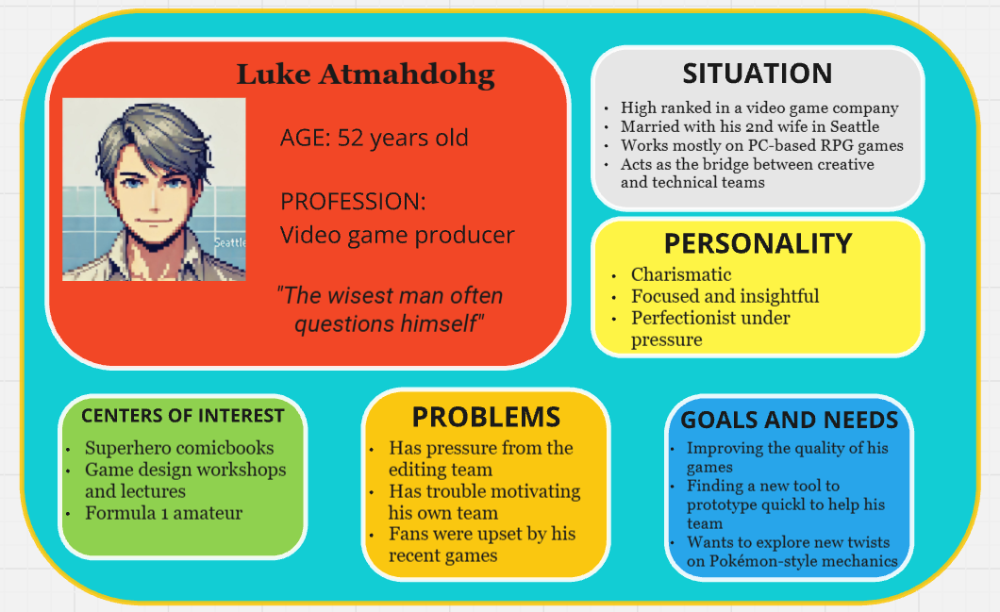

# Moonshot Project: KriticalHit - Functional Specifications

## Table of Contents

Table of Contents

 - [1. Overview](#1-overview)
   - [1.1 Document Purpose](#11-document-purpose)
   - [1.2 Context](#12-context)
   - [1.3 RPG Domain](#13-rpg-domain)
 - [2. Product Goal](#2-product-goal)
   - [2.1 Project Scope](#21-project-scope)
   - [2.2 Constraints](#22-constraints)
   - [2.3 Risks and Assumptions](#23-risks-and-assumptions)
 - [3. Audience study](#3-audience-study)
   - [3.1 User Personas](#31-user-personas)
     - [3.1.1 Henri Hollais](#311-henri-hollais)
     - [3.1.2 Violet Hitgoh](#312-violet-hitgoh)
     - [3.1.3 Arun Reddy](#313-arun-reddy)
     - [3.1.4 Luke Atmadohg](#314-luke-atmadohg)
     - [3.1.5 Katrina Ladalh](#315-katrina-ladalh)
   - [3.2 Survey](#32-survey)
 - [4. List of features](#4-list-of-features)
 - [5. Product Details](#5-product-details)
   - [5.1 Minimum Viable Product](#41-minimum-viable-product)
   - [5.2 Non-Functional Requirements](#52-non-functional-requirements)
   - [5.3 Prototype and User Interface](#53-prototype-and-user-interface)
   - [5.4 Acceptance Criteria](#54-acceptance-criteria)
   - [5.5 Security](#55-security)
 - [5. Related Documents](#5-related-documents)
 - [6. Glossary](#6-glossary)
   - [6.1 RPG Lexical Field](#61-rpg-lexical-field)
   - [6.2 Miscallenous](#62-miscallenous)
 - [7. Sources](#7-sources)

# 1. Overview

### 1.1 Document Purpose
This document has been written to provide the functional specification of a Moonshot Project named Kritical Hit. In fact, the Moonshot Project is a final evaluation imposed by the ALGOSUP school to create our own unique and professional project through the whole scolarity and to validate our Master level in Software development.

### 1.2 Context
Video games have always been a huge domain in the entertainment industry, generating nowadays around 180 billions of american dollars. Indeed, the market is still in constant evolution due to the improvement of video game hardwares and softwares, especially thanks to the rise of the game engines. While they are also used in other varieties of industries, they brought an innovative approach to create more sophisticated games due to the complexity of the most modern iterations.

However, the development of a video game has always been a long and minutious task for many software engineers. Due to the development of the new technologies and the evolution of the general audience tastes, video games need to reach a good level of performance and quality to be appealing and marketable.

As an instance, the role-playing represent a unique genre in the video game industry that is greatly loved by players. Though, this genre require several features to be taken into account, notably the battle system that represent the charm of RPGs and draw diverse players. That's why game design softwares are used to build them up.

The problem is that these kinds of software, despite the freedom they provide, either have limited resources or doesn't look appealing enough for new gamemakers. Furthermore, installing plugins to improve these "helpful" tools would be too time consuming for amateurs and game designers.

### 1.3 RPG Domain

An RPG (Role-Play Game) is a game where the player embodies a fictional character that will evolve, often alongside other characters, where he will accomplish diverse quests, fight enemies and explore a more or less imaginary world. Indeed, RPGs are based on a point system and experience level that can be increased and allow the player to get stronger and receive new abilities. 

Inspired by several sources like the Dungeon and Dragons pen-and-paper games and fantasy writings authors like J. R. R. Tolkien, RPGs bring a whole new concept of entertainment with the success of Franchises like Pokemon, Final Fantasy, and Dragon Quest. Throughout time, they differienced themselves in subgenres like Action RPG (including action gameplay) and MMORPG (online role-playing).

Each player chooses a character, whether completely create him or emboding a defined one (like Cloud from Final Fantasy VII), and have the freedom to change its appearance (clothes, weapons, magic powers) and its statistics (strength, agility, vitality...).

## 2. Product Goal

### 2.1 Project Scope
In order to assist either game design amateurs or professional developpers, the goal will be to conceive a desktop application quite similar to a game engine. 

In fact, it will be a software implemented with a user-friendly interface that will assist people to set up the battle system rules for a future RPG game in development. It will allow the user to express his creativity and allow him the freedom to create countless variations of RPG battle templates.

Eventually, these are the expected main features that will complete the product:

  - The software will allow the user to navigate through the different menus with an understandable and colorful interface similar to the game Super Mario Maker.
  - The software must be able to contain a large database of data including many battle templates.
  - The user must be able to create RPG characters and test his own battle template by simulating an RPG fight using these characters.
  - The user will have the possibility to decide how are calculated damages, and how work the different stats, skills and statuses.

### 2.2 Constraints
First of all, this project will be accomplished by someone who has never created a single software on his own ever before. Indeed, this Moonshot Project has to be realized individually, without any active assistance from other students, teachers or professional alike. 

As a consequence, investments are impossible, so this project must only rely on limited local budget, hardware equipment and software tools.

Furthermore, the product's development will be realized by a single contributor who will accomplish the entirety of the scheduled tasks with limited help, but also with limited work time due to his current studies. In fact, the contributor needs to accomplish this Moonshot Project to validate his degree, but without any clear deadline, he will need to adapt his task schedule depending on his studies' progression.

### 2.3 Risks and Assumptions

### 2.3.1 Risks 
|   **Risk**  |   **Impact** |  **Mitigation**  |                     
|   :-------  |   :--------- |  :-------------  |
|   **Insuffisant app responsive speed**  |   The computer's performance might not be fast enough to allow the user to test the app properly |  Extended researches about app's speed and responsiveness must be performed  |
|  **User-friendly interface bad outcomes**  |   Focusing on a simplified interactivity with the software can create limits of its potential and functionality  |  Highlighting the importance of testing UI prototypes to balance usability and simplicity   |
|   **Complex UI effects** |   Some planned UI widgets may be too difficult and complex to implement in the software and could decrease its responsiveness   |  Creation of UI prototypes   |
|   **Heavy database** |   The software's response could be slow due to the required amount of database stored in back-end  |  Further studies of database app storage   |

### 2.3.2 Assumptions 
|   **Assumption**  |   **Impact** |  **Mitigation**  |                     
|   :-------  |   :--------- |  :-------------  |
|   **2D character models**  |   To simulate RPG battle, 2D characters should be represented as they required less space in the memory than 3D ones |  Finding how to integrate 2D sprites in an app and make them react  |
|   **Tree representations**  |   It could bring visibility to the user to have a clearier view on certain features such as stats |  Research on tree-like representation UI models  |
|   **Interactive tutorial**  |   A tutorial could be added to help the user get familiarized with the product |  Search how to implement a tutorial in an app  |
|   **Battle systems RPG**  |   RPG battle systems are various and unique, so we need to make sure the user gets enough creativity for his own taste|  Several battle systems must be tested out   |

## 3. Audience study

### 3.1 User Personas

#### 3.1.1 Henri Hollais

#### 3.1.2 Violet Hitgoh

#### 3.1.3 Arun Reddy

#### 3.1.4 Luke Atmadohg

#### 3.1.5 Katrina Ladalh

#### 3.2 Survey
AAA

## 4. List of Features

The software contain a variety of features, that belong to 5 big domains:

- **Template Creation**: The features involving the set up of our own battle mechanics for a rpg battle, the use of different tools to customize them, and their simulation.

- **Character Creation**: The features allowing to create a particular character class as an "actor" for a targeted battle system.

- **Stats Creation**: The features to create and modify the stats for a particular battle system and its characters.

- **Skills Creation**: The features to set up the different skills and abilities of a battle system and its characters.

- **Status Creation**: The features to set up new status effects which will influence the gameplay of the battle system and its character.

In fact, many of these functionalities could be challenging to be implemented during the development. So, the MoSCoW matrix method will also be used to sort each features and sub-sub features by how likely they will be implemented.

### 4.1. Must-Have
These features are mandatory and non-negociable needs for this project.

#### 4.1.1. Template Creation:

- **Template Management**: Allow the user to create and organize his battle mechanics templates.
  - Creating a template: Allow the user to create a new template.
  - Modifying a template: Allow the user to load a template which already exist.
  - Deleting a template: Allow the user to delete a template which already exist.

- **Setting up Battle System**: Allow the user to set up the rules of its battle system and detail how they work.
  - Choosing Characters: Help the user select the characters which will be used for the battle system.
  - Choosing Stats: Help the user select the stats which will be used for the battle system.

- **RPG Style**: Allow the user to choose what kind of RPG style he want for his battle system.
  - Default Style: Allow the user to choose an RPG style similar to an existing game. A few choices will be proposed to the user.
    - Final Fantasy: The battle system is similar to the 7th opus of the series. 
    - New default style: Possibility to create a new default style from other battle system templates we created so far.
  - Custom Style: Allow the user to create an original battle template from scratch and express his creativity.
    - Turn-based type: Each character attack turn by turn.
      - Active mode: Each fighter select their action and perform it directly.  

- **Additional Game Mechanic**: Allow the user to implement additionnal game mechanics as extra battle rules.
  - Counter: Allow the user to add a counter that can be used for a specific game element, like a bonus granted to a character.
    - Limited counter: A counter cannot reach a certain number between 0 and 99.
      - It's possible to assign a minimal value N.
      - As a condition, we can get N points per turn, and prevent to receive them when we use 1 or more in the previous turn.
      - Using 1 or several can grant bonus to our skills (damages, increased duration for bonuses, number of attack per turn).
  - Attack Order System: Rule to decide in which order the characters can act.
    - Default types: Possibility to choose an order system based on pre-existing games.
      - The character's order turn can be from the fastest to the lowest.

- **Battle System Simulation**: Allow the user to test his battle system by simulating a fight using its rules.
  - Testing battle system: Allow the user to start the simulation and play the fight as a character.
    - We choose a battle system, the character involved, their stats and skills, and the number of enemies.
    - All characters start at full HP.
    - We choose our characters' actions and we play as we want.
    - We can leave the simulation at any moment.
    - We can test the simulator with a default battle template and default characters to ge familiarized with it.
   

#### 4.1.2. Character Creation:
- **Character Management**: Allow the user to create and organize his characters.
  - Creating Character: Allow the user to create a new character.
  - Load Character: Allow the user to load a character which already exist.
  - Delete Character: Allow the user to delete a character which already exist.

- **Character Set Up**: Allows the user to set up his character and his abilities.
  - Default Character: Select a default character already created in the app's database.
    - Default set up: The character has already have stats and skills applied to him, making him ready to test in the simulation.
    - Template selection: Permits the user to connect a character with a battle system to test it.
    - Stats selection: Permits the user to decide a character's stats.
- AAA

#### 4.1.3. Stats Creation:
- **Stats Trees Management**: Allows the user to organize his state tree templates which represent a list of stats connected at each other.
  - Stats Tree Creation: Allow the user to create a new Stats Tree.
  - Stats Tree Loading: Allow the user to load a Stats Tree to modify it.
  - Stats tree Deletion: Allow the user to delete a Stats Tree.

- **Setting up a Stat tree**: Allows the user to set up his Stats Tree and decide the involved stats.
  - Default stats: Classic stats used in class RPG games:
    - Attack, Defense, Speed, and HP are mandatory stats.
    - Other have been set up but their use are optional: SP and Critical.
    - If those secondary stats are ignored, they are the same for everyone.
  - Damage Calculator selection: Allow to select the damage calculator which will be applied to the Stats trees.
    - The damage calculator database can be found in the Stats Trees set up page.

- **Damage Calculator**: Allows the user to set up his own damage calculator and decide about the formula.
  - Default version: The one already used to calculate damage from default RPG battle systems. It can be based from games but also be modified slightly.
  - Custom version: We have to set up the inputs we need for creating the damage formula.
    - The Attack and Defense will be required for the formula.
    - The damages of an attack can depend on a skill's power.
    - The buffs, nerfs and hazards will be used as modifiers.
    - It's possible to decide the operations and mathematic formulas required for creating the calculator.
    - For calculating the Critical Hit bonus, we can set the value.

- **Stat Set Up**: Set up the rules for a certain stat.
  - General: Basic rules a stat can possess.
    - We can decide if a stat can be buffed and/or nerfed.
  - Stat limit: Add a limit to put the stat within a range.
    - A stat can have a fixed limit ( 5, 10, 99, 999...)
  - Attack and Defense: How these stats are used in the battle system.
    - We can decide to split them in physical and special damage or no.
  

#### 4.1.4. Skills Creation:
- **Skills Trees Management**: Allows the user to organize his Skills Trees which represent a list of attacks and skills.
  - Skills Tree Creation: Allow the user to create a new Skills Tree.
  - Skills Tree Loading: Allow the user to load a Skills Tree to modify it.
  - Skills tree Deletion: Allow the user to delete a Skills Tree.

- **Skills Tree Set up**: Allows the user to set up his Skills Tree and decide the involved stats.
  - Default skills will be set up by the software to allow the user testing them in the battle simulation.
  - We can connect a Skills Tree to an existing battle template to test it.

- **Skills Creation**: Allow the user to set up a skill that will be used for his battle system.
  - Simple attacks: Create Basic attacks that doesn't require SP and without real side effects.
    - They can give damages depending on the character's Attack and/or other stats.
  - Special skills: Create skills that also trigger special effects either on enemies or the player/
    - They can be offensive attacks or just trigger skills effects.
    - Effects can be buff/nerf, statuses and healing.
    - Effects can last during a certain number of turns or become permanent.

#### 4.1.5. Status Creation:
- **Statuses Trees Management**: Allows the user to organize his Statuses Trees which are series of statuses.
  - Statuses Tree Creation: Allow the user to create a new Statuses Tree.
  - Statuses Tree Modification: Allow the user to load an existing Statuses Tree.
  - Statuses tree Deletion: Allow the user to delete an existing Statuses Tree.

- **Statuses Tree Set up**: Allows the user to set up his Statuses List and decide which statuses are used.
  - Default statuses will be set up by the software to allow the user testing them in the battle simulation.
  - Several trees can share the same statuses.
  - We can connect a Statuses Tree to an existing battle template to test it.
  - If possible, a Statuses tree can be used for several battle templates.

- **Statuses Creation**: Allow the user to create a new status in his Statuses List.
  - We can set up a status' effects, its duration and its conditions.
  - We can decide if only players, enemies or both can get statuses effects or not.
  - We can decide which attacks can give statuses.

### 4.2. Should-Have
These features are essential to the product, but they don't represent a vital part.

#### 4.2.1. Template Creation:
- **Template Management**: 
  - Cloning a template: Allow the user to create a new template which is a copy of an existing template.

- **Setting up Battle System**:
  - Choosing Skills: Help the user select the skills which will be used for the battle system.
  - Choosing Statuses: Help the user select the statuses which will be used for the battle system.

- **RPG Style**: 
  - Default style:
    - Pokemon style: The battle system will be based on the rules of the latest Pokemon mainline game.

- **Additional Game Mechanic**: 
  - Counter: 
    - Limited counter: 
      - We can increase the counter depending the number of times we attack/kill an enemy, or if we use certain skills.
      - The number of times we can uses points to increase our skills can be limited for the entire battle.
      - Using 1 
  - Attack Order System: 
    - Default type: 
      - The turn order can be absolute or changed by priority skills.
    - Custom type: The user choose a different way to determine the turn order.
      - The order can involves another stat other than Speed.
  - Defend system: Allow the player to put a defensive state during his turn and to receive less damage.
    - The damages received is reduced, and the reduction is calculated with the character's Defense stat.
    - The character can gets the priority in next turn after his defense state.
  - Weakness System: Applies a mechanic where enemies can be weaker to certain attacks and receive more damage.
    - Classic: Basic rules of the Weakness System.
      - An enemy can get more damages from specific skills.
      - A system of Strengths and Weaknesses is implemented in the Skills part of the Kritical Hit app.
    - Special: Additional features to make the system unique.
      - The enemy has a specific HP/counter bar where he takes damages from STRONG attacks.
      - When his defense is broken, either the monster cannot act next turn and/or his defense is lowered/
      - He can retrieves his full weakness gauge at next turn.
  - Action Menu: Help the user creating a list of all the possible actions (attack, magic, object, etc...) that the player can do in battle.
    - Classic actions like "Attack", "Magic", "Special" and "Defend" represent default actions in the default action menu. 
    - We can merge the "Magic" and "Special" actions together, and ignore the "Defend" action if we don't need it.
    - Other actions like "Run", "Use Weapon" or "Heal" can be added.

- **Battle System Simulation**: 
  - Testing battle system: 
    - We can add a certain hazard during battle test.
    - We can save the test simulation set up for next use.
    - We can restart the battle again from the beginning.   

#### 4.2.2. Character Creation:
- **Character Management**: 
  - Cloning Character: Allow the user to create a new character which is a copy of an existing one. 

- **Character Set Up**: 
  - Skills selection: Permits the user to set a character' skills.
  - Attributes selection: Permits the user to set a character's attributes (special abilities, elements...).
  - Custom Character: Create and set up a new character from scratch.
    - As long as we have set up other features like battle templates, stats tree and skills tree, we can apply each of them to our character.
    - It's possible to name the character.

#### 4.2.3. Stats Creation:
- **Stats Trees Management**:
  - Stats Tree Cloning: Allow the user to clone an existing Stats Tree and create a copy.

- **Setting up a Stat tree**: 
  - Default stats: 
    - Some stats can be ignored for this battle test.
  - New stats:
    - Presense of database for using potential stats (Accuracy, Evasion, etc...).
    - Each stat can have a personalizable emblem.
  - Stat description:
    - We can write the rules of a certain stat.
    - We can write a description about the tree as well.

- **Damage Calculator**: 
  - Custom version: 
    - If the damage result is 0, we can decide to make 1 the minimum value.
    
- **Stat Set Up**: Set up the rules for a certain stat.
  - General:
    - A stat or more can influence the value of another stat, using some kind of formula.
    - We can choose if some stats depend on main stats values, like "Evasion" depending on the speed's stat.
    - If we change or delete a stat, we might get a coordination error depending on the other stats.
    - We can add a little description for a stat. 
  - Attack and Defense: 
    - If we only split one of these 2 stats in physical and elemental type, the other will be the same for both type.
    - If none or them are used, the damage will be calculated on the skill's power and/or other stats.
  

#### 4.2.4. Skills Creation:
- **Skills Trees Management**:
  - Skills Tree Clonage: Allow the user to clone an existing Skills Tree and create a copy.

- **Skills Tree Set up**:
  - Skills Tree Organization: Helps the user organize the skills present within the list.
    - Skills can be sorted (attack, special...).
    - A list can be used for several battle templates.
    - We can get a connection error if we use an attack that isn't compatible with a target battle template.

- **Skills Creation**:
  - Simple attacks:
    - These attacks can be used a certain number of time if the battle system use an action counter.
  - Emblem attribution: an emblem giving element attribute to an attack can be applied.

- **Special Abilities Creation**: Allow the user to create and manage special abilities that act as support skills for a character.
  - Setting up list: Allow the user to set up a list of special abilities that will be used for a battle template.
    - We can decide if we need special abilities or not.
    - A list can be used for several Skills Trees if compatible.
  - Ability creation: Permits the user to set up a special ability for characters.
    - Can give a bonus (countable value, percentage) to a character.
    - Conditions of activation can be chosen (Remaining HP, Enemy killed, Hazard...)
    - Can automatically deals damages or trigger a nerf/status when hit by an enemy (can depends on Attack's element).

- **Elements Creation**: Allow the user to create and manage Elements that distinct Character and Skills, and also give them various bonus.
  - Setting up Element list: Create a list of Elements that could be used for the battle system.
    - We can decide if our battle template will need them or not and how much elements we can have.
    - We can decide if we can connect them to characters, skills and special abilities.
  - Element Creation: Helps creating an element that will provides attributes to a character, a skill or a special ability.
    - Can provide a bonus to our character.
    - Enemies can possess one too. 
    - Can influence other elements, like Water element dealing more damage to Fire element.
    - We can use a database of elements logo for representation.
      
#### 4.2.5. Status Creation:
- **Statuses Trees Management**:
  - Statuses Tree Clonage: Allow the user to clone an existing Statuses Lists and create a copy.

- **Statuses Tree Set up**:
  - We can decide if several statuses can be active on a single character or not.

- **Statuses Creation**:
  - It could be possible if a status can be cured by certain skills, or if some statuses are permanent during the whole battle.

- **Hazard Creation**: Allow the user to create and manage the battle's hazards which will influence the characters depending on the place's environment.
  - Setting up Hazard List: Allows the user to set up an hazard list.
    - Default hazard lists (Rain, Sunshine, Wind, etc...) are already present in the Hazard list database.
    - A global database of Hazards List is used where, if compatible, it's possible that a same list is used for several battle systems.
    - We can decide if our battle template can trigger one or several hazard events at the same time or not. For the latter case, triggering another hazard event will replace the previous one.
    - Each list can share some hazards.
  - Hazard Creation: Permits the user to create a hazard event and decide its rules.
    - The event affects the whole battlefield.
    - We decide the effects, the duration and the conditions of a hazard event.
    - Some characters can be immunized depending on conditions (special ability, etc...).
    - We select whwich skills and abilities can trigger a hazard event.

### 4.3. Could-Have
These features aren't necessary to the core product and have a much smaller impact if left out, but they are considered as "nice-to-have".

#### 4.3.1. Template Creation:
- **Template Management**: 
  - Renaming a template: Allows the user to rename a certain template he has already created.
  - Managing template: The managing system is improved, allowing to sort and filter (alphabetically, date updated, type of battle system, etc...) all battle templates created so far. 

- **RPG Style**: 
  - Default style:
    - EarthBound style: The battle system will be based on the rules of the SNES game name Earthbound, released in 1994.
  - Custom Style: 
    - Turn-based type: 
      - Classic mode: All party members select their action before they perform it.
      - Multi-turn mode: All fighter has a "Turn value", and the one with the highest value starts.
        - Once a character performed all of his action in his turn, his Turn value goes back to 0 and all other characters have their Turn values increased.
    - Active Time type: Each fighter can perform an action if their TimeBar is filled enough.
      - A gauge named "Timebar" is applied to the player and charges itself over time: if he perform an action, it causes the gauge to empty. The cycle repeat until the battle ends.
      - The timebar can be randomly filled or depends on the character's values.
      - Displays the action menu of a character when he reaches a certain timebar value.
      - You can set the max value of a timebar in general.
s.

- **Additional Game Mechanic**: 
  - Counter: 
    - Limited counter: 
      - When used to grant bonuses, a certain fixed number of points can only be used for certain skills.
      - Some skills can only be unlocked with enough points used.
      - It's possible to earn/lose counter points with certain skills, and even to share them with allies.
    - Special counter: this counter is different because the limit of points can be way bigger (100, 1000, etc...).
      - There is no way to lose these points by default.
      - Can grant bonuses and/or unlock skills when a certain number is reached.
      - We obtain some at each turn.
  - Attack Order System: 
    - Default type: 
      - At each turn, each character's speed can be increased by a randomized percentage value put in a range.
  - Defend system:
    - The defend system can completely cancel the damages received.
    - At the next turn, the damages dealt by an enemy will be increased.
    - When attacked, we can deal damages back to the attacker.
    - We can decide if the defend system can block Critical Hits or not
    - The Defend action can only be performed under conditions (HPs, MPs, dead ally...).
  - Weakness System: 
    - Classic: 
      - Our characters can also have weaknesses.
      - A system of resistance is implemented to allow characters resisting specific attacks.
    - Special: 
      - We can include a Body Parts system, where enemies are more sensible to certain areas like Head, Leg, Body, or Hand.
      - Multi-targets attacks can aim either 1 specific part per monster, or all parts for a specific enemy.
  - Multiplayer Mode: It would be possible to test a battle system with several characters, and allow the user to manage his party.
    - We can choose the complete size of our party (up to 6 characters), and how much members are active in battle (up to 4).
    - We can add a new action named "SWITCH" to change active party members during battle.
    - Enemies can also have a limited numbers of characters in their party.
    - Both players and enemies can attack several characters at the same time.
    - Characters can perform skills on their allies, and even some attacks.
     

- **Battle System Simulation**: 
  - Testing battle system: 
    - Monster stats can be auto-generated depending on the player's stats. 
    - We can start the simulation where the player has already lost HPs.
  - Viewing Results: Show information about the simulation fight (average damage dealt to enemies, number of turns until the end of the fight, etc...) to the user.
    - The results shows data about the fight like the numbers of turns, the damages dealt per characters, and a resumee of all actions performed by each characters per turn.
    - The results also display a ratio of how well each characters performed, depending on the damages they dealt and received.
   

#### 4.3.2. Character Creation:
- **Character Management**: 
  - Renaming a character: Allows the user to rename a certain character he has already created.
  - Managing characters database: Allow the user to organize his characters database differently (alphabetically, date updated, etc...). 

- **Character Set Up**: 
  - Default Character: 
    - Default set up: 
    - Template selection:
    - Stats selection:
- AAA

#### 4.3.3. Stats Creation:
- **Stats Trees Management**:
  - Stats Tree Creation:
  - Stats Tree Modification:
  - Stats tree Deletion: 

- **Setting up a Stat tree**: 
  - Default stats: 

- **Damage Calculator**: 
  - Custom version: 
    - We can add a random value put in a range to alterate the formula.
    - The damage calculator feature contain a simulation where a character attacks a monster and the final damages he deals. 

- **Stat Set Up**: Set up the rules for a certain stat.
  - General:
    - We can 
  - Stat limit:
    - A stat 
  - Attack and Defense: 
    - We can 

#### 4.3.4. Skills Creation:
- **Skills Trees Management**:
  - Skills Tree Clonage:

- **Skills Tree Set up**:
  - List of attacks:

- **Skills Creation**:
  - Simple attacks:
  - Special skills:

- **Special Abilities Creation**:
  - Setting up list:
    - 
  - Ability creation:
    -
    -
    -
    -

- **Elements Creation**
  - Setting up Element list:
    -
    -
  - Element Creation:
    -
    -
    -
    -

#### 4.3.5. Status Creation:
- **Statuses Trees Management**:
  - Statuses Tree Clonage:

- **Statuses Tree Set up**:
  - List

- **Statuses Creation**:
  - List

- **Hazard Creation**:
  - Setting up Hazard List:
    -
    -
    -
    -
  - Hazard Creation:
    -
    -
    -
    -

## 5. Product Details

### 5.1 Minimum Viable Product
|   **Phase**  |   **Added features** |  **Version**  |                     
|   :-------  |   :--------- |  :-------------  |
|   **Phase 1**  |   App squeleton + Simple background + template menu |  0.1 |
|   **Phase 2**  |   Rules menu |  0.2 |
|   **Phase 3**  |   Simple UI effects + simulation menu + Additional backgrounds  |  0.4 (Alpha) |
|   **Phase 4**  |   Template gallery + Character menu |  0.6 |
|   **Phase 5**  |   Stats menu + Damage calculator + extra UI effects + Additional backgrounds |  0.7 (Beta) |
|   **Phase 6**  |   Skills menu |  0.8 |
|   **Phase 7**  |   Status menu + Additional backgrounds and UI effects + Advanced simulation|  0.9 |
|   **Phase 8**  |   Code conversion + settings |  1.0 |

### 5.2 Non-Functional Requirements
AAA

### 5.3 Prototype and User Interface
AAA

### 5.4 Acceptance Criteria
AAA

### 5.5 Security
AAA

## 6. Related Documents
AAA

## 7. Glossary

### 7.1. RPG Lexical Field

|         Term         |                  Definition                   |  
| :------------------: | :------------------------------------------: | 
| **Ability** |   Also called "Trait", it's a specific characteristic of a character, generally allowing him to provide advantages during certain situations in battle.    |
| **Buff** |   A skill, ability or other game mechanic that improves a character's capabilities to increase his effectiveness.    |
| **Character** |   Persona created with characteristics embodied by a player within the context of the game.    |
| **Critical Hit** |   Successful attack dealing greater damage than a normal attack which occurs generally depending on the player's luck. Also nicknamed "Crit".    |
| **Damage** |   In game, any form of pain that decrease a character's life due to an attack is expressed as a damage.    |
|**Defend** |   Also called "Guard", action performed by a character to protect himself from an oncoming attack, generally to reduce the damage received.    |
| **Element** |   An attribute given to a character that refers to a type of attribute that can be applied to a skill, an effect or a character itself. Several can be used to create strengths and weaknesses for the different actors of the RPG battle. |
| **H.P.** |   Abbreviation for "Hit Points", represents how much damage a character can take before being knocked out.     |
| **Hazard** |   Passive effect affecting the entire battlefield in a fight that can hinders (or benefit) all characters.    |
| **K.O.** |   Abbreviation for "Knocked Out", state when a character have lost all of his HPs and is unable to fight.    |
| **Modifiers** |   Factors influencing a battle that allow the calculation of several attributes, like the total damage, or a specific stat.   |
| **Nerf** |    Also called "debuff", it's a skill, ability or other game mechanic that decrease a character's capabilities to reduce his effectiveness.    |
| **Party** |    Group of characters teaming up during various adventures in a role-play game.    |
| **S.P.** |   Abbreviation for "Skill Points" and also called "mana", a limited quantity of points possessed by a character allowing him to uses a particular skill at the cost of a few of them.     |
| **Skill** |   Particular action performed by a character during a battle. It allows to either attack the enemy, provides an effect or both, sometimes at the cost of a few SPs.   |
| **Special Ability** |   Abilities characterized as game mechanics which provide a passive effect to a character in battle, like an immunity to an element.    |
| **Stat** |   Numerical value that applies to a character's ability (Attack, Defense, Speed...).    |
| **Status** |   Specific state affected to a character, generally negative, causing effects such as losing HPs each turn (poison) or being slowed down (paralyzis).    |

### 7.2. Miscallenous

|         Term         |                  Definition                   |  
| :------------------: | :------------------------------------------: | 
| **Game Design** |   Processus of creation and development of rules and other constituent elements of a video game.    |
| **Plugin** |   Software conceived to be implemented in another software through an interface and bringing new features to the latter.    |
| **Prototype** |   Trial version and/or simulation of a software product made to provide a preview before its final version.    |

## 8. Sources
AAA

https://rpggeek.com/