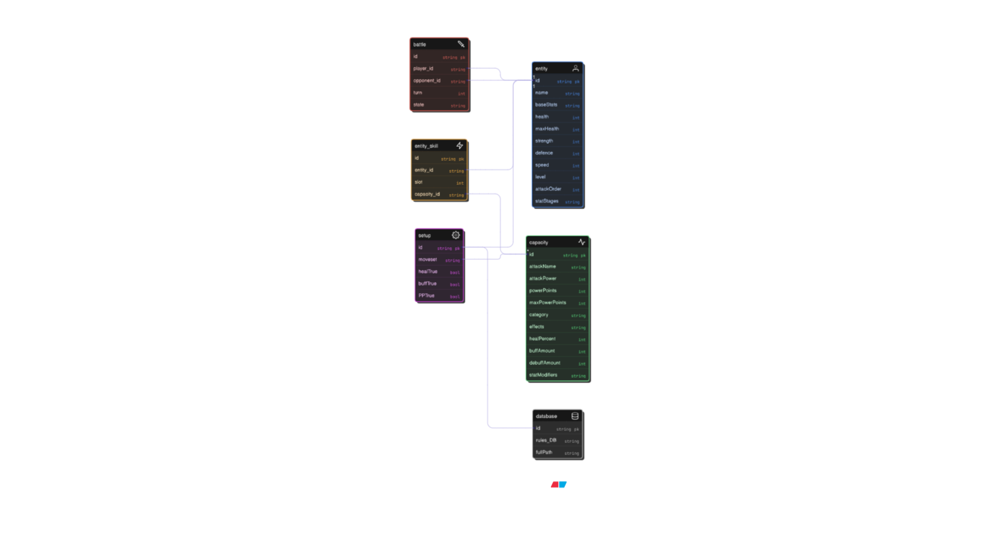

# Moonshot Project: KriticalHit - Technical Specifications

| Author        | Paul NOWAK |
|---------------|------------ |
| Created       | July 12th 2024  |
| Last Modified | June 6th 2025  |
| Document Deadline | June 9th 2025 |

## Table of Contents

<details open>
<summary>Table of Contents</summary>

- [1. Overview](#1-overview)
  - [1.1 Document Purpose](#11-document-purpose)
  - [1.2 Project Presentation](#12-project-presentation)
  - [1.3 System Overview](#13-system-overview)
- [2. System Architecture](#2-system-architecture)
  - [2.1 App Architecture](#21-app-architecture)
  - [2.2 Modules and Components](#22-modules-and-components)
  - [2.3 Other External IT Tools](#23-other-external-it-tools)
- [3. Technologies Used](#3-technologies-used)
  - [3.1 Front End](#31-front-end)
  - [3.2 Back End](#32-back-end)
  - [3.3 Database Design](#33-database-design)
  - [3.4 Technical Constraints and Limitations](#34-technical-constraints-and-limitations)
  - [3.5 Non-Functional Requirements](#35-non-functional-requirements)
- [4. Application Features](#4-application-features)
  - [4.1 Setting Up Battle Templates](#41-setting-up-battle-templates)
  - [4.2 Rules Implementation](#42-rules-implementation)
  - [4.3 Characters Implementation](#43-characters-implementation)
  - [4.4 Stats Implementation](#44-stats-implementation)
  - [4.5 Skills Implementation](#45-skills-implementation)
  - [4.6 Statuses Implementation](#46-statuses-implementation)
  - [4.7 Battle Simulation](#47-battle-simulation)
  - [4.8 Script Converter](#48-script-converter)
- [5. Data Management](#5-data-management)
  - [5.1 Data Management Strategy](#51-data-management-strategy)
  - [5.2 Type of Data Storage](#52-type-of-data-storage)
  - [5.3 API for Handling Data](#53-api-for-handling-data)
  - [5.4 Data Flow Diagrams](#54-data-flow-diagrams)
  - [5.5 Data Security](#55-data-security)
- [6. Product Deployment](#6-product-deployment)
  - [6.1 Deployment Environment](#61-deployment-environment)
  - [6.2 Release Schedule](#62-release-schedule)
  - [6.3 Proof of Concepts](#63-proof-of-concepts)
  - [6.4 Beta Version](#64-beta-version)
  - [6.5 Full Versions](#65-full-versions)
- [7. Glossary](#7-glossary)

</details>

## 1. Overview

### 1.1 Document Purpose

This document has been created to provide the technical specification of a Moonshot Project named Kritical Hit. In fact, the Moonshot Project is a final evaluation imposed by the ALGOSUP school to create our own unique and professional project through the whole scolarity and to validate our Master level in Software development.

Furthemore, it's a complementary document to the Functionnal Specifications while showcasing the technical details required for the project and the strategies planned to accomplish it. 

### 1.2 Project Presentation

Kritical Hit is a Desktop Application and Game Development assistant tool designed to support the creation of Combat Design systems for RPG games, with a particular emphasis on the mechanics found in Pokémon-style gameplay.

The application will feature a **user-friendly interface** aimed at providing intuitive navigation across all tools and functionalities. Special attention will be given to ensuring accessibility for both novice and experienced developers. Users will easily access core modules such as battle simulation, character setup, and rule customization through clearly organized menus and visually guided workflows.

A key component of the interface will be the **Simulation Menu**, where users can test and visualize the behavior of an RPG game's combat system in real time. This simulation environment enables immediate feedback and iterative design, allowing developers to fine-tune their systems effectively.

Once users are familiar with the simulation tools, they can dive into the **template customization** system. Kritical Hit will support the creation, modification, and storage of multiple battle templates. These templates include settings for battle rules, character selection, and other RPG assets. The internal database will allow templates to be saved, loaded, and shared, making it easy to manage different combat configurations and test scenarios.

This structure ensures that developers can first explore, test, and refine ideas through the interface and simulation tools, before committing to more advanced template editing.

### 1.3 System Overview

The software will be developed as a **desktop application** to guarantee high performance and responsiveness, especially given the significant volume of data involved in RPG combat system design and simulation. This local setup ensures smooth functionality without relying on internet speed, which is essential for maintaining consistency during real-time simulations and UI interactions.

Kritical Hit will be developed using **C++** in combination with the **Qt framework**, leveraging its robust support for graphical user interface (GUI) development. **Qt Creator**, a dedicated IDE for Qt applications, will be used to manage the design and implementation of the interface and underlying logic.

Qt offers cross-platform capabilities and a comprehensive set of software libraries and APIs tailored for scalable desktop and embedded applications. This makes it a strong fit for building an application that is both **modular and maintainable**, while supporting rich UI features and responsive simulation tools essential for Kritical Hit’s goals.

The choice of C++ and Qt ensures that the application can handle complex data structures and intensive simulation processes, all while delivering a seamless and user-friendly interface experience.

## 2. System Architecture

### 2.1 App Architecture

The application was developed using the **Qt Framework**, specifically as a **Qt Widgets Application**. This format allows for a GUI based on `.ui` files designed visually with **Qt Designer**, while logic and behavior are implemented through **C++ source and header files**.

The project is configured to use:

- **Qt version**: 6.5.2  
- **Compiler**: MinGW 64-bit  
- **Build system**: `qmake` (Qt’s original build tool)

> Although Qt supports both `qmake` and `CMake`, the `qmake` system was selected for its simplicity and ease of use, especially for a first-time Qt-based project. Cross-platform portability was not a priority at this stage, making `qmake` a suitable choice.

The main project file `KriticalHit_App.pro` contains all configuration data required for building the application, including file references, compiler flags, and module dependencies.

---

#### File Structure Overview

The following is the actual **on-disk file organization**, presented as a tree structure:


``` 
/Kritical-Hit
├── .git/                       # Git version control data
├── Dev/
│   ├── KriticalHit_App/        # Main application source directory
│   │   ├── Images/             # Asset folder for image files
│   │   ├── *.cpp               # Source code implementing application logic
│   │   ├── *.h                 # Header files declaring classes and interfaces
│   │   ├── *.ui                # UI layout files created with Qt Designer
│   │   ├── *.ts                # Translation file for internationalization
│   │   ├── *.pro               # qmake project file
│   │   ├── License.txt         # MIT License
│   └── build-KriticalHit_App-Desktop_Qt_6_5_2_MinGW_64_bit-Debug/
│       ├── debug/, release/    # Compiled binaries
│       ├── *.ttf               # Custom font files
│       ├── *.db                # Local database used by the application
│       ├── Makefile.*          # Build instructions generated by qmake
│       ├── ui_*.h              # Auto-generated headers from .ui files
├── Documents/                  # Specifications, test plans, project docs
├── Prototypes/                 # Early Qt prototypes and feature experiments
└── README.md                   # Project overview and setup instructions 
```  

> **Note**: Qt Creator **does not display this structure directly**. In its *Projects* view, files are grouped virtually into categories such as:
> - **Headers** (`*.h`)
> - **Sources** (`*.cpp`)
> - **Forms** (`*.ui`)  
> This logical grouping is for readability and ease of navigation inside the IDE. It does not reflect actual physical storage.

### 2.2 Modules and Components

Qt Framework is integrated with several specialized cross plateforms applications called modules. Indeed, most of them remain source and binary and are generally useful on the majority of Qt applications

A module used for a special purpose is considered an add-on module even if it is available on all supported platforms.

Here are the main modules used for our QT project:

| **Name**      | **Description**                                                                 |
|---------------|----------------------------------------------------------------------------------|
| **Qt Core**       | Core module with signals/slots, object trees, and property management.          |
| **Qt GUI**        | Provides classes for windowing, 2D graphics, OpenGL, and text rendering.        |
| **Qt Test**       | Offers tools for unit testing, including QTest, QSignalSpy, and model testing.  |
| **Qt SQL**        | Provides classes for database integration using SQL and various backends.       |

Some of these modules contains several classes with their own utilities, such as **QDebug** for debugging, **QApplication** to  manages the GUI application's control flow and main settings, or even **QWidget** to handle User Interface objects.

Regular C++ libraries are also used like **string.h** to manage string objects or **random.h** to use random number generation.

In my project, I've also decided to set up my own functional modules, each having their own class, and these 3 are the most important:

- **Battle**: Is used to set up a battle between 2 characters, handles the battle logic and deal with the combat-related functions. 
- **Entity**: Represent a Pokemon character, that has his own attributes (Base stats, name, level) and his moveset that can go up to 4 capacity object. 
- **Capacity**: Represent a certain attack (also called move) having its own attribut (name, attack power, Power Points...). A file named 


- **setup**:
- **Database**: 




### 2.3 Other External IT Tools

## 3. Technologies Used

### 3.1 Front End

### 3.2 Back End

### 3.3 Database Design

### 3.4 Technical Constraints and Limitations

### 3.5 Non-Functional Requirements

## 4. Application Features

### 4.1 Battle Simulation

### 4.2 Rules Implementation

### 4.3 Characters Selection Implementation

### 4.4 Setting Up Battle Templates

### 4.5 Damage Calculator Implementation

## 5. Data Management

### 5.1 Data Management Strategy

### 5.2 Type of Data Storage

### 5.3 API for Handling Data

### 5.4 Data Flow Diagrams

### 5.5 Data Security

## 6. Product Deployment

### 6.1 Deployment Environment

### 6.2 Release Schedule

### 6.3 Proof of Concepts

### 6.4 Beta Version

### 6.5 Full Versions

## 7. Glossary

