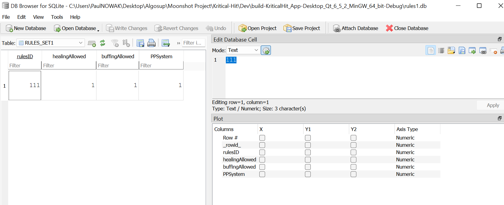

# Moonshot Project: KriticalHit - Technical Specifications

| Author        | Paul NOWAK |
|---------------|------------ |
| Created       | July 12th 2024 |
| Last Modified | June 9th 2025  |
| Document Deadline | June 9th 2025 |

## Table of Contents

<details open>
<summary>Table of Contents</summary>

- [1. Overview](#1-overview)  
  - [1.1 Document Purpose](#11-document-purpose)  
  - [1.2 Project Presentation](#12-project-presentation)  
  - [1.3 System Overview](#13-system-overview)  
- [2. System Architecture](#2-system-architecture)  
  - [2.1 App Architecture](#21-app-architecture)  
  - [2.2 Modules and Components](#22-modules-and-components)  
  - [2.3 Other External IT Tools](#23-other-external-it-tools)  
- [3. Technologies Used](#3-technologies-used)  
  - [3.1 Front End](#31-front-end)  
    - [3.1.1 Qt Creator IDE Overview](#311-qt-creator-ide-overview)  
    - [3.1.2 Design Mode and Widget Uses](#312-design-mode-and-widget-uses)  
    - [3.1.3 Edit Mode, Project Structure, and Development Tools](#313-edit-mode-project-structure-and-development-tools)  
    - [3.1.4 Signal & Slot System](#314-signal--slot-system)  
  - [3.2 Database Specifications](#32-database-specifications)  
  - [3.3 Technical Constraints and Limitations](#33-technical-constraints-and-limitations)  
  - [3.4 Non-Functional Requirements - Technical Implementation Details](#34-non-functional-requirements---technical-implementation-details)  
- [4. Application Features](#4-application-features)  
  - [4.1 Battle System Rules](#41-battle-system-rules)  
  - [4.2 Battle Simulation Core](#42-battle-simulation-core)  
  - [4.3 Main Battle Functions](#43-main-battle-functions)  
  - [4.4 Rules Implementation](#44-rules-implementation)  
  - [4.5 Characters Implementation](#45-characters-implementation)  
  - [4.6 Capacities Implementation](#46-capacities-implementation)  
  - [4.7 Setting Up Battle](#47-setting-up-battle)  
  - [4.8 Future Features](#48-future-features)  
- [5. Product Deployment](#5-product-deployment)  
  - [5.1 Deployment Environment](#51-deployment-environment)  
  - [5.2 Release Schedule](#52-release-schedule)  
- [6. Glossary](#6-glossary)  

</details>


## 1. Overview

### 1.1 Document Purpose

This document has been created to provide the technical specification of a Moonshot Project named Kritical Hit. In fact, the Moonshot Project is a final evaluation imposed by the ALGOSUP school to create our own unique and professional project through the whole scolarity and to validate our Master level in Software development.

Furthemore, it's a complementary document to the Functionnal Specifications while showcasing the technical details required for the project and the strategies planned to accomplish it. 

### 1.2 Project Presentation

Kritical Hit is a Desktop Application and Game Development assistant tool designed to support the creation of Combat Design systems for RPG games, with a particular emphasis on the mechanics found in Pokémon-style gameplay.

The application will feature a **user-friendly interface** aimed at providing intuitive navigation across all tools and functionalities. Special attention will be given to ensuring accessibility for both novice and experienced developers. Users will easily access core modules such as battle simulation, character setup, and rule customization through clearly organized menus and visually guided workflows.

A key component of the interface will be the **Simulation Menu**, where users can test and visualize the behavior of an RPG game's combat system in real time. This simulation environment enables immediate feedback and iterative design, allowing developers to fine-tune their systems effectively.

Once users are familiar with the simulation tools, they can dive into the **template customization** system. Kritical Hit will support the creation, modification, and storage of multiple battle templates. These templates include settings for battle rules, character selection, and other RPG assets. The internal database will allow templates to be saved, loaded, and shared, making it easy to manage different combat configurations and test scenarios.

This structure ensures that developers can first explore, test, and refine ideas through the interface and simulation tools, before committing to more advanced template editing.

### 1.3 System Overview

The software will be developed as a **desktop application** to guarantee high performance and responsiveness, especially given the significant volume of data involved in RPG combat system design and simulation. This local setup ensures smooth functionality without relying on internet speed, which is essential for maintaining consistency during real-time simulations and UI interactions.

Kritical Hit will be developed using **C++** in combination with the **Qt framework**, leveraging its robust support for graphical user interface (GUI) development. **Qt Creator**, a dedicated IDE for Qt applications, will be used to manage the design and implementation of the interface and underlying logic.

Qt offers cross-platform capabilities and a comprehensive set of software libraries and APIs tailored for scalable desktop and embedded applications. This makes it a strong fit for building an application that is both **modular and maintainable**, while supporting rich UI features and responsive simulation tools essential for Kritical Hit’s goals.

The choice of C++ and Qt ensures that the application can handle complex data structures and intensive simulation processes, all while delivering a seamless and user-friendly interface experience.

## 2. System Architecture

### 2.1 App Architecture

The application was developed using the **Qt Framework**, specifically as a **Qt Widgets Application**. This format allows for a GUI based on `.ui` files designed visually with **Qt Designer**, while logic and behavior are implemented through **C++ source and header files**.

The project is configured to use:

- **Qt version**: 6.5.2  
- **Compiler**: MinGW 64-bit  
- **Build system**: `qmake` (Qt’s original build tool)

> Although Qt supports both `qmake` and `CMake`, the `qmake` system was selected for its simplicity and ease of use, especially for a first-time Qt-based project. Cross-platform portability was not a priority at this stage, making `qmake` a suitable choice.

The main project file `KriticalHit_App.pro` contains all configuration data required for building the application, including file references, compiler flags, and module dependencies.

---

#### File Structure Overview

The following is the actual **on-disk file organization**, presented as a tree structure:


``` 
/Kritical-Hit
├── .git/                       # Git version control data
├── Dev/
│   ├── KriticalHit_App/        # Main application source directory
│   │   ├── Images/             # Asset folder for image files
│   │   ├── *.cpp               # Source code implementing application logic
│   │   ├── *.h                 # Header files declaring classes and interfaces
│   │   ├── *.ui                # UI layout files created with Qt Designer
│   │   ├── *.ts                # Translation file for internationalization
│   │   ├── *.pro               # qmake project file
│   │   ├── License.txt         # MIT License
│   └── build-KriticalHit_App-Desktop_Qt_6_5_2_MinGW_64_bit-Debug/
│       ├── debug/, release/    # Compiled binaries
│       ├── *.ttf               # Custom font files
│       ├── *.db                # Local database used by the application
│       ├── Makefile.*          # Build instructions generated by qmake
│       ├── ui_*.h              # Auto-generated headers from .ui files
├── Documents/                  # Specifications, test plans, project docs
├── Prototypes/                 # Early Qt prototypes and feature experiments
└── README.md                   # Project overview and setup instructions 
```  

### 2.2 Modules and Components

The **Qt Framework** is built around a set of modular libraries that provide specialized, cross-platform functionality. These **Qt modules** come in both source and binary form and are widely applicable across different Qt applications.

Modules with specific functionality (such as testing or database access) are often considered *add-on modules*, even when supported across all platforms.

Below are the main modules used in this project:

| **Module Name** | **Description**                                                                 |
|------------------|----------------------------------------------------------------------------------|
| **Qt Core**       | Provides the core functionality: event loops, signals/slots, object trees, and property management. |
| **Qt GUI**        | Offers classes for windowing, 2D graphics, OpenGL, fonts, and basic imaging.     |
| **Qt Test**       | Enables unit testing with tools like `QTest`, `QSignalSpy`, and model testers.   |
| **Qt SQL**        | Supports SQL-based database integration with various database backends.          |

Some of these modules contain classes with specialized utilities, such as:
- `QDebug` – for easy debugging output  
- `QApplication` – manages the GUI application’s main control flow  
- `QWidget` – base class for all UI objects

In addition to Qt modules, standard **C++ libraries** are also used in this project, including:
- `<string>` – for string management  
- `<random>` – for generating random numbers (e.g., simulating attack variability)

---

### Custom Functional Modules

To implement game-specific logic, several **custom functional modules** were developed. These contain the core functionality of the simulation:

- **`Battle`**: Manages the combat system between two characters, including turn-based logic and damage calculation.
- **`Entity`**: Represents a character (e.g., a Pokémon-like fighter), including its base stats, level, name, and a set of up to 4 `Capacity` objects.
- **`Capacity`**: Defines a move or ability (name, power, PP, type, etc.) used during battles.

Additional helper modules coordinate setup and data integration:

- **`Setup`**: Prepares the battle configuration, rules, and selected characters/movesets.
- **`Database`**: Manages the database connection and queries to store or retrieve character and template data.

---

### User Interface Structure

The project uses several `.ui` files (with associated `.cpp` and `.h` files) to design the user interface:

- **Main Window Menu**: Landing screen where users log in with email and password.
- **Simulation Menu**: Main interface where battles are run and simulated.
- **Template Main Menu**: Central hub that links to other menus and features.
- **Rules Menu**: Allows the user to view, edit, and save the rules applied to battles.

#### Planned UI Menus for Future Versions:

- **New Template Menu**: Allows users to create and customize new battle templates.
- **Template Gallery Menu**: Displays existing templates stored in the database.
- **Character Selection Menu**: Interface to pick 2 characters from a pool of 6.
- **Damage Calculator Menu**: Enables users to modify the damage formula based on stats and selected rules.

### 2.3 Other External IT Tools

The development and documentation of the project were supported by a variety of external IT tools. These tools cover a broad range of use cases, from code editing and version control to project management, design, and AI assistance.

| **Tool Name**                     | **Description**                                                                                                                                                   | **Used For**                                                                                          |
| --------------------------------- | ----------------------------------------------------------------------------------------------------------------------------------------------------------------- | ----------------------------------------------------------------------------------------------------- |
| **Visual Studio Code**            | Lightweight yet powerful source code editor with built-in support for JavaScript, TypeScript, Node.js, and extensions for C++, Python, Java, and more.            | Writing code, editing specification documents, and working with external prototypes.                  |
| **GitHub / GitHub Desktop**       | GitHub is a cloud-based platform for hosting and managing code repositories with Git version control. GitHub Desktop provides a user-friendly interface.          | Repository management, group collaboration, version control, creating issues and pull requests.       |
| **DB Browser**                    | A visual tool to create, design, and manage SQLite database files, supporting browsing, querying, and modifying database tables without needing SQL command line. | Managing database connections, executing queries, modifying tables, and inspecting database contents. |
| **ChatGPT (OpenAI)**              | An advanced AI chatbot built on GPT-4o, capable of answering questions, generating content, reviewing text, and even creating code.                               | Spelling checks, rewriting content, AI image generation for personas, brainstorming and ideation.     |
| **ClickUp**                       | A flexible project management tool for organizing tasks, tracking progress, and managing time with boards, lists, and timelines.                                  | Task and time management, sprint planning, collaborative project tracking.                            |
| **Microsoft Office 365 (Online)** | Web-based versions of Word, Excel, PowerPoint, and OneNote for collaborative editing and document management.                                                     | Writing weekly reports, project documentation, surveys (via Microsoft Forms).                         |
| **NinjaAI**                       | AI assistant specialized in rewriting and improving documents, reports, and written content with an emphasis on clarity and quality.                              | Reformulating technical content, improving documentation clarity, rewriting reports.                  |
| **Draw\.io (diagrams.net)**       | A free online diagram tool for creating flowcharts, UML diagrams, ER diagrams, and other graph-based visualizations.                                              | Designing workflows, technical diagrams, and logic flows.                                             |
| **Figma**                         | A collaborative design platform for UI/UX design, wireframes, and prototyping, enabling teams to work together in real time.                                      | UI prototyping, concept art, wireframes for menus and interactions.                                   |
| **Miro**                          | An online collaborative whiteboard platform for ideation, project planning, and team brainstorming.                                                               | Creating personas, team discussions, collaborative design thinking.                                   |
| **Eraser.io**                     | An AI-powered diagram generator that transforms text prompts into diagrams, charts, and visualizations.                                                           | Quickly generating UMLs, flowcharts, system architecture, and technical visuals based on text input.  |


## 3. Technologies Used

### 3.1 Front End

Kritical Hit’s front end is almost entirely developed using the **Qt framework**, which provides both the core libraries and the Qt Creator IDE for designing and building applications.

Qt allows for both visual design and low-level programming through `.ui` (user interface) files and C++/Python back-end integration. It is ideal for desktop applications with custom UI logic and cross-platform capabilities.

> 💡 To open a project, double-click the `.pro` file. Qt Creator launches and lets you work through different development modes.

---

### 3.1.1 Qt Creator IDE Overview 

Qt Creator is the official IDE for developing Qt-based applications. Here's an example screenshot of Kritical Hit's interface in **Design Mode**:


The Qt Creator interface in **Design Mode** is composed of several tools and panes. Here's a quick breakdown of the most important ones:

| **Component**         | **Description** |
|-----------------------|------------------|
| **1. Form Editor**         | Drag-and-drop interface to design windows using Qt Widgets. |
| **2. Welcome Mode**        | Start page for opening projects, viewing examples, or tutorials. |
| **3. Edit Mode**           | Modify source code and project files (`.cpp`, `.h`, `.ui`). |
| **4. Design Mode**         | Visual editing for `.ui` files with live layout previews. |
| **5. Debug Mode**          | Analyze runtime behavior, memory, and breakpoints. |
| **6. Projects Mode**       | Configure how your app is built and run. |
| **7. Help Mode**           | Access Qt framework and Qt Creator documentation. |
| **8. Kit Selector**        | Select the target platform (Debug/Release, Desktop/Embedded). |
| **9. Run Button**          | Build and run the application. |
| **10. Debug Button**       | Run debugger with optional breakpoints. |
| **11. Build Button**       | Compile the application. |
| **12. Widget Box**         | UI component toolbox: Buttons, Layouts, Containers, etc. |
| **13. Object Inspector**   | Hierarchical list of all widgets in the current form. |
| **14. Property Editor**    | Modify widget properties like text, visibility, font, etc. |
| **15. Output View**        | Shows logs from build, debug output, and app status messages. |

---

### 3.1.2 Design Mode and Widget Uses

**Design Mode** is the core feature of Qt Creator. It allows users to drag and drop UI elements directly into the form editor, making interface design intuitive and visual.

One of the primary UI elements is the **PushButton** widget, which provides a clickable command button.

When you select a PushButton and place it on the form editor, the **Object Inspector** automatically updates by adding the new widget as a child of the window widget.

To customize the button’s appearance, right-click it and select **Change StyleSheet**. This lets you modify properties like font family, background color, and dimensions. You can also apply stylesheets to other widgets, including the window itself. This approach allows styling multiple widgets of the same family using inheritance and C++ classes.

---

To set up the button to perform an action, right-click the button and choose: *Go to Slot* -> *QAbstractButton* -> *clicked*.

Qt Creator will automatically generate a new function within the window widget class that executes when the button is clicked. For example:

```cpp
void TemplateMainMenu::on_simulation_Button_clicked()
{
    ui->stackedWidget3->setCurrentIndex(1);
}
```

Additionally, the window widget’s header file is updated to include this new function as a **private slot**.


### 3.1.3 Edit Mode, Project Structure, and Development Tools

When working in **Edit Mode**, Qt Creator organizes files into virtual categories for better readability. This organization does not necessarily reflect the actual file system structure but helps developers quickly find relevant files.

| **Category**  | **Extension** | **Purpose**                                                 |
|---------------|---------------|-------------------------------------------------------------|
| **Headers**   | `.h`          | Define class interfaces, variables, constants, and method declarations. |
| **Sources**   | `.cpp`        | Implement the functionality of methods and logic declared in headers.  |
| **Forms**     | `.ui`         | XML-based layout files created via Design Mode, defining layout and widget properties. |

> ⚙️ `.ui` files are converted into auto-generated C++ code during compilation.

---

Qt Creator also provides many features that enhance development productivity:

- **Code completion**: Suggests class names, functions, and parameters as you type.
- **Semantic highlighting**: Uses color coding to distinguish types, variables, and functions.
- **Syntax error checking**: Displays inline errors while coding to catch mistakes early.
- **Documentation tooltips**: Hover over keywords or functions to view quick descriptions.
- **Live UI preview**: Changes made to `.ui` files instantly update the design view.
- **Git integration**: Commit, push, and track changes directly within the IDE.
- **Keyboard shortcuts**: Enable fast navigation and editing (can be customized or expanded later).

---

### 3.1.4 Signal & Slot System

Qt Creator uses a **Signals and Slots** mechanism to enable seamless communication between objects. This powerful event-driven model allows different widgets and windows to interact efficiently. Slots are essentially private functions tied to widget events, while signals notify other parts of the program when something happens, enabling connections between widgets across different windows.

---

To illustrate, consider the **QStackedWidget** class, which manages a stack of widgets where only one is visible at a time. It works with a system of pages and indexes to display different views within the same container.

For example, if you design **Page 1** with certain UI elements and switch to **Page 2** in Design Mode, Page 2 will initially appear empty until you add widgets to it. You can add a new page by right-clicking the `QStackedWidget` object in the Object Inspector.


Use the two arrows at the top-right corner of the stacked widget editor to navigate between pages. This lets you update and organize the widget hierarchy across different pages.

You can also programmatically control page navigation. For instance, when the stacked widget reaches a certain page, you can trigger it to switch to another widget or window.

---

#### Example: Navigating Between Menus Using Signals and Slots

Suppose you want to switch from the **Main Template Menu** to a **Simulation Menu**:

1. In `templatemainmenu.h`, include the header for the simulation menu:

    ```cpp
    #include "simulationmenu.h"
    ```

2. Declare a private member instance of `SimulationMenu` and a slot function to handle menu switching:

    ```cpp
    private:
        SimulationMenu _simInfo;
    private slots:
        void moveTemplateMenu();
    ```

3. In `simulationmenu.h`, declare a signal to indicate when the battle is finished:

    ```cpp
    signals:
        void battleFinished();
    ```

4. In `templatemainmenu.cpp` constructor, add the simulation menu widget to the stacked widget and connect the signal to the slot:

    ```cpp
    ui->stackedWidget3->insertWidget(1, &_simInfo);
    connect(&_simInfo, SIGNAL(battleFinished()), this, SLOT(moveTemplateMenu()));
    ```

---

Now, when the simulation button on the main template menu is clicked, the stacked widget index updates to show the simulation menu. When the battle ends (in `simulation.cpp`), you emit the `battleFinished()` signal:

```cpp
emit battleFinished();
```

This triggers *moveTemplateMenu()*, which resets the stacked widget index and returns the user to the main template menu page.

This system of signals and slots combined with stacked widgets provides a flexible and maintainable way to manage complex UI navigation and event handling in Qt applications.


### 3.2 Database Specifications

#### Overview

The application utilizes a **SQLite database** as its primary data storage solution.  
While the project does not implement a traditional backend or API architecture, the database serves as a *crucial component* for managing game rules and settings.

---

#### Current Database Implementation

##### Schema

The current database schema is defined as:

```sql
CREATE TABLE RULES_SET1 (
    rulesID INTEGER PRIMARY KEY NOT NULL,
    healingAllowed INTEGER NOT NULL,  -- Boolean (0/1)
    buffingAllowed INTEGER NOT NULL,  -- Boolean (0/1)
    PPSystem INTEGER NOT NULL         -- Boolean (0/1)
);
```


---

##### Error Handling

The application implements **basic error handling** through:

- Return value checking for database operations  
- Console logging via `qDebug()` for error tracking  
- Graceful failure handling with default values  
- Direct SQL error reporting through `QSqlError`  

---

##### Database Access

Database operations are performed using **raw SQL queries** through Qt's SQL modules.  
Example:


```cpp
QSqlQuery query(rules_DB);
query.prepare("UPDATE RULES_SET1 SET buffingAllowed = :val WHERE rulesID = 111");
query.bindValue(":val", value ? 1 : 0);
```

---

#### Setup Instructions

##### 1. Database Creation

- Use *DB Browser for SQLite* to create the initial database  
- Place the database file in the **Qt Project build folder**

##### 2. Project Configuration

- Add SQL module to project file (`.pro`):

```
QT += sql
```

- Include required headers in `mainwindow.h`:

```cpp
#include <QSqlDatabase>
#include <QSqlQuery>
#include <QSqlError>
#include <QDir>
```

##### 3. Connection Setup

- Add database connection variable to `mainwindow.h`:


```cpp
private:
    QSqlDatabase DB_Connection;
```

- Initialize connection in `mainwindow.cpp`:

```cpp
QDir databasePath;
QString path = databasePath.currentPath()+"/NAME.db";
DB_Connection = QSqlDatabase::addDatabase("QSQLITE");
DB_Connection.setDatabaseName(path);
```

---

#### Future Enhancements

The database structure will be expanded to include:

- **Battle template storage**  
- **Entity data management**  
- **Capacity object storage**

This expansion will improve memory efficiency by *moving data from runtime memory to persistent storage*.

---

#### Technical Notes

- SQLite was chosen for its *simplicity and easy integration* with Qt  
- Boolean values are stored as **integers (0/1)** due to SQLite limitations  
- Database file must reside in the **build folder** for runtime access  
- A **single database connection** is maintained throughout the application lifecycle  

---

#### Database Management

*DB Browser for SQLite* is used as the primary tool for:

- Table creation and modification  
- Data viewing and editing  
- SQL query execution  
- Database structure visualization



The class diagram below illustrates how the database integration fits into the overall application architecture:


### 3.3 Technical Constraints and Limitations

#### Development Environment Specifications
The development environment consists of a Windows 11 Pro (64-bit) system powered by an Intel® Core™ i7-1065G7 processor running at 1.30GHz with boost capabilities up to 1.50 GHz, supported by 16 GB of installed RAM, of which approximately 6 GB is utilized during application testing phases.

#### Current Technical Limitations
The application's development faces several significant constraints, particularly in memory management within the moveLibrary.h component, where attempts to expand beyond approximately 15 capacity objects result in application crashes, indicating a critical need for optimization through improved database implementation strategies.

Development is currently conducted using Qt version 6.5.2 with QMake as the build system, which presents its own set of limitations including reduced flexibility for large-scale projects, lack of support for complex build logic, and challenges in cross-platform dependency management that would be better addressed through CMake, especially for Qt 6+ projects.

#### Database Implementation Constraints
While the current SQLite implementation adequately handles basic rule storage, the database architecture requires significant optimization to manage larger datasets effectively. The setup and configuration process for database tables has proven more complex than anticipated, suggesting a need for streamlined database management procedures and improved architectural design to support future scalability requirements.

#### Development Environment Challenges
A significant technical constraint involves the debugging capabilities of the development environment, where disk management issues currently prevent the effective use of Qt Creator's integrated debugging tools, particularly when accessing the simulation menu. This limitation substantially impacts the development workflow and testing capabilities.

#### Testing and Deployment Limitations
The development and testing processes are currently restricted to a single Windows-based machine, which introduces potential risks in terms of unidentified platform-specific issues and cross-platform compatibility concerns. This single-environment testing limitation could potentially impact the application's reliability across different operating systems and hardware configurations.

#### Build System Considerations
The current utilization of QMake as the build system introduces several operational constraints, including the necessity for manual build process updates and limited integration capabilities with external tools. These limitations particularly affect the project's scalability and maintenance, suggesting that a future migration to CMake might be beneficial for more advanced development requirements.

#### Performance Monitoring Constraints
The current development environment lacks comprehensive tools for monitoring and optimizing memory usage, which has led to difficulties in identifying and resolving performance bottlenecks, particularly in relation to database operations and object management within the application's core functionality.

#### Future Considerations
These identified constraints and limitations are being actively addressed through planned improvements in database implementation, memory management strategies, and potential build system upgrades, with a focus on enhancing the application's stability, scalability, and overall performance characteristics.

### 3.4 Non-Functional Requirements - Technical Implementation Details

#### Performance Monitoring

**Current Status**
• No active performance monitoring tools implemented
• Response time requirements (100ms for clicks, 200ms for navigation) not currently measured
• Planning to implement QT Test module for performance testing and monitoring

**Planned Optimizations**
• Database architecture redesign to support larger datasets
• Implementation of performance benchmarking tools
• Integration of QT Test module for systematic testing

#### Configuration Management

**Interface Implementation**
• UI layouts managed through .ui files
• Widget placement, styling, and hierarchy controlled via Qt Designer
• Custom font implementation (PressStart2P-vaV7.ttf) through stylesheet configuration

**Current Limitations**
• Basic authentication system using simple if-else statements
• Limited user settings persistence
• No comprehensive configuration file structure

#### Security Implementation

**Current Status**
• Basic file operations without specific security measures
• Planned implementation of private database access
• No current mechanism for preventing data corruption
• Security measures for file operations to be implemented

**Future Security Enhancements**
• Implementation of file locking mechanisms
• Development of data corruption prevention strategies
• Enhanced database security protocols

#### System Compatibility

**Technical Requirements**
• Qt Version: 6.5.2
• Operating System: Windows 11 Pro
• Hardware Specifications:
* Processor: Intel® Core™ i7-1065G7 or equivalent
* RAM: Minimum 16 GB recommended
* Storage: Sufficient for application and database growth

**Development Approach**
• Platform-independent code implementation
• No OS-specific dependencies
• Designed for compatibility with standard Windows 11 Pro systems

#### Planned Technical Improvements

**Short-term Goals**
• Implementation of performance monitoring tools
• Development of robust configuration system
• Enhancement of file operation security

**Long-term Goals**
• Comprehensive testing framework implementation
• Database optimization and security enhancement
• Cross-platform compatibility testing
• Robust error handling and data corruption prevention

These technical specifications aim to support the non-functional requirements while ensuring system reliability, security, and performance optimization.

## 4. Application Features

### 4.1 Battle System Rules

The battle system is inspired by the traditional Pokémon mechanics and defines how turn-based encounters between creatures are resolved. This system aims to simulate strategic one-on-one combat with various tactical elements.

#### General Rule

- The primary objective of a battle is to reduce the opponent Pokémon's HP (Hit Points) to 0, resulting in a knockout (KO).

#### Pokémon Attributes

Each Pokémon possesses the following characteristics:

- **Level**: A numerical indicator of experience and power. It affects the damage calculation.
- **Stats (6 total)**:
  - **HP (Hit Points)**: Determines how much damage the Pokémon can receive before fainting.
  - **Attack**: Influences the damage dealt by physical moves.
  - **Defense**: Reduces incoming damage from physical attacks.
  - **Special Attack**: Influences the damage of special (non-physical) moves.
  - **Special Defense**: Reduces incoming damage from special moves.
  - **Speed**: Determines the order of actions in a turn; the faster Pokémon attacks first.

#### Typing System

- Each Pokémon can have **one or two types** (e.g., Fire, Water, Grass), and each move also has a type.
- **Type Effectiveness**:
  - Super effective: 2× damage
  - Not very effective: 0.5× damage
  - No effect (immunity): 0× damage
- **Same-Type Attack Bonus (STAB)**:
  - If a move's type matches one of the user's types, a **1.5× damage bonus** is applied.
- Understanding the **type chart** is critical for maximizing damage output.

#### Moves and Attacks

- A Pokémon can know **up to four different attacks**.
- Most attacks have:
  - **Power**: A base value that contributes to the damage dealt.
  - **PP (Power Points)**: Indicates how many times a move can be used.
    - If a move’s PP is depleted, it cannot be used.
    - If all moves have 0 PP, the Pokémon is considered to have no usable moves and may lose automatically (depending on system rules).
- Some moves are **non-offensive**:
  - **Healing moves** restore a portion of the user’s HP, usually based on a fixed percentage or stat-based formula.
  - **Stat-altering moves** can **buff (increase)** or **nerf (decrease)** stats between **-6 and +6 stages**. These changes are persistent until overridden.

#### Damage Calculation Formula

The damage dealt by an offensive move is calculated using the following base formula:

```text
BaseDamage = (((Level * 0.4 + 2) * Attack * Power) / (Defense * 50)) + 2
```

**Where:**
- `Level`: Level of the attacking Pokémon
- `Attack`: The attacker's stat (Attack or Special Attack, depending on move type)
- `Power`: The base power of the move
- `Defense`: The target's stat (Defense or Special Defense, based on move)
- The `+2` ensures minimum damage output

This base damage is then adjusted with the following multipliers:

```text
BaseDamage = (((Level * 0.4 + 2) * Attack * Power) / (Defense * 50)) + 2
```


**Multipliers:**
- `STAB`: 1.5 if the move type matches one of the attacker's types, otherwise 1
- `Effectiveness`: 2 for super effective, 0.5 for not very effective, 0 for immune
- `CriticalHit`: 1.5 if a critical hit occurs (12.5% or 1/8 chance), otherwise 1

#### Battle Flow

- Battles are **turn-based**, and **each side performs one action per turn**.
- The **faster Pokémon (higher Speed)** acts first.
- At the end of a turn, the player is prompted to choose the next action:
  - Select a move
  - Quit the battle (if permitted by the rules)

#### Strategy Considerations

- Players must find the best strategy to **defeat opponents quickly** or **survive longer**, depending on the situation.
- Understanding typing, move selection, stat advantages, and turn order is key to success.

#### Current Implementation

- The current version includes **2 distinct Pokémon** with different stats.
- Only the Attack, Defence, Speed and HP stats are used.
- All Pokémon use the **same moveset**.
- **Typing system is currently disabled** in this version. All damage calculations are neutral (no STAB, type effectiveness, or immunities applied).


### 4.2 Battle Simulation Core

#### Overview
The battle simulation core manages the turn-based combat system through the SimulationMenu widget. Here's a detailed breakdown of its key components and functionality.

#### Widget Initialization and Setup
The SimulationMenu widget is accessed via a pushbutton from the template main menu. During the showEvent(), the widget:

- Initializes the battle through **initializeBattle()**
- Sets up character displays and HP bars
- Configures the battle scene with graphical elements
- Starts a 2-second timer before enabling player input

#### Core Battle Functions

##### Battle Flow Control

- **initializeBattle()**: Creates characters, movesets, and battle instance using the Setup class
- **playerTurn(int move)**: Handles player move execution and result processing
- **enemyTurn()**: Manages AI opponent moves using random selection (25% chance per move)
- **secondCharacterPerform(bool isPlayer, int move)**: Coordinates second character's turn
- **goToNextTurn()**: Advances turn counter and updates battle state

##### Move Resolution System

- **handleMoveResult()**: Processes move outcomes including:
  - Damage calculation and HP updates
  - Healing effects
  - Stat modifications
  - Battle continuation checks
  - PP (Power Points) management

##### Status Management

- Dynamic status messages display battle events through:
  - showStatusMessage() for fixed states
  - showDynamicStatusMessage() for action-specific updates
- Battle state tracking using the **MoveResultState** struct:

```cpp
struct MoveResultState {
    bool continueBattle;
    bool hasHealing;
    bool hasBuffing;
    Entity* character;
    std::shared_ptr<capacity> moveUsed;
};
```

##### UI and Control Management
- Attack buttons are disabled during move animations
- Battle completion triggers **battleFinished()** signal
- Memory management includes proper cleanup of battle objects
- HP bars update in real-time using percentage calculations

### 4.3 Main Battle Functions

#### Core Combat Mechanics

- **calculateDamage()**: Computes damage using the formula:

```cpp
damage = (((level * 0.4 + 2) * attack * power) / (defense * 50)) + 2
```

- **performMove()**: Executes moves and applies their effects
- **applyEffect()**: Processes different effect types (Attack, Heal, Buff)

#### State Management
- Battle progression tracked through **BattleState** enum:

```cpp
enum class BattleState {
    Start,
    WaitingForPlayer,
    Animating,
    Finished
};
```
- Turn order determined by **checkAttackOrder()** based on speed stats

#### Effect System

- **EffectResult** struct tracks move outcomes:

```cpp
struct EffectResult {
    int damageDealt;
    int hpHealed;
    short int attackBoost;
    short int defenceBoost;
    short int speedBoost;
};
```

- Stat modifications handled through **getStatMultiplier()**:
  - Positive stages: (2 + stage) / 2
  - Negative stages: 2 / (2 - stage)
  - Clamped between -6 and +6

#### AI Implementation
- Enemy moves selected using **randomMoveIndex()**
- Utilizes C++'s std::mt19937 random number generator
- Each move has equal 25% selection probability

### 4.4 Rules Implementation

The rules system implementation involves several key components working together:

#### Database Initialization

The database connection is initially established in **templateMainMenu.cpp** when its constructor is called. This is a crucial first step as all rule operations depend on having an active database connection.

#### Navigation to Rules Menu

When a user clicks the rules button in the template main menu, the stackedWidget index is updated to display the rules menu widget. This transition is handled through Qt's widget stacking system.

#### Rules State Management

The rulesMenu class interacts with the database class to manage rule states:

1. When the rules menu is displayed, the `showEvent` method is triggered and:
- Calls `database::getAllRules()` to retrieve the current state of all rules
- Updates the UI checkboxes to reflect the current rule states:

  ```cpp
  QMap<QString, bool> rules = database::getAllRules();
  ui->healing_checkBox->setChecked(rules["healingAllowed"]);
  ui->buffing_checkBox->setChecked(rules["buffingAllowed"]);
  ui->PP_checkBox->setChecked(rules["PPSystem"]);
  ```

2. When the user clicks the Confirm button:
- The current state of all checkboxes is captured
- `database::setAllRules()` is called to update all rules simultaneously:
  ```cpp
  bool newHealValue = ui->healing_checkBox->isChecked();
  bool newBuffValue = ui->buffing_checkBox->isChecked();
  bool newPPValue = ui->PP_checkBox->isChecked();
  database::setAllRules(newHealValue, newBuffValue, newPPValue);
  ```
- The `rulesConfirmed` signal is emitted to trigger the return to the template main menu


This implementation ensures efficient rule state management with minimal database operations by using batch updates instead of individual rule updates. The signal-slot mechanism handles the navigation flow, maintaining a clean separation between the UI and business logic.

### 4.5 Characters Implementation

#### Entity Class Overview

The Entity class serves as the foundation for all characters in the game, implementing core functionality for managing character stats and abilities. It represents any creature that can participate in battles, with comprehensive stat management and skill systems.


#### Stats Management System

##### Base Stats

The base stats are stored in a vector `_baseStats` and represent the character's innate, unchangeable attributes:

```cpp
void Entity::setBaseStats(int health, int strength, int defence, int speed) {
    _baseStats[0] = health;    // Base HP
    _baseStats[1] = strength;  // Base Strength
    _baseStats[2] = defence;   // Base Defence
    _baseStats[3] = speed;     // Base Speed
}
```

##### Dynamic Stats

While base stats remain constant, the actual battle stats (`_health`, `_strength`, `_defence`, `_speed`) can be modified during gameplay:

• Initially set to match their corresponding base stats:
```cpp
_maxHealth = _baseStats[0];
_health = _baseStats[0];
_strength = _baseStats[1];
_defence = _baseStats[2];
_speed = _baseStats[3];
```

• Can be temporarily modified through buffs/nerfs using the stat stage system:

```cpp
void Entity::setStatStage(StatType stat, int stage) {
    if (stage > 6) stage = 6;      // Cap maximum buff
    if (stage < -6) stage = -6;    // Cap maximum nerf
    _statStages[static_cast<int>(stat)] = stage;
}
```


#### Health Management

The `checkHealth()` function ensures health values remain within valid bounds:

```cpp
void Entity::checkHealth() {
    if (getHealth() > getMaxHealth()) {
        setHealth(getMaxHealth());    // Prevent overhealing
    } else if (getHealth() < 0) {
        setHealth(0);                 // Prevent negative health
    }
}
```

This function is crucial for maintaining game balance by:
• Preventing health from exceeding maximum health after healing
• Ensuring health doesn't go below zero when taking damage
• Maintaining consistent health state throughout battle

This implementation creates a robust system where characters have permanent base attributes while allowing for dynamic stat modifications during gameplay, all while maintaining proper boundaries for health values.

### 4.6 Capacities Implementation

#### Core Structure and Enumerations

The capacity system is built around several key enumerations that define the fundamental types of moves and effects:

```cpp
enum class MoveCategory {
    Physical,
    Special,
    Status
};

enum class EffectType {
    Attack,
    Buff,
    Debuff,
    Heal
};

enum class StatType {
    Strength,
    Defence,
    Speed
};
```

#### Stat Modification System

The `StatModifier` struct provides a robust way to define stat changes:

```cpp
struct StatModifier {
    StatType stat;    // Which stat to modify
    int amount;       // Modification magnitude (+/-)
};
```

This structure is crucial for implementing buff/debuff mechanics, allowing precise control over:
• Which stat is being modified (Strength/Defence/Speed)
• The magnitude and direction of the modification
• Multiple modifications from a single capacity


#### Capacity Class Implementation

The capacity class maintains several key attributes:

```cpp
protected:
    std::string _attackName;
    int _attackPower;
    int _powerPoints;
    int _maxPowerPoints;
    MoveCategory _category;
    std::vector<EffectType> _effects;
    std::vector<StatModifier> _statModifiers;
```

#### Power Point (PP) Management

The PP system is implemented through the `useCapacity()` function:

```cpp
bool capacity::useCapacity() {
    if (_powerPoints > 0) {
        _powerPoints--;
        return true;
    }
    return false;
}
```

This ensures:
• Moves can only be used if PP is available
• PP decrements after each use
• Moves become unusable when PP reaches 0

#### Integration with Entity System

Each Entity maintains a moveset of 4 capacities:

```cpp
std::array<capacity, 4> _skillList;
```

This allows:
• Each entity to have a unique set of moves
• Moves to be accessed and modified individually
• PP tracking for each move separately


#### Stat Modification Tracking

The system includes comprehensive stat tracking:

```cpp
std::vector<int> capacity::getStatChangeSummary() const {
    std::vector<int> summary(3, 0);  // Tracks all stat changes
    for (const auto& modifier : _statModifiers) {
        switch (modifier.stat) {
            case StatType::Strength: summary[0] += modifier.amount; break;
            case StatType::Defence:  summary[1] += modifier.amount; break;
            case StatType::Speed:    summary[2] += modifier.amount; break;
        }
    }
    return summary;
}
```
This implementation provides a robust foundation for complex battle mechanics while maintaining clear separation of concerns and efficient resource management.

### 4.7 Setting Up Battle

#### Rule Management System

The Setup class serves as the battle initialization controller, managing game rules and move configurations. It interfaces with the database to retrieve rule states:

```cpp
Setup::Setup() {
    healTrue = database::getHealingRule();
    buffTrue = database::getBuffingRule();
    PPTrue = database::getPPRule();
    
    initializeMoveset();
    filterMoveset();
}
```

#### Rule Implementation

Three core gameplay rules are managed:
1. `healingAllowed` (healTrue): Controls whether healing moves are permitted
2. `buffingAllowed` (buffTrue): Determines if stat-boosting moves are allowed
3. `PPSystem` (PPTrue): Enables/disables the Power Point system for move usage

#### Moveset Management

The moveset system implements rule-based move filtering through two key functions:

```cpp
void Setup::initializeMoveset() {
    moveset = {
        MoveLibrary::Pound,
        MoveLibrary::TakeDown,
        MoveLibrary::Recover,    // Healing move
        MoveLibrary::SwordDance  // Buff move
    };
}

void Setup::filterMoveset() {
    for (auto& move : moveset) {
        const std::vector<EffectType>& effects = move.getEffects();
        
        // Rule-based move replacement
        if (!healTrue && hasHealEffect(effects)) {
            move = MoveLibrary::VineWhip;
        }
        else if (!buffTrue && hasBuffEffect(effects)) {
            move = MoveLibrary::Bite;
        }
    }
}
```

#### PP System Integration

The PP system is integrated into the battle mechanics through the attack button handlers:

```cpp
void SimulationMenu::on_attackButton_1_clicked() {
    if (battleSetup->getPPRule() == false || player->getNewSkill(0).useCapacity()) {
        newCheckAttack(0);
    } else {
        QMessageBox::warning(this, "No PP Left", "This move cannot be used anymore.");
    }
}
```

This implementation:
• Checks if PP system is enabled
• Verifies PP availability before allowing move usage
• Provides user feedback when moves are depleted
• Maintains move usage tracking throughout the battle

The Setup class is always instantiated before battle initiation, ensuring all rules and movesets are properly configured before combat begins. This creates a robust foundation for rule-based gameplay mechanics while maintaining clean separation of concerns.

### 4.8 Future Features

#### Planned Database Extensions

The current implementation lays the groundwork for several advanced features that would require more sophisticated database structures:


##### Character Selection System

```sql
-- Character Base Table
CREATE TABLE Characters (
    characterID INTEGER PRIMARY KEY,
    name TEXT NOT NULL,
    baseHP INTEGER,
    baseStrength INTEGER,
    baseDefense INTEGER,
    baseSpeed INTEGER
);

-- Team Configuration Table
CREATE TABLE Teams (
    teamID INTEGER PRIMARY KEY,
    userID INTEGER,
    slot1_characterID INTEGER,
    slot2_characterID INTEGER,
    FOREIGN KEY (slot1_characterID) REFERENCES Characters(characterID),
    FOREIGN KEY (slot2_characterID) REFERENCES Characters(characterID)
);

-- Character Movesets Table
CREATE TABLE CharacterMovesets (
    characterID INTEGER,
    moveID INTEGER,
    slot INTEGER CHECK (slot BETWEEN 1 AND 4),
    PRIMARY KEY (characterID, slot),
    FOREIGN KEY (characterID) REFERENCES Characters(characterID)
);
```

##### Damage Calculator Database

```sql
-- Damage Formula Configuration
CREATE TABLE DamageCalculator (
    calculatorID INTEGER PRIMARY KEY,
    formulaVersion TEXT,
    baseMultiplier FLOAT,
    criticalHitModifier FLOAT,
    effectivenessModifier FLOAT
);

-- or for text-based algorithm storage:
CREATE TABLE DamageAlgorithms (
    algorithmID INTEGER PRIMARY KEY,
    algorithmText TEXT,
    inputParameters TEXT,
    lastModified TIMESTAMP
);
```

##### Battle Template System

```sql
-- Master Template Table
CREATE TABLE BattleTemplates (
    templateID INTEGER PRIMARY KEY,
    templateName TEXT,
    rulesSetID INTEGER,
    characterSetID INTEGER,
    calculatorID INTEGER,
    FOREIGN KEY (rulesSetID) REFERENCES RULES_SET1(rulesID),
    FOREIGN KEY (characterSetID) REFERENCES Teams(teamID),
    FOREIGN KEY (calculatorID) REFERENCES DamageCalculator(calculatorID)
);
```

#### Integration Points

The system would require several key integration components:

1. Character Management:

```cpp
class CharacterManager {
    QSqlDatabase characterDB;
    std::vector<Entity*> availableCharacters;
    
    void loadCharacterFromDB(int characterID);
    void updateMovesetWithRules(Entity* character, const RuleSet& rules);
};

```

2. Dynamic Damage Calculation:

```cpp
class DamageCalculator {
    QSqlDatabase formulaDB;
    
    float calculateDamage(const Attack& attack, const Entity& attacker, const Entity& defender);
    void loadFormulaParameters();
};
```

3. Template Management:

```cpp
class BattleTemplateManager {
    QSqlDatabase templateDB;
    
    void loadTemplate(int templateID);
    void saveTemplate(const BattleConfiguration& config);
    void applyTemplateRules(int templateID);
};
```

These planned features would significantly expand the system's capabilities while maintaining the current architecture's modularity and rule-based approach. The database structure would support complex relationships between different game elements while allowing for flexible configuration and easy expansion.

## 5. Product Deployment

### 5.1 Deployment Environment

#### Build Configuration
1. Project Configuration:
- Switch build configuration from Debug to Release mode in Qt Creator
- Optimize compilation settings for release deployment
- Remove debug symbols and assertions

#### Package Creation

```bash
# Directory structure for deployment
KriticalHit/
├── KriticalHit.exe        # Main executable
├── rules1.db             # Database file
├── qt6core.dll          # Qt dependencies
├── qt6gui.dll
├── qt6widgets.dll
└── platforms/           # Qt platform plugins
    └── qwindows.dll
```

#### Distribution Process
1. Create deployment package:
- Compress project folder and build folder into ZIP archive
- Include all necessary DLL files and dependencies
- Ensure database file is properly packaged

2. User Installation:
- Extract ZIP file to desired location
- Run KriticalHit.exe directly
- No additional framework installation required
- All dependencies included in package

3. Documentation:
- Installation instructions available in README.md
- Download links provided in project repository
- System requirements listed in documentation


### 5.2 Release Schedule

| Version | Release Date | Status      | Key Features                                                                 |
|---------|--------------|-------------|------------------------------------------------------------------------------|
| 1.0     | June 9, 2025 | ✅ Confirmed | - Basic battle system<br>- Rule customization<br>- Initial moveset           |
| 1.5     | TBD          | 🔄 Planned   | - Type System<br>- Nerfing Moves <br>- Custom movesets           |
| 2.0     | TBD          | 🔄 Planned   | - Character Selection<br>- Expanded Stats<br>  |
| 2.5     | TBD          | 🔄 Planned   | - Battle Template Management<br>- Damage Calculator Menu<br>  |

Each release will undergo thorough testing and quality assurance before deployment. Version numbers reflect significant feature additions and improvements to the core gameplay experience.

## 6. Glossary

| **Term**                  | **Definition**                                                                 |
|---------------------------|--------------------------------------------------------------------------------|
| **AI Opponent**           | A non-player character that selects moves using automated logic.               |
| **Battle State**          | Enum representing the different stages of battle (e.g., Start, Finished).      |
| **Battle System**         | The rules and logic governing turn-based combat between entities.             |
| **Buff**                  | An increase in a stat (e.g., Strength +1 stage).                              |
| **Capacity**              | A move or skill that an Entity can use in battle.                             |
| **Character Selection**   | A feature allowing users to choose entities before battle begins.             |
| **Critical Hit**          | A bonus damage event that occurs randomly during attacks (usually 1.5×).      |
| **Database**              | A structured data system (SQLite) used for storing rules, entities, and templates.|
| **Damage Calculator**     | The logic or module responsible for computing how much damage a move inflicts.|
| **EffectResult**          | A structure capturing the outcome of a move, including damage or stat changes.|
| **EffectType**            | The category of effect applied by a move (e.g., Attack, Heal, Buff, Debuff).  |
| **Entity**                | A character or combatant in the simulation, similar to a Pokémon.             |
| **Healing Move**          | A capacity that restores HP to the user.                                      |
| **MoveCategory**          | Classification of a move: Physical, Special, or Status.                       |
| **MoveResultState**       | A structure used to track the outcome of a turn and whether the battle continues.|
| **Move Set**              | The list of up to 4 capacities assigned to an Entity.                         |
| **Nerf**                  | A decrease in a stat (e.g., Speed -2 stages).                                 |
| **Object Inspector**      | Qt Designer panel that shows all widgets in a UI hierarchy.                   |
| **PP (Power Points)**     | The number of times a move can be used before becoming unusable.              |
| **QStackedWidget**        | A Qt widget that displays one child widget at a time, used for menu navigation.|
| **QWidget**               | A base class for all UI components in Qt.                                     |
| **Qt Creator**            | The official IDE used to develop Qt-based applications.                       |
| **Qt Designer**           | A visual tool within Qt Creator used to design `.ui` files.                   |
| **Qt Framework**          | The C++ framework used to develop the application and UI.                     |
| **RuleSet**               | A collection of gameplay rules (e.g., whether healing or buffing is allowed). |
| **Setup Module**          | Initializes the simulation, loading rules and configuring entities.           |
| **Signal & Slot**         | Qt’s event system allowing widgets to communicate.                            |
| **Simulation Core**       | The backend logic that controls turn order, move effects, and battle flow.    |
| **Simulation Menu**       | The main interface where users execute and visualize battles.                 |
| **STAB**                  | Same-Type Attack Bonus; a damage multiplier for moves matching the user's type.|
| **Template**              | A predefined set of rules and entities used to quickly set up battles.        |
