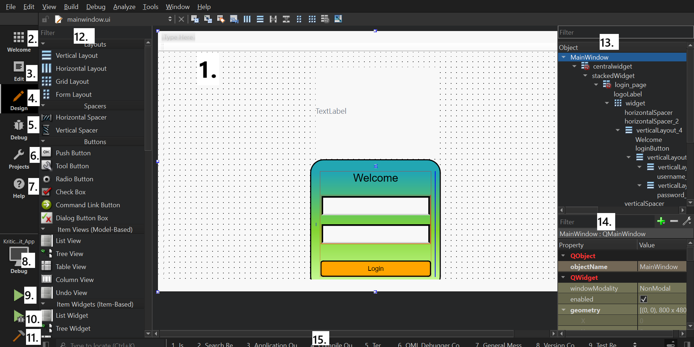
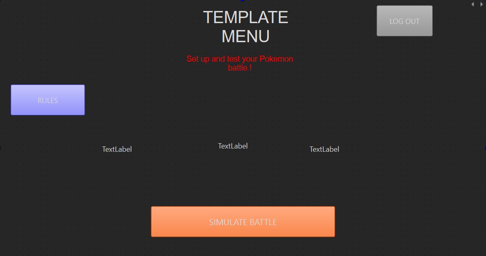

# Moonshot Project: KriticalHit - Technical Specifications

| Author        | Paul NOWAK |
|---------------|------------ |
| Created       | July 12th 2024  |
| Last Modified | June 6th 2025  |
| Document Deadline | June 9th 2025 |

## Table of Contents

<details open>
<summary>Table of Contents</summary>

- [1. Overview](#1-overview)
  - [1.1 Document Purpose](#11-document-purpose)
  - [1.2 Project Presentation](#12-project-presentation)
  - [1.3 System Overview](#13-system-overview)
- [2. System Architecture](#2-system-architecture)
  - [2.1 App Architecture](#21-app-architecture)
  - [2.2 Modules and Components](#22-modules-and-components)
  - [2.3 Other External IT Tools](#23-other-external-it-tools)
- [3. Technologies Used](#3-technologies-used)
  - [3.1 Front End](#31-front-end)
  - [3.2 Back End](#32-back-end)
  - [3.3 Database Design](#33-database-design)
  - [3.4 Technical Constraints and Limitations](#34-technical-constraints-and-limitations)
  - [3.5 Non-Functional Requirements](#35-non-functional-requirements)
- [4. Application Features](#4-application-features)
  - [4.1 Setting Up Battle Templates](#41-setting-up-battle-templates)
  - [4.2 Rules Implementation](#42-rules-implementation)
  - [4.3 Characters Implementation](#43-characters-implementation)
  - [4.4 Stats Implementation](#44-stats-implementation)
  - [4.5 Skills Implementation](#45-skills-implementation)
  - [4.6 Statuses Implementation](#46-statuses-implementation)
  - [4.7 Battle Simulation](#47-battle-simulation)
  - [4.8 Script Converter](#48-script-converter)
- [5. Data Management](#5-data-management)
  - [5.1 Data Management Strategy](#51-data-management-strategy)
  - [5.2 Type of Data Storage](#52-type-of-data-storage)
  - [5.3 API for Handling Data](#53-api-for-handling-data)
  - [5.4 Data Flow Diagrams](#54-data-flow-diagrams)
  - [5.5 Data Security](#55-data-security)
- [6. Product Deployment](#6-product-deployment)
  - [6.1 Deployment Environment](#61-deployment-environment)
  - [6.2 Release Schedule](#62-release-schedule)
  - [6.3 Proof of Concepts](#63-proof-of-concepts)
  - [6.4 Beta Version](#64-beta-version)
  - [6.5 Full Versions](#65-full-versions)
- [7. Glossary](#7-glossary)

</details>

## 1. Overview

### 1.1 Document Purpose

This document has been created to provide the technical specification of a Moonshot Project named Kritical Hit. In fact, the Moonshot Project is a final evaluation imposed by the ALGOSUP school to create our own unique and professional project through the whole scolarity and to validate our Master level in Software development.

Furthemore, it's a complementary document to the Functionnal Specifications while showcasing the technical details required for the project and the strategies planned to accomplish it. 

### 1.2 Project Presentation

Kritical Hit is a Desktop Application and Game Development assistant tool designed to support the creation of Combat Design systems for RPG games, with a particular emphasis on the mechanics found in Pokémon-style gameplay.

The application will feature a **user-friendly interface** aimed at providing intuitive navigation across all tools and functionalities. Special attention will be given to ensuring accessibility for both novice and experienced developers. Users will easily access core modules such as battle simulation, character setup, and rule customization through clearly organized menus and visually guided workflows.

A key component of the interface will be the **Simulation Menu**, where users can test and visualize the behavior of an RPG game's combat system in real time. This simulation environment enables immediate feedback and iterative design, allowing developers to fine-tune their systems effectively.

Once users are familiar with the simulation tools, they can dive into the **template customization** system. Kritical Hit will support the creation, modification, and storage of multiple battle templates. These templates include settings for battle rules, character selection, and other RPG assets. The internal database will allow templates to be saved, loaded, and shared, making it easy to manage different combat configurations and test scenarios.

This structure ensures that developers can first explore, test, and refine ideas through the interface and simulation tools, before committing to more advanced template editing.

### 1.3 System Overview

The software will be developed as a **desktop application** to guarantee high performance and responsiveness, especially given the significant volume of data involved in RPG combat system design and simulation. This local setup ensures smooth functionality without relying on internet speed, which is essential for maintaining consistency during real-time simulations and UI interactions.

Kritical Hit will be developed using **C++** in combination with the **Qt framework**, leveraging its robust support for graphical user interface (GUI) development. **Qt Creator**, a dedicated IDE for Qt applications, will be used to manage the design and implementation of the interface and underlying logic.

Qt offers cross-platform capabilities and a comprehensive set of software libraries and APIs tailored for scalable desktop and embedded applications. This makes it a strong fit for building an application that is both **modular and maintainable**, while supporting rich UI features and responsive simulation tools essential for Kritical Hit’s goals.

The choice of C++ and Qt ensures that the application can handle complex data structures and intensive simulation processes, all while delivering a seamless and user-friendly interface experience.

## 2. System Architecture

### 2.1 App Architecture

The application was developed using the **Qt Framework**, specifically as a **Qt Widgets Application**. This format allows for a GUI based on `.ui` files designed visually with **Qt Designer**, while logic and behavior are implemented through **C++ source and header files**.

The project is configured to use:

- **Qt version**: 6.5.2  
- **Compiler**: MinGW 64-bit  
- **Build system**: `qmake` (Qt’s original build tool)

> Although Qt supports both `qmake` and `CMake`, the `qmake` system was selected for its simplicity and ease of use, especially for a first-time Qt-based project. Cross-platform portability was not a priority at this stage, making `qmake` a suitable choice.

The main project file `KriticalHit_App.pro` contains all configuration data required for building the application, including file references, compiler flags, and module dependencies.

---

#### File Structure Overview

The following is the actual **on-disk file organization**, presented as a tree structure:


``` 
/Kritical-Hit
├── .git/                       # Git version control data
├── Dev/
│   ├── KriticalHit_App/        # Main application source directory
│   │   ├── Images/             # Asset folder for image files
│   │   ├── *.cpp               # Source code implementing application logic
│   │   ├── *.h                 # Header files declaring classes and interfaces
│   │   ├── *.ui                # UI layout files created with Qt Designer
│   │   ├── *.ts                # Translation file for internationalization
│   │   ├── *.pro               # qmake project file
│   │   ├── License.txt         # MIT License
│   └── build-KriticalHit_App-Desktop_Qt_6_5_2_MinGW_64_bit-Debug/
│       ├── debug/, release/    # Compiled binaries
│       ├── *.ttf               # Custom font files
│       ├── *.db                # Local database used by the application
│       ├── Makefile.*          # Build instructions generated by qmake
│       ├── ui_*.h              # Auto-generated headers from .ui files
├── Documents/                  # Specifications, test plans, project docs
├── Prototypes/                 # Early Qt prototypes and feature experiments
└── README.md                   # Project overview and setup instructions 
```  

### 2.2 Modules and Components

The **Qt Framework** is built around a set of modular libraries that provide specialized, cross-platform functionality. These **Qt modules** come in both source and binary form and are widely applicable across different Qt applications.

Modules with specific functionality (such as testing or database access) are often considered *add-on modules*, even when supported across all platforms.

Below are the main modules used in this project:

| **Module Name** | **Description**                                                                 |
|------------------|----------------------------------------------------------------------------------|
| **Qt Core**       | Provides the core functionality: event loops, signals/slots, object trees, and property management. |
| **Qt GUI**        | Offers classes for windowing, 2D graphics, OpenGL, fonts, and basic imaging.     |
| **Qt Test**       | Enables unit testing with tools like `QTest`, `QSignalSpy`, and model testers.   |
| **Qt SQL**        | Supports SQL-based database integration with various database backends.          |

Some of these modules contain classes with specialized utilities, such as:
- `QDebug` – for easy debugging output  
- `QApplication` – manages the GUI application’s main control flow  
- `QWidget` – base class for all UI objects

In addition to Qt modules, standard **C++ libraries** are also used in this project, including:
- `<string>` – for string management  
- `<random>` – for generating random numbers (e.g., simulating attack variability)

---

### Custom Functional Modules

To implement game-specific logic, several **custom functional modules** were developed. These contain the core functionality of the simulation:

- **`Battle`**: Manages the combat system between two characters, including turn-based logic and damage calculation.
- **`Entity`**: Represents a character (e.g., a Pokémon-like fighter), including its base stats, level, name, and a set of up to 4 `Capacity` objects.
- **`Capacity`**: Defines a move or ability (name, power, PP, type, etc.) used during battles.

Additional helper modules coordinate setup and data integration:

- **`Setup`**: Prepares the battle configuration, rules, and selected characters/movesets.
- **`Database`**: Manages the database connection and queries to store or retrieve character and template data.

#### Class Diagram

The following diagram illustrates the main classes and their relationships in version 1.0:


---

### User Interface Structure

The project uses several `.ui` files (with associated `.cpp` and `.h` files) to design the user interface:

- **Main Window Menu**: Landing screen where users log in with email and password.
- **Simulation Menu**: Main interface where battles are run and simulated.
- **Template Main Menu**: Central hub that links to other menus and features.
- **Rules Menu**: Allows the user to view, edit, and save the rules applied to battles.

#### Planned UI Menus for Future Versions:

- **New Template Menu**: Allows users to create and customize new battle templates.
- **Template Gallery Menu**: Displays existing templates stored in the database.
- **Character Selection Menu**: Interface to pick 2 characters from a pool of 6.
- **Damage Calculator Menu**: Enables users to modify the damage formula based on stats and selected rules.

### 2.3 Other External IT Tools

The development and documentation of the project were supported by a variety of external IT tools. These tools cover a broad range of use cases, from code editing and version control to project management, design, and AI assistance.

| **Tool Name**           | **Description**                                                                                                                                                  | **Used For**                                                                                          |
|--------------------------|------------------------------------------------------------------------------------------------------------------------------------------------------------------|--------------------------------------------------------------------------------------------------------|
| **Visual Studio Code**   | Lightweight yet powerful source code editor with built-in support for JavaScript, TypeScript, Node.js, and extensions for C++, Python, Java, and more.         | Writing code, editing specification documents, and working with external prototypes.                  |
| **GitHub / GitHub Desktop** | GitHub is a cloud-based platform for hosting and managing code repositories with Git version control. GitHub Desktop provides a user-friendly interface.      | Repository management, group collaboration, version control, creating issues and pull requests.       |
| **ClickUp**              | A flexible project management tool for organizing tasks, tracking progress, and managing time with boards, lists, and timelines.                                | Task and time management, sprint planning, collaborative project tracking.                            |
| **Draw.io (diagrams.net)** | A free online diagram tool for creating flowcharts, UML diagrams, ER diagrams, and other graph-based visualizations.                                             | Designing workflows, technical diagrams, and logic flows.                                             |
| **Figma**                | A collaborative design platform for UI/UX design, wireframes, and prototyping, enabling teams to work together in real time.                                   | UI prototyping, concept art, wireframes for menus and interactions.                                   |
| **Miro**                 | An online collaborative whiteboard platform for ideation, project planning, and team brainstorming.                                                            | Creating personas, team discussions, collaborative design thinking.                                   |
| **Microsoft Office 365 (Online)** | Web-based versions of Word, Excel, PowerPoint, and OneNote for collaborative editing and document management.                                              | Writing weekly reports, project documentation, surveys (via Microsoft Forms).                         |
| **ChatGPT (OpenAI)**     | An advanced AI chatbot built on GPT-4o, capable of answering questions, generating content, reviewing text, and even creating code.                             | Spelling checks, rewriting content, AI image generation for personas, brainstorming and ideation.     |
| **NinjaAI**              | AI assistant specialized in rewriting and improving documents, reports, and written content with an emphasis on clarity and quality.                            | Reformulating technical content, improving documentation clarity, rewriting reports.                  |
| **Eraser.io**            | An AI-powered diagram generator that transforms text prompts into diagrams, charts, and visualizations.                                                         | Quickly generating UMLs, flowcharts, system architecture, and technical visuals based on text input.  |

## 3. Technologies Used

### 3.1 Front End

Kritical Hit’s front end is almost entirely developed using the **Qt framework**, which provides both the core libraries and the Qt Creator IDE for designing and building applications.

Qt allows for both visual design and low-level programming through `.ui` (user interface) files and C++/Python back-end integration. It is ideal for desktop applications with custom UI logic and cross-platform capabilities.

> 💡 To open a project, double-click the `.pro` file. Qt Creator launches and lets you work through different development modes.

---

### 3.1.1 Qt Creator IDE Overview 

Qt Creator is the official IDE for developing Qt-based applications. Here's an example screenshot of Kritical Hit's interface in **Design Mode**:



The Qt Creator interface in **Design Mode** is composed of several tools and panes. Here's a quick breakdown of the most important ones:

| **Component**         | **Description** |
|-----------------------|------------------|
| **1. Form Editor**         | Drag-and-drop interface to design windows using Qt Widgets. |
| **2. Welcome Mode**        | Start page for opening projects, viewing examples, or tutorials. |
| **3. Edit Mode**           | Modify source code and project files (`.cpp`, `.h`, `.ui`). |
| **4. Design Mode**         | Visual editing for `.ui` files with live layout previews. |
| **5. Debug Mode**          | Analyze runtime behavior, memory, and breakpoints. |
| **6. Projects Mode**       | Configure how your app is built and run. |
| **7. Help Mode**           | Access Qt framework and Qt Creator documentation. |
| **8. Kit Selector**        | Select the target platform (Debug/Release, Desktop/Embedded). |
| **9. Run Button**          | Build and run the application. |
| **10. Debug Button**       | Run debugger with optional breakpoints. |
| **11. Build Button**       | Compile the application. |
| **12. Widget Box**         | UI component toolbox: Buttons, Layouts, Containers, etc. |
| **13. Object Inspector**   | Hierarchical list of all widgets in the current form. |
| **14. Property Editor**    | Modify widget properties like text, visibility, font, etc. |
| **15. Output View**        | Shows logs from build, debug output, and app status messages. |

---

### 3.1.2 Design Mode and Widget Uses

**Design Mode** is the core feature of Qt Creator. It allows users to drag and drop UI elements directly into the form editor, making interface design intuitive and visual.

One of the primary UI elements is the **PushButton** widget, which provides a clickable command button.

When you select a PushButton and place it on the form editor, the **Object Inspector** automatically updates by adding the new widget as a child of the window widget.

To customize the button’s appearance, right-click it and select **Change StyleSheet**. This lets you modify properties like font family, background color, and dimensions. You can also apply stylesheets to other widgets, including the window itself. This approach allows styling multiple widgets of the same family using inheritance and C++ classes.

---

To set up the button to perform an action, right-click the button and choose: *Go to Slot* -> *QAbstractButton* -> *clicked*.

Qt Creator will automatically generate a new function within the window widget class that executes when the button is clicked. For example:

```cpp
void TemplateMainMenu::on_simulation_Button_clicked()
{
    ui->stackedWidget3->setCurrentIndex(1);
}
```

Additionally, the window widget’s header file is updated to include this new function as a **private slot**.


### 3.1.3 Edit Mode, Project Structure, and Development Tools

When working in **Edit Mode**, Qt Creator organizes files into virtual categories for better readability. This organization does not necessarily reflect the actual file system structure but helps developers quickly find relevant files.

| **Category**  | **Extension** | **Purpose**                                                 |
|---------------|---------------|-------------------------------------------------------------|
| **Headers**   | `.h`          | Define class interfaces, variables, constants, and method declarations. |
| **Sources**   | `.cpp`        | Implement the functionality of methods and logic declared in headers.  |
| **Forms**     | `.ui`         | XML-based layout files created via Design Mode, defining layout and widget properties. |

> ⚙️ `.ui` files are converted into auto-generated C++ code during compilation.

---

Qt Creator also provides many features that enhance development productivity:

- **Code completion**: Suggests class names, functions, and parameters as you type.
- **Semantic highlighting**: Uses color coding to distinguish types, variables, and functions.
- **Syntax error checking**: Displays inline errors while coding to catch mistakes early.
- **Documentation tooltips**: Hover over keywords or functions to view quick descriptions.
- **Live UI preview**: Changes made to `.ui` files instantly update the design view.
- **Git integration**: Commit, push, and track changes directly within the IDE.
- **Keyboard shortcuts**: Enable fast navigation and editing (can be customized or expanded later).

---

### 3.1.4 Signal & Slot System

Qt Creator uses a **Signals and Slots** mechanism to enable seamless communication between objects. This powerful event-driven model allows different widgets and windows to interact efficiently. Slots are essentially private functions tied to widget events, while signals notify other parts of the program when something happens, enabling connections between widgets across different windows.

---

To illustrate, consider the **QStackedWidget** class, which manages a stack of widgets where only one is visible at a time. It works with a system of pages and indexes to display different views within the same container.

For example, if you design **Page 1** with certain UI elements and switch to **Page 2** in Design Mode, Page 2 will initially appear empty until you add widgets to it. You can add a new page by right-clicking the `QStackedWidget` object in the Object Inspector.



Use the two arrows at the top-right corner of the stacked widget editor to navigate between pages. This lets you update and organize the widget hierarchy across different pages.

You can also programmatically control page navigation. For instance, when the stacked widget reaches a certain page, you can trigger it to switch to another widget or window.

---

#### Example: Navigating Between Menus Using Signals and Slots

Suppose you want to switch from the **Main Template Menu** to a **Simulation Menu**:

1. In `templatemainmenu.h`, include the header for the simulation menu:

    ```cpp
    #include "simulationmenu.h"
    ```

2. Declare a private member instance of `SimulationMenu` and a slot function to handle menu switching:

    ```cpp
    private:
        SimulationMenu _simInfo;
    private slots:
        void moveTemplateMenu();
    ```

3. In `simulationmenu.h`, declare a signal to indicate when the battle is finished:

    ```cpp
    signals:
        void battleFinished();
    ```

4. In `templatemainmenu.cpp` constructor, add the simulation menu widget to the stacked widget and connect the signal to the slot:

    ```cpp
    ui->stackedWidget3->insertWidget(1, &_simInfo);
    connect(&_simInfo, SIGNAL(battleFinished()), this, SLOT(moveTemplateMenu()));
    ```

---

Now, when the simulation button on the main template menu is clicked, the stacked widget index updates to show the simulation menu. When the battle ends (in `simulation.cpp`), you emit the `battleFinished()` signal:

```cpp
emit battleFinished();
```

This triggers *moveTemplateMenu()*, which resets the stacked widget index and returns the user to the main template menu page.

This system of signals and slots combined with stacked widgets provides a flexible and maintainable way to manage complex UI navigation and event handling in Qt applications.


### 3.2 Back End

### 3.3 Database Design

### 3.4 Technical Constraints and Limitations

### 3.5 Non-Functional Requirements

## 4. Application Features

### 4.1 Battle Simulation

### 4.2 Rules Implementation

### 4.3 Characters Selection Implementation

### 4.4 Setting Up Battle Templates

### 4.5 Damage Calculator Implementation

## 5. Data Management

### 5.1 Data Management Strategy

### 5.2 Type of Data Storage

### 5.3 API for Handling Data

### 5.4 Data Flow Diagrams

### 5.5 Data Security

## 6. Product Deployment

### 6.1 Deployment Environment

### 6.2 Release Schedule

### 6.3 Proof of Concepts

### 6.4 Beta Version

### 6.5 Full Versions

## 7. Glossary

