# Moonshot Project: Kritical Hit Written Report V1.0

| Author        | Paul NOWAK |
|---------------|------------ |
| Created       | June 9th 2025  |
| Last Modified | June 9th 2025  |
| Document Deadline | June 9th 2025 |

## Table of contents

<details open>

- [1. Introduction](#1-introduction)
   - [1.1. Document Purpose](#11-document-purpose)
   - [1.2. Overview](#12-overview)
- [2. Monthly Progress Reports](#2-monthly-progress-reports)
   - [2.1. 2023](#2023)
   - [2.2. 2024](#2024)
   - [2.3. 2025](#2025)
   - [2.4. Final Review](#final-review)
- [3. Functional Specifications](#3-functional-specifications)
   - [3.1. Overview](#31-overview)
      - [3.1.1. Document Purpose](#311-document-purpose)
      - [3.1.2. Context](#312-context)
      - [3.1.3. RPG Domain](#313-rpg-domain)
   - [3.2. Product Goal](#32-product-goal)
      - [3.2.1. Project Scope](#321-project-scope)
      - [3.2.2. Constraints](#322-constraints)
      - [3.2.3. Risks and Assumptions](#323-risks-and-assumptions)
   - [3.3. User Personas](#33-user-personas)
      - [3.3.1. Henri Hollais](#331-henri-hollais)
      - [3.3.2. Violet Hitgoh](#332-violet-hitgoh)
      - [3.3.3. Arun Reddy](#333-arun-reddy)
      - [3.3.4. Luke Atmadohg](#334-luke-atmadohg)
      - [3.3.5. Katrina Ladalh](#335-katrina-ladalh)
   - [3.4. List of Features](#34-list-of-features)
      - [3.4.1. User-Friendly Application](#341-user-friendly-application)
      - [3.4.2. Battle Interface and Flow Simulation](#342-battle-interface-and-flow-simulation)
      - [3.4.3. Battle Mechanics System](#343-battle-mechanics-system)
      - [3.4.4. Set Up Battle](#344-set-up-battle)
   - [3.5. Product Details](#35-product-details)
      - [3.5.1. Minimum Viable Product](#351-minimum-viable-product)
      - [3.5.2. Non-Functional Requirements](#352-non-functional-requirements)
      - [3.5.3. Acceptance Criteria](#353-acceptance-criteria)
      - [3.5.4. Out of Scope](#354-out-of-scope)
   - [3.6. Technical Stack & Requirements](#36-technical-stack--requirements)
      - [3.6.1. Development Environment](#361-development-environment)
      - [3.6.2. Database Overview](#362-database-overview)
      - [3.6.3. System Requirements](#363-system-requirements)
   - [3.7. Testing Strategy Overview](#37-testing-strategy-overview)
      - [3.7.1. Testing Objectives](#371-testing-objectives)
      - [3.7.2. Testing Scope](#372-testing-scope)
   - [3.8. User Interface & User Experience](#38-user-interface--user-experience)
      - [3.8.1. Importance](#381-importance)
      - [3.8.2. User Flowchart](#382-user-flowchart)
      - [3.8.3. UI Elements](#383-ui-elements)
      - [3.8.4. Accessibility and Responsiveness](#384-accessibility-and-responsiveness)
      - [3.8.5. Visual Feedback and Error Handling](#385-visual-feedback-and-error-handling)
   - [3.9. Glossary](#39-glossary)
      - [3.9.1. RPG Lexical Field](#391-rpg-lexical-field)
      - [3.9.2. Miscallenous](#392-miscallenous)
- [4. Technical Specifications](#4-technical-specifications)
   - [4.1. Overview](#41-overview)
      - [4.1.1. Document Purpose](#411-document-purpose)
      - [4.1.2. Project Presentation](#412-project-presentation)
      - [4.1.3. System Overview](#413-system-overview)
   - [4.2. System Architecture](#42-system-architecture)
      - [4.2.1. App Architecture](#421-app-architecture)
      - [4.2.2. Modules and Components](#422-modules-and-components)
      - [4.2.3. Other External IT Tools](#423-other-external-it-tools)
   - [4.3. Technologies Used](#43-technologies-used)
      - [4.3.1. Front End](#431-front-end)
      - [4.3.2. Database Specifications](#432-database-specifications)
      - [4.3.3. Technical Constraints and Limitations](#433-technical-constraints-and-limitations)
      - [4.3.4. Non-Functional Requirements - Technical Implementation Details](#434-non-functional-requirements---technical-implementation-details)
   - [4.4. Application Features](#44-application-features)
      - [4.4.1. Battle System Rules](#441-battle-system-rules)
      - [4.4.2. Battle Simulation Core](#442-battle-simulation-core)
      - [4.4.3. Main Battle Functions](#443-main-battle-functions)
      - [4.4.4. Rules Implementation](#444-rules-implementation)
      - [4.4.5. Characters Implementation](#445-characters-implementation)
      - [4.4.6. Capacities Implementation](#446-capacities-implementation)
      - [4.4.7. Setting Up Battle](#447-setting-up-battle)
      - [4.4.8. Future Features](#448-future-features)
   - [4.5. Product Deployment](#45-product-deployment)
      - [4.5.1. Deployment Environment](#451-deployment-environment)
      - [4.5.2. Release Schedule](#452-release-schedule)
- [5. Test Plan](#5-test-plan)
   - [5.1. Introduction](#51-introduction)
      - [5.1.1. Document Purpose](#511-document-purpose)
      - [5.1.2. Objectives](#512-objectives)
   - [5.2. Testing Strategy](#52-testing-strategy)
      - [5.2.1. Functional Testing](#521-functional-testing)
      - [5.2.2. Non-Functional Testing](#522-non-functional-testing)
      - [5.2.3. Regression Testing](#523-regression-testing)
   - [5.3. Testing Process](#53-testing-process)
      - [5.3.1. Environment Setup](#531-environment-setup)
      - [5.3.2. Test Development Structure](#532-test-development-structure)
      - [5.3.3. Test Execution Flow](#533-test-execution-flow)
      - [5.3.4. External Testing Protocol](#534-external-testing-protocol)
      - [5.3.5. Bug Tracking System](#535-bug-tracking-system)
      - [5.3.6. Test Execution Checklist](#536-test-execution-checklist)
   - [5.4. Main Features to Test](#54-main-features-to-test)
      - [5.4.1. Battle System Configuration](#541-battle-system-configuration)
      - [5.4.2. Simulation Interface](#542-simulation-interface)
      - [5.4.3. User Interface](#543-user-interface)
   - [5.5. Out of Scope Features](#55-out-of-scope-features)
      - [5.5.1. Feature Exclusion Overview](#551-feature-exclusion-overview)
      - [5.5.2. Future Implementation Possibilities](#552-future-implementation-possibilities)
      - [5.5.3. Testing Impact Analysis](#553-testing-impact-analysis)
      - [5.5.4. Documentation and Communication](#554-documentation-and-communication)
      - [5.5.5. Testing Preparation for Future Features](#555-testing-preparation-for-future-features)
   - [5.6. Hardware Requirements](#56-hardware-requirements)
      - [5.6.1. Testing Environment Specifications](#561-testing-environment-specifications)
      - [5.6.2. Test Environment Variations](#562-test-environment-variations)
      - [5.6.3. Input Device Testing](#563-input-device-testing)
      - [5.6.4. Performance Testing Tools](#564-performance-testing-tools)
      - [5.6.5. Testing Metrics](#565-testing-metrics)
   - [5.7. Environment Requirements](#57-environment-requirements)
      - [5.7.1. Development Environment Setup](#571-development-environment-setup)
      - [5.7.2. Testing Framework Configuration](#572-testing-framework-configuration)
      - [5.7.3. Version Control Strategy](#573-version-control-strategy)
      - [5.7.4. Test Environment Management](#574-test-environment-management)
      - [5.7.5. Quality Assurance Procedures](#575-quality-assurance-procedures)
   - [5.8. External User Testing](#58-external-user-testing)
      - [5.8.1. Participant Selection](#581-participant-selection)
      - [5.8.2. Test Environment Setup](#582-test-environment-setup)
      - [5.8.3. Testing Protocol](#583-testing-protocol)
      - [5.8.4. Data Collection and Analysis](#584-data-collection-and-analysis)
      - [5.8.5. Testing Management](#585-testing-management)
   - [5.9. Problem Reporting](#59-problem-reporting)
      - [5.9.1. Bug Classification System](#591-bug-classification-system)
      - [5.9.2. Documentation Process](#592-documentation-process)
   - [5.10. Risks and Assumptions](#510-risks-and-assumptions)
      - [5.10.1. Testing Risk Matrix](#5101-testing-risk-matrix)
      - [5.10.2. Testing Assumptions](#5102-testing-assumptions)
- [6. Test Cases](#6-test-cases)
   - [6.1. Battle Simulation](#61-battle-simulation)
      - [6.1.1. Unit Tests](#611-unit-tests)
      - [6.1.2. Integration Tests](#612-integration-tests)
      - [6.1.3. System Tests](#613-system-tests)
      - [6.1.4. Performance Tests](#614-performance-tests)
   - [6.2. Interface](#62-interface)
      - [6.2.1. Unit Tests](#621-unit-tests)
      - [6.2.2. Integration Tests](#622-integration-tests)
      - [6.2.3. System Tests](#623-system-tests)
      - [6.2.4. Performance Tests](#624-performance-tests)
   - [6.3. Template Configuration](#63-template-configuration)
      - [6.3.1. Unit Tests](#631-unit-tests)
      - [6.3.2. Integration Tests](#632-integration-tests)
      - [6.3.3. System Tests](#633-system-tests)
      - [6.3.4. Performance Tests](#634-performance-tests)
- [7. Bug Tracking](#7-bug-tracking)
   - [7.1. Bug Template](#71-bug-template)
   - [7.2. Unit Testing Bugs](#72-unit-testing-bugs)
   - [7.3. Interface Testing Bugs](#73-interface-testing-bugs)
   - [7.4. System Testing Bugs](#74-system-testing-bugs)
   - [7.5. Performance Testing Bugs](#75-performance-testing-bugs)
- [8. Glossary](#8-glossary)
   - [8.1. RPG Lexical Field](#81-rpg-lexical-field)
   - [8.2. Miscallenous](#82-miscallenous)

</details>

## 2. Monthly Progress Reports

### 2023

#### February 2023  

In December 2022, my Moonshot project named **KriticalHit** was validated by the Algosup team, who gave me the green light to start working on it.  

At the beginning of the year 2023, I started writing weekly reports about my activities on my computer. These are document summaries of my accomplishments, problems, observations, and goals that I need to achieve. I try to update them each day, if I manage to find time to work on the development of KriticalHit.  

Indeed, I wanted to leave a trace of any kind of work I was doing, in case I need to check older files for future work.  

Currently, I’m in the **pre-production phase** of KriticalHit, which means I am focusing on the planning and research aspects of the project.  

For now, I’m still trying to figure out how I will organize myself (tools to use, main tasks to accomplish) while researching valuable information related to my work. To have a good start, I need to clearly define the rules for how my product will work, so I can begin working on the functional and technical specifications.  

Now, I’m planning to use a **project management software** to organize all the data, tasks, documents, and progress of my work. I’ve done some research on the best options, and I’m currently hesitating between **Trello** and **Wrike**.  

Meanwhile, I’ve started researching **game engines** in general, such as **GameMaker** (a 2D game engine), to get an idea of how I could build my software.  

François Gutherz from **Harfang3D** gave me advice about how they developed Harfang3D, so I now have several leads on how I could design my own game engine.  

Finally, after gathering everything I need to manage my project and conducting my initial research, I will begin studying in more depth how to build KriticalHit and make a final decision:  

> **Will I build this software from scratch, or base it on an existing one?**  

#### March 2023 

I pursued my research about different game engines, like **Construct** or **GameMaker**, to get an idea of how my software would look like.  

Indeed, I’ve spoken to **Konstantinos Dimopoulos**, my Game Design teacher, about my project. I wanted to ask him for advice on how to make my engine as interactive and user-friendly as possible. While proposing some applications, he told me that he will contact me again if he finds any interesting **UI mock-up providers**.  

Then, a comrade advised me to use [**ClickUp**](https://clickup.com/) as a project management tool. So, I created a project for **Kritical Hit** where I’ve listed all my tasks, sorted them into different domains (**Planning**, **Research**, **Design**, **Development**, **Testing**, and **Deployment & Maintenance**) and by importance.  

### ClickUp Organization  

I also created a **Gantt diagram** to visualize my tasks and tried to plan how much time I would require to solve each of them. This view is very likely to change in the next weeks.  

After creating document templates for project management (continuous improvement and brainstorming subjects), I also started to follow a **C++ tutorial course** on YouTube by “**The Cherno**.”  

Finally, as I was still trying to figure out how to build my software (from scratch or based on another engine), after much research, I realized I would need to **list all the features** I want for my software. That way, I can decide what my engine will need and what it won’t need.  

So, I’ve created an **Excel Spreadsheet** to list all the features I would need, rank how important they are, and break them down into smaller tasks as much as possible.  

It would include things like:  
- *Will the main menu have a LEAVE button?*  
- *Will there be a confirmation window displayed when we click it?*  
- *What about the “save template” button? Will it have no confirmation window?*  

As many possibilities could be addressed, this spreadsheet will help me write my **functional specifications**. Once I decide everything I need, I’ll have a clearer view of what kind of engine I must build.

#### April 2023  

This month, I managed to complete my **Features List** for my **KriticalHit** project. Indeed, it contains details about each feature’s description, process, degree of importance, and requirements.  

[**KriticalHit Features list.xlsx**](#)  

In the process, **Konstantinos Dimopoulos** advised me not to detail the features too much and to focus more on the **core aspects**. Now, I need to validate them and decide which ones I will implement based on their importance.  

I managed to define the **milestones** to accomplish my project:

- Project Scope decided  
- UI Prototype finished  
- Software Development started  
- Quality Assurance Testing  
- User Acceptance Testing  
- Project Delivery  

Although I seem to have completed my task list, I still need to confirm the **time required** for each of them, as I struggle to make accurate estimations.  

In fact, I believe I should inquire more about the **average time required** for similar objectives and milestones.  

By the way, **Konstantinos Dimopoulos** suggested I use [**Figma**](https://www.figma.com/) as a prototype design tool. For that, I just need to watch some tutorials about it and explore the kinds of **UI mock-ups** I could create.


#### May 2023  

First, I finally finished detailing my **Features List** for **KriticalHit**. I also selected the ones I want to implement based on their **importance** and for **time management** purposes.

Then, I continued to look for a tool to help me create an interface and learned that **design-first prototype UIs** could cause backtracking issues. So, I decided to search for a tool to make a **code-based prototype** instead.

I found **UXPin**, a wonderful prototyping tool that includes built-in UI elements to help create an interface with a **code-based approach**.

Indeed, it’s possible to **export the prototype in full HTML**, but it isn’t integrated with the C++ language yet.

However, I discovered the possibility of using a **C++ web framework** that handles HTML elements, and I found [**Wt**](https://www.webtoolkit.eu/wt):

> Wt is a C++ library for creating web applications using HTML elements, and I would be interested in using it.

By the way, I decided to make **Kritical Hit** a **Desktop Application**, written in **C++**, built with **dynamic libraries** for performance, and using an **HTML interface**.

At the end of the month, I was finally able to **reorganize my tasks** and estimate how much time they would require. Of course, there’s no guarantee that the schedule will be 100% followed, but I’ll try my best to stick to it.

Indeed, it’s likely that I’ll **update it regularly** in the next few months.

#### June 2023  

At the start of the month, I created an account to test **UXPin**’s features through a **one-month free trial**.

I created a **test prototype** where I experimented with different symbols (circles, textboxes, etc.) and tried various interactions, such as:

- Moving an icon from one place to another by clicking on it  
- Changing an icon’s color while hovering the mouse  

Furthermore, UXPin allows you to add **states** to elements to create more unique interactions. I was able to create a **hidden menu** that scrolls in from the left when clicking on an icon.

---

To get more information about the **Wt framework**, I had a phone call with a manager named **Wim Dumon**. I initially intended to use Wt to create a **C++ desktop application** for better performance.

However, he explained that Wt is more focused on **web applications**, and advised me to use the **Qt framework**, which is more suitable for **desktop applications**.

---

Then, I did some research on a framework called **ORK**, which helps with creating **RPG games** in Unity.

I discovered that there are several types of **RPG battle systems**, and I should choose the ones most suitable for implementation in **KriticalHit**.

Indeed, I plan to **study ORK’s source code** so I can understand its architecture and potentially reuse parts of it in my own software.

---

Finally, I started drawing various **concept arts** for my application.

#### July 2023  


First of all, I started to research the **Qt Framework**: it’s a cross-platform software development framework that contains a comprehensive set of highly intuitive and modularized C++ library classes.

Indeed, it produces highly readable, easily maintainable, and reusable code with high runtime performance and a small footprint.

However, the full software is very expensive, and the free trial is only for 10 days. Although there is a free open-source version for smaller projects, I have yet to determine if it’s sufficient for my Moonshot project.

I found a tutorial on YouTube (created by Sciber) that allows us to create a small project with Qt. I tried to follow it, but I only managed to download a version of Qt used for designing and not for creating.

So, I sent a message to Sciber, who promised to help solve the issue for me.

Meanwhile, I’ve also decided to research **WebView2**: it’s a free service created by Microsoft Edge that allows us to embed web technologies (HTML, etc.) in a native C++ app.

I created a post on a Microsoft forum where I received a tutorial and a sample project to learn how to use WebView2. Then, I cloned the project from a GitHub repository and started following the tutorial.

Perhaps learning more about C++ again would help me continue this tutorial.

Finally, I continued to draw my concept arts for **Kritical Hit**. I also plan to detail more about what each feature can do.

#### August 2023  
 
This month, I tried to inquire more about **WebView2** and **Qt**.

First, I followed a tutorial for WebView2 which allowed me to open a window using Microsoft Edge.

I also discovered another tutorial showing how to embed web content into a native application. Indeed, it contains some use cases highlighting communication in WebView2, like sending messages from the host app to WebView2, for example.

Some lines of code from certain files use web code, but I have yet to manage modifying it so the HTML code can be changed during debugging.

Then, I’m still searching for **Qt Creator**, and I also created a post on the Qt forum for help.

As I’m still training in C++, I plan to create a simple text-based RPG program for practice, but also potentially to test possibilities for my app’s features.

Finally, I’ve been detailing sub-features for my app in my personal notes, and I plan to start writing my functional and/or technical specifications.

#### September 2023  


To begin with, I finally managed to try the Qt tutorial I found by reinstalling the application again. Indeed, I was able to create a small application with a simple calculator.

Then, I managed to contact M. Gutherz, my current computer science teacher, who is familiar with the Qt framework. I emphasized that I was looking for a GUI with good interactivity, so he advised me about **QML**, a GUI framework for Qt that offers a good trade-off.

Finally, I decided to ask Markus Adams, a teacher specialized in project management, to better estimate the time required for each of my tasks.


#### October & November 2023  


I figured out that I often underestimate the time required for my tasks in my Gantt chart, which can be found on my ClickUp account. Thanks to Markus Adams’ advice, a teacher specializing in project management, I decided to reorganize my tasks.

So, I decided to work on a project charter where I reworked my task list and estimated the time required for each.

Among the new objectives, I plan to make a roadmap on how to build my software step by step and gather all the information I need for writing my functional requirements.

Although, I still plan to run tests using the Qt framework and try creating software with a user-friendly interface.


#### December 2023 & January 2024 

I decided to start a new list of tasks for my Moonshot project. In fact, it contains more details about existing tasks, such as subtasks and dependencies, and they are organized into 10 phases: Planning/Initiation, User Research, Technical Requirements, Interface Design, Battle System Mechanics, Programming Setup, Code Creation, Docs and Tutorials, Testing & Q.A., and Software Launch.

[ClickUp Project Link](https://app.clickup.com/9003082302/v/g/8ca08hy-582)  Note: This link is now outdated.

Furthermore, I created a new Gantt diagram to schedule the tasks and estimate how much time they would require. I also plan to check their progress each week and verify if the deadlines are being met.

To finish the month of January, I have to start writing a new project charter (in a README file), set the milestones and KPIs, and also decide on the MVP (Minimum Viable Product).

#### Year-End Review
The first year was primarily focused on project planning, research, and foundational work:

**Key Achievements**:

- Project validation by ALGOSUP in December 2022
- Established project management system using ClickUp
- Completed initial features list and research on game engines
- Made key technology decisions (C++, Qt Framework)
- Created first concept arts
- Started learning required technical skills (C++, Qt)

**Main Challenges**:
- Difficulty estimating task durations accurately
- Uncertainty about whether to build from scratch or use existing engine
- Technical tool selection process took longer than expected
- Frequent schedule reorganization needed

**Overall Status**: The project remained in pre-production phase throughout 2023, with focus on planning and research rather than implementation. While this meant slower visible progress, it established important foundations.

### 2024 

#### February 2024  

This month, I managed to finish all the tasks required to achieve Phase 2: User Research. In fact, I mostly worked on setting up everything needed for the creation of the functional specifications.

For example, I defined a rough plan to make it, identified the targeted audience and market, and created several user personas.

Although I made some progress, I still have trouble finishing my tasks on time.

Indeed, I need to complete Phase 1 by starting to write the functional specifications. I must also decide on some technical details, start working on the UI, and imagine different scenarios for RPG battles.

#### March 2024  

I started to write the functional specifications for my Kritical Hit project.

As a help, I created a navigation roadmap for preparing the UI concept arts, conceived different battle test scenarios to decide the RPG features to implement, and started some research to prepare the technical specifications.

However, I had to delay many of my tasks and reorganize my task schedule because the number of tasks per week was too high. In fact, I believe I will need more time to achieve my Moonshot project.

I plan to complete the functional specifications this month and to monitor my progress on a weekly basis.

#### April & May 2024  

I’m still in the process of writing the functional specifications, as I need to carefully apply the MoSCoW matrix to the complete list of features.

I had to reorganize my schedule again, but I expect to finish the Functional Specifications in June.

Even though I believe my project will be done in C++, I plan to do some research to see if it could also be done in C#. If so, I might need another framework other than Qt.

Now, I have decided to create concept arts on Figma, working on the login and menu screens.


#### June 2024 & July 2024 & August 2024  

During my vacation, I had to modify the summary of the functional specifications document. I decided to provide more details about the UI interaction, which will be crucial for this project.

To complete that section, I continued working on the concept art, including the Battle template screen, which will be the core of the software.

Additionally, I finally completed the MoSCoW matrix. My plan is to reorganize my schedule based on the importance of the features.

There are five types of features that must be implemented:

- Template Creation  
- Character Creation  
- Stats Creation  
- Skills Creation  
- Status Creation  

Lastly, I created a Minimum Viable Product (MVP) of the app, where the first version contains only the app skeleton and the Template Creation menu.


#### September 2024  

Recently, I presented the progress of my current Moonshot Project to some of my comrades. Indeed, I mentioned that I might need another framework other than Qt if I plan to build the app using C# instead of C++.

Some of them found my project too ambitious, especially since I have never developed new software by myself, and advised me to make it an extension of a game engine like Unity instead.

Furthermore, they insisted that I should finish the specification documents and start coding as soon as possible, using the Agile methodology for better organization.

Finally, they proposed setting up a meeting with Franck, as I need to review the target problem of my Moonshot Project.


#### October 2024

Finally, I started the creation of a prototype for Kritical Hit, focused on giving a preview of the targeted User Interface.

Indeed, it’s based on Phase 1 of my Minimum Viable Product, including the navigation within the app and the template menu, and it contains the very first code files of my Moonshot project, placed within a new branch named “Prototype”.

Although it’s not ready to be tested yet after a total of 6 hours spent working on the prototype this month, I believe I will be able to finish it this November.

**SPRINT:** Honestly, I believe I didn’t spend enough time on my prototype, which resulted in some misunderstanding of several Qt tools.

Even if I’m mostly satisfied with several of the framework’s features to make my UI, I haven’t followed any complete tutorial videos because I have yet to test the various features I need.

Additionally, some of my tasks related to the technical specifications documents are overdue.

So, I need to update my ClickUp document, following only the order of tasks to be completed.


#### November 2024  

So far, I was able to build my first prototype and have a few people review it. The feedback I received often mentioned the overuse of colors and the lack of modernity in the design.

However, I found out that my prototype only showed a single feature, which simply introduced how my app’s interface worked, and never revealed the true potential of Kritical Hit.

Indeed, I need to build a new prototype showcasing the expected features, such as the simulation menu and the rules menu. I will use most of the criticism I gathered when testing my first prototype to build the new one.

However, I will have to complete this before the official 0.1 version of Kritical Hit, which will contain a cleaner version of the interface.

**SPRINT:** Although I managed to build my first prototype, I didn’t complete any official version on time. Furthermore, I haven’t started writing my Technical Specifications yet.

Another problem: some reviewers took too much time to provide feedback, and I lost time waiting before starting work on the next prototype.

What I need to change is to find a better way to select future testers, such as asking them in advance, and to move forward to the next update of Kritical Hit while the current version is still being tested.

Additionally, I need to conduct some technical research about potential Qt resources to help me build my app and gather knowledge for my Technical Specifications.


#### December 2024

I started working both on the 0.1 version of Kritical Hit and on writing my technical specifications.

Thanks to various tutorials and research, I was able to start getting used to using Qt Creator, but I still have a lot to learn.

I managed to integrate the login system for accessing the main menu, and I built my first two pages while trying to address the criticism from my first prototype.

Furthermore, I started writing my technical specifications by planning and gathering information about the potential Qt Creator modules required for our project.

**SPRINT:** My progress is slow, and I need to work more regularly.

Indeed, I believe I didn’t focus enough on the technical specifications while working on the unfinished version 0.1.

Next time, I need to balance my Moonshot Project working time between coding and writing documentation, as I haven’t even started my test plan yet.

In the end, I might need a mentor for my Moonshot project to provide advice both on my organization and my decisions.

### Year-End Review

The second year saw transition from planning to initial implementation:

**Key Achievements**:
- Completed user research phase
- Created functional specifications
- Developed first UI prototype
- Started actual coding with Qt Creator
- Refined project scope (focusing on Pokémon-style battles)
- Established MVP requirements
- Began technical specifications

**Main Challenges**:
- Continued issues with time management
- Project scope proved too ambitious initially
- Documentation fell behind implementation
- Prototype feedback highlighted need for design improvements
- Difficulty balancing coding vs documentation work

**Overall Status**: 2024 marked important transition from planning to implementation, though progress was slower than hoped. The project scope was successfully narrowed to something more achievable.

### 2025

#### January 2025  

The first month of the year was focused on database research.

Indeed, I discovered Power Designer to create a conceptual data model based on my needs and generate a database.

Then, I installed DB Browser to use the SQLite database, and I was able to create a prototype database test where I can perform different query operations: GET, UPDATE, INSERT, and DELETE.

**SPRINT:** Unfortunately, I focused too much on trying the database.

I need to work more regularly on coding as well as on the various documents required for the project. So, starting next month, I need to balance coding and document writing.

I should also implement sprints each week, so I need to update the monthly report template.

Finally, I plan to go to the ALGOSUP library to check resources about the Qt Framework, and I need to have a meeting with Franck to discuss the Moonshot project further.


#### February 2025  

That month, I was especially focused on the project code. Indeed, I took the opportunity to build new pages, `.ui` files, and new classes for my app.

Many changes were made during the vacation, as I realized the number of features I wanted to implement was too ambitious. Instead of creating an RPG simulator inspired by various RPG games, I decided to focus on the Pokémon battle mechanics.

That’s why I changed my priorities and decided to work on the simulation menu as soon as possible. In fact, I want to take an approach focused on implementing simpler features.

I’m satisfied with my progress, and I plan to have a first released version of my project ready by April 2025.


#### March 2025  

Despite medical conditions, I was able to make progress in the development of my project.

I reached a point where the simulation menu is closer to the original Pokémon games, with two attack actions possible and a Quit menu.

However, I focused a lot on creating the Simulation menu, so I need to reorganize my task schedule, especially the documentation tasks. Updating my MVP will require me to review the current version of my Functional Specifications.

As I plan to start working on the Rules menu, I should consider the interface design of the other menus and seek advice from other students regarding organization.


#### April 2025  

I managed to create and connect the Rules menu to my Simulation menu, allowing activation or deactivation of certain features, such as specific capacities or the PP system.

My simulation can now include healing and buffing moves, and I created new external files to set up the battle. However, I still encountered some issues, such as a crashing debug mode and a simple but defective AI entity.

I’m also close to finishing a new version of my Moonshot Project, but I need to consider whether I’ll be able to complete the next version by May.

Furthermore, I need to work more regularly on the documentation, starting with revising the functional specifications as soon as possible, followed by the other documents.

In any case, I plan to fix the AI issue and see if I can continue adding new features in May.


#### May 2025 

May 2025 marked the end of the code development phase for Kritical Hit, at least for the first version.

I had to stop adding new features in order to focus on completing the remaining documentation.

Since I was very late on the document due June 9th, I decided to use ChatGPT and NinjaAI to help speed up the process.

I rewrote the functional specifications and completed the test plan, but I still need to finish the test cases, bug tracking, and technical specifications. Additionally, I must review everything and eventually merge the documents into a single file.

The following month will be dedicated primarily to preparing for the oral presentation, where I need to develop a compelling 40-minute storytelling.

#### Partial Year Review (Through May)

The final months focused on completion and documentation:

**Key Achievements**:

- Implemented database functionality
- Created working battle simulation
- Added rules menu and game mechanics
- Developed AI system (though with issues)
- Started completing required documentation

**Main Challenges**:

- Time pressure to complete documentation
- Technical issues with AI and debugging
- Balancing feature completion with documentation needs
- Medical conditions affecting work in March

**Overall Status**: Project entered final phase with focus on completing minimum viable product and required documentation, though time pressure became significant factor.

### Final Review

The project evolved from an ambitious RPG battle simulator to a more focused Pokémon-style battle system, with steady if slower than planned progress toward completion. Each year showed distinct phases: planning (2023), implementation (2024), and completion/documentation (2025).

# 3. Functional Specifications

## 3.1. Overview

### 3.1.1. Document Purpose

This document has been written to provide the functional specification of a Moonshot Project named Kritical Hit. The Moonshot Project is a final evaluation imposed by the ALGOSUP school staff to create our unique and professional project through the whole scolarity and validate our Master's level in Software development.

### 3.1.2. Context

Video games have long been a cornerstone of the entertainment industry, generating approximately $180 billion annually. The market continues to evolve rapidly, driven by advancements in both hardware and software—particularly through the rise of powerful  game engines. While these engines are also utilized across various industries, they have revolutionized  game design by enabling the creation of more complex and sophisticated interactive experiences.

Despite these innovations, developing a video game remains a time-consuming and detail-oriented task for software engineers. With the rise of new technologies and changing audience expectations, modern games are expected to meet high standards in performance, quality, and depth to remain competitive and marketable.

Among all genres,  role-playing games (RPGs) hold a special place in the industry. They offer immersive storytelling, rich  character progression, and strategic battle systems that attract a wide and loyal audience.

A prime example is the  Pokémon franchise, which exemplifies the global appeal and commercial success of  RPGs. As of 2023, Pokémon is the highest-grossing entertainment media franchise in the world, having earned over 150 billion dollars in total revenue. This includes 30 billion dollars from video games alone and over 100 billion dollars from licensed merchandise. The core games in the Pokémon series follow a classic  RPG structure, where players assume the roles of  characters who captures, trains, and battles Pokémon with the ultimate goal of becoming the Pokémon Champion.

Building such  RPGs often requires dedicated  game design tools, particularly for crafting engaging battle  mechanics and managing complex character systems. However, current  game engine software tools often fall short—they may either lack essential resources or present interfaces that are not welcoming to new developers. Moreover, extending their functionality by adding  plugins can be too time-consuming or technically demanding for amateurs or solo designers.

This highlights a critical gap in the tools available for designing high-quality  RPG systems, especially for developers inspired by franchises like Pokémon but lacking the means or technical expertise to implement similarly rich gameplay experiences.

### 3.1.3. RPG Domain

An  RPG (Role-Play Game) is a game where the player embodies a fictional  character that will evolve, often alongside other characters, where he will accomplish diverse quests, fight enemies and explore a more or less imaginary world. Indeed, RPGs are based on a point system and experience level that can be increased and allow the player to get stronger and receive new  abilities.

Inspired by several sources like the Dungeon and Dragons pen-and-paper games and fantasy writings by authors like J. R. R. Tolkien,  RPGs bring a whole new concept of entertainment with the success of Franchises like Pokemon, Final Fantasy, and Dragon Quest. Throughout time, they have distinguished themselves in subgenres like Action RPG (including action gameplay) and MMORPG (online role-playing).

Each player chooses a  character, whether completely create him or embodying a defined one (like Cloud from Final Fantasy VII), and have the freedom to change its appearance (clothes, weapons, magic powers) and its  stats (strength, agility, vitality...).


## 3.2. Product Goal

### 3.2.1. Project Scope

To support both amateur  game design and professional developers, the goal of this project is to design a desktop application functioning similarly to a lightweight  game engine.

This software will feature an intuitive, user-friendly  UI to help users define and configure battle system rules for  RPGs in development. It aims to foster creativity and give users the flexibility to create a wide variety of RPG battle  templates with ease.

Inspired by iconic titles like  Pokémon, the application will include a  simulation interface that replicates the feel of a classic Pokémon battle, allowing users to test their systems familiarly and engagingly.

The following are the key features envisioned for the final product:

- The software will allow the user to navigate through the different menus with an understandable and colorful interface, similar to the game Super Mario Maker.

- Users will be able to simulate a  turn-based Pokémon-style battle between two sides, each selecting one of four available Pokémon before the fight begins.

- The system will include an integrated battle interface reminiscent of the original Pokémon games, allowing users to interactively test how their fight logic and rules behave in a  turn-based  simulation.

- A rules menu will allow users to enable or disable specific  mechanics—such as turn order logic,  stat caps, or  critical hit chance—before starting a new simulation.

- Battle  moves inspired by Pokémon will be available, including damaging attacks, healing actions,  buffs ( stat increases), and  nerfs ( stat reductions), offering a diverse range of effects to test.

- User can also create and load several many battle  templates in the application's  database to save a variety of battle rules.


### 3.2.2. Constraints

First and foremost, this project will be developed by a single individual with no prior experience in creating complete software independently. As part of the Moonshot Project, it must be completed alone, without active assistance from other students, teachers, or professionals.

Due to this context, no financial investments are possible. The project will rely entirely on a limited local budget, as well as the available hardware and software tools.

Additionally, the product will be developed under time constraints, as the contributor must balance this project alongside ongoing academic commitments. Although the Moonshot Project is required to validate the contributor’s degree, it does not follow a fixed deadline—task scheduling must therefore remain flexible and adapt to the progression of the contributor’s studies.

Finally, as the project now focuses specifically on implementing gameplay  mechanics inspired by Pokémon battles, this  game design choice inherently limits the versatility and creative freedom users may have when testing other types of combat systems. At least in the planned final version, the  simulation will be tailored to  turn-based, Pokémon-style encounters, potentially reducing support for broader  RPG battle variations.

#### Technical, Database, and Performance Constraints

The development environment being used is unfamiliar to the contributor, who is working with this tool for the first time. As such, the contributor may face difficulties understanding how the environment handles memory, manages technical specifications, and deals with performance and  database interactions. These challenges could impact the stability and efficiency of the application during development.

The project will be developed and tested exclusively on a single computer. Any technical limitations of this machine—including available RAM, processor capability, and storage—may directly influence development speed, build size, and runtime performance. Hardware issues or system-specific bugs may also go unnoticed due to the absence of cross-platform testing or deployment.

Moreover, the contributor lacks experience in designing, configuring, and integrating  databases within applications. This unfamiliarity may lead to inefficient  database schema structures, suboptimal query handling, and potentially poor data management practices. Such issues could hinder the application's performance, especially if real-time data access or scalability becomes necessary during later stages of development.

### 3.2.3. Risks and Assumptions

#### 3.2.3.1 Risks 
|   **Risk**  |   **Impact** |  **Mitigation**  |                     
|   :-------  |   :--------- |  :-------------  |
|   **Insufficient app responsive speed**  |   The computer's performance might not be fast enough to allow the user to test the app properly |  Extended research about the app's speed and responsiveness must be performed  |
|  **User-friendly interface bad outcomes**  |   Highlighting the importance of testing  UI  prototypes to balance usability and simplicity   |
|   **Complex UI effects** |   Some planned  UI widgets may be too difficult and complex to implement in the software and could decrease its responsiveness   |  Creation of  UI  prototypes   |
|   **Heavy database** |   The software's response could be slow due to the required amount of  database stored in  backend  |  Further studies of  database app storage   |

#### 3.2.3.2 Assumptions 
|   **Assumption**  |   **Impact** |  **Mitigation**  |                     
|   :-------  |   :--------- |  :-------------  |
|   **2D character models**  |   To simulate RPG battle, 2D  sprites should be represented as they require less space in the memory than 3D ones |  Finding how to integrate 2D  sprites in an app and make them react  |
|   **Tree representations**  |   It could bring visibility to the user to have a clearer view on certain features such as  stats |  Research on tree-like representation  UI models  |
|   **Interactive tutorial**  |   A tutorial could be added to help the user get familiarized with the product |  Search how to implement a tutorial in an app  |
|   **Battle systems RPG**  |    RPG battle systems are various and unique, so we need to make sure the user gets enough creativity for his taste|  Several battle systems must be tested out   |

## 3.3. User Personas

### 3.3.1. Henri Hollais

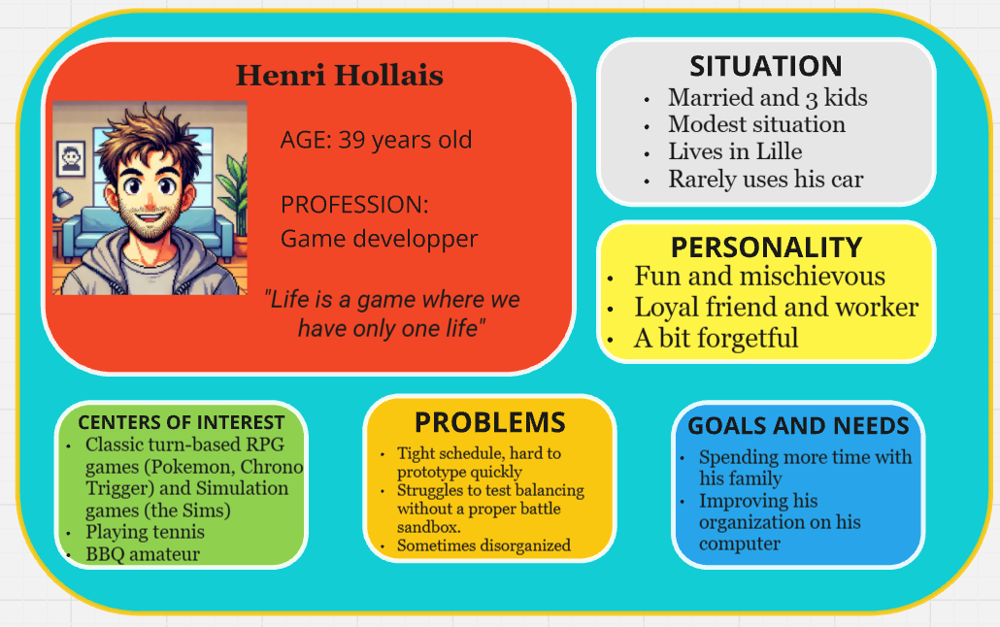

### 3.3.2. Violet Hitgoh

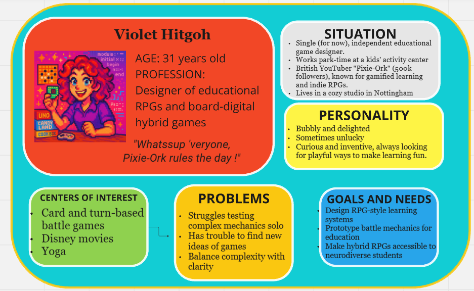

### 3.3.3. Arun Reddy

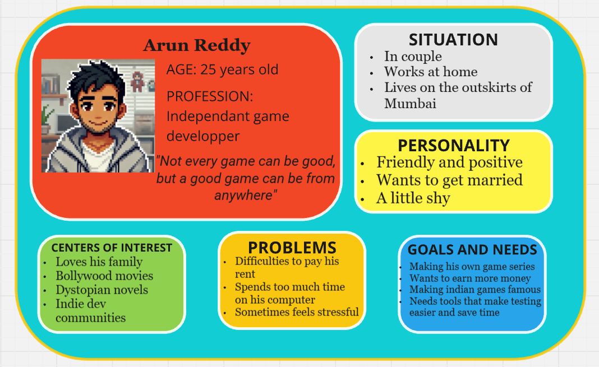

### 3.3.4. Luke Atmadohg

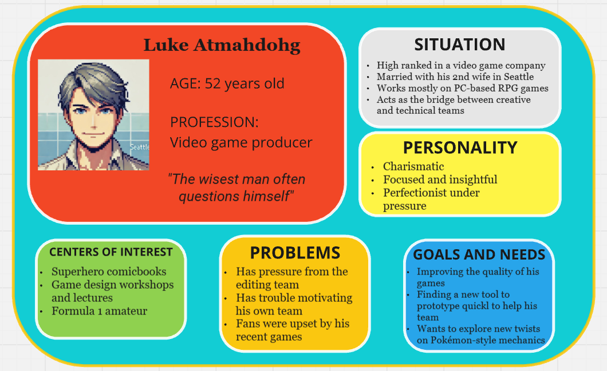

### 3.3.5. Katrina Ladalh

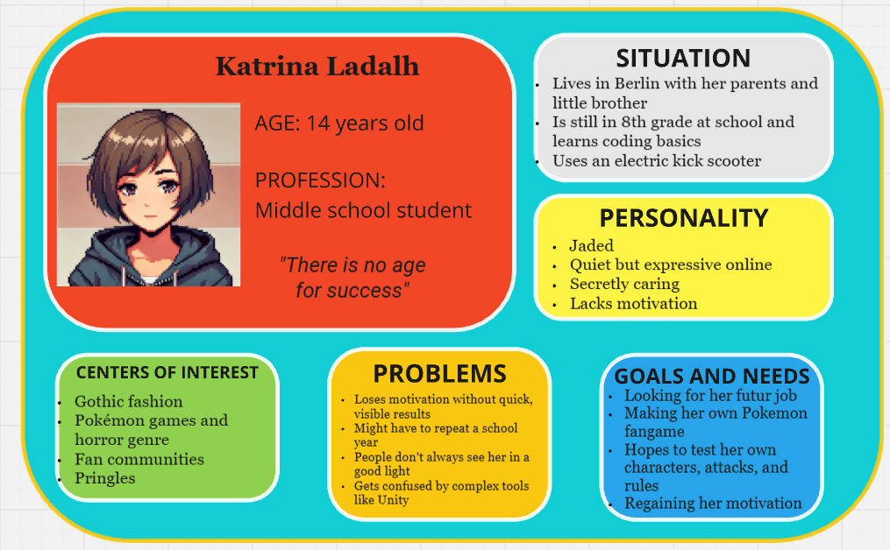

## 3.4. List of Features

The software includes a wide range of features, many of which may be difficult to implement during development. 

Therefore, the  MoSCoW matrix method will be used to prioritize each feature and sub-feature based on their likelihood of being implemented.

- **MUST-HAVE**: These features are mandatory and non-negotiable needs for this project.

- *SHOULD-HAVE*: These features are essential to the product, but they don't represent a vital part.

- COULD-HAVE: These features aren't necessary to the core product and have a much smaller impact if left out, but they are considered "nice to have".

### 3.4.1. User-Friendly Application

These features were designed to ensure the interactive appeal of *Kritical Hit* and allowed users to navigate seamlessly through the various menus.

#### 3.4.1.1 User Login System

| **Feature**                | **Description**                              | **Priority** |
| :------------------------- | :------------------------------------------- | :----------- |
| **User Login**             | Implement a login system for users           | COULD-HAVE         |
| ↳ **Validate Credentials** | Ensure user credentials are checked properly | COULD-HAVE           |
| ↳ **Error Messages**       | Display error messages when login fails      | COULD-HAVE           |

#### 3.4.1.2 Main Menu Page

| **Feature**                     | **Description**                                     | **Priority** |
| :------------------------------ | :-------------------------------------------------- | :----------- |
| **Main Menu UI**                | Build the main menu page                            | **MUST-HAVE**          |
| ↳ **Go to  Simulation Page**     | Allow navigation to the battle  simulation interface | **MUST-HAVE**         |
| ↳ **Go to Rules Menu**          | Allow access to the rules customization menu        | **MUST-HAVE**          |
| ↳ **Go to  Character Selection** | Navigate to Pokémon/ character selection screen      | COULD-HAVE          |
| ↳ **Go to  Damage Calculator** | Navigate to  Damage Calculator editor screen      | COULD-HAVE          |
| ↳ **Logout Button**             | Add a logout option to exit the user session        | COULD-HAVE          |

#### 3.4.1.3 Responsive Design

| **Feature**           | **Description**                                 | **Priority** |
| :-------------------- | :---------------------------------------------- | :----------- |
| **Full-Screen Mode**  | Enable full-screen display for better immersion | COULD-HAVE           |
| ** Responsive Layout** | Ensure each page adapts to various screen sizes | COULD-HAVE          |


### 3.4.2. Battle Interface and Flow Simulation

These features focus on delivering a functional and immersive battle experience, simulating  turn-based combat flow with responsive  UI and basic enemy AI.

#### 3.4.2.1 Battle Interface Design

| **Feature**                      | **Description**                                              | **Priority** |
| :------------------------------- | :----------------------------------------------------------- | :----------- |
| **Design Battle Interface**      | Create the  UI for the battle screen                          | **MUST-HAVE**         |
| ↳ **Show Pokémon &  HP Bars**     | Display both Pokémon on-screen with visual  HP bars           | **MUST-HAVE**         |
| ↳ **Display Battle Text**        | Show relevant messages and narration during battle           | *SHOULD-HAVE*          |
| ↳ ↳ *"What will you do?"* Prompt | Display the classic player  turn prompt                       | *SHOULD-HAVE*          |
| ↳ ↳ * Move Usage Text*            | Show messages like "Pikachu uses Thunderbolt!"               | *SHOULD-HAVE*          |
| ↳ ↳ *Healing Text*               | Display messages for healing  moves (e.g. "Bulbasaur heals!") | COULD-HAVE          |
| ↳ ↳ * Buff Text*                  | Display  stat increase messages (e.g. "Attack rose!")         | COULD-HAVE           |
| ↳ ↳ * Nerf Text*                | Display  stat decrease messages (e.g. "Defense fell!")        | COULD-HAVE           |
| ↳ **Implement  Move Buttons**     | Show four  move buttons the player can click                  | **MUST-HAVE**          |
| ↳ **Update  UI Elements**         | Dynamically update  HP bars, text, and states after actions   | **MUST-HAVE**          |

#### 3.4.2.2 Enemy AI System

| **Feature**                 | **Description**                                 | **Priority** |
| :-------------------------- | :---------------------------------------------- | :----------- |
| **Enemy AI**                | Automate opponent's decisions during battle     | **MUST-HAVE**          |
| ↳ **Random  Move Selection** | Enemy chooses a  move randomly                   | **MUST-HAVE**          |
| ↳ **Check for  PP**          | Prevent enemy from choosing  moves with 0  PP     | *SHOULD-HAVE*          |
| ↳ ** HP-Based Decisions**    | Make smarter  move choices based on remaining  HP | COULD-HAVE           |


#### 3.4.2.3 Quitting the Battle

| **Feature**               | **Description**                               | **Priority** |
| :------------------------ | :-------------------------------------------- | :----------- |
| **Quit Battle Handling**  | Manage quitting mid-battle                    | *SHOULD-HAVE*          |
| ↳ **Confirmation Popup**  | Show confirmation before exiting the battle   | *SHOULD-HAVE*          |
| ↳ **Return to Main Menu** | Navigate back to the main menu after quitting | *SHOULD-HAVE*         |


#### 3.4.2.4 Battle End Conditions

| **Feature**                   | **Description**                                   | **Priority** |
| :---------------------------- | :------------------------------------------------ | :----------- |
| **Detect Battle End**         | Determine when the battle is over                 | **MUST-HAVE**          |
| ↳ **Pokémon Fainting**        | Detect when a Pokémon's  HP reaches 0              | **MUST-HAVE**          |
| ↳ **Display Outcome Message** | Show win/lose message and return to the main menu | **MUST-HAVE**          |


### 3.4.3. Battle Mechanics System

This section defines the core logic behind battles, focusing on  turn resolution,  move execution, and  stat-based outcomes to ensure strategic depth.

#### 3.4.3.1 Combat Turn System

| **Feature**                         | **Description**                                          | **Priority** |
| :---------------------------------- | :------------------------------------------------------- | :----------- |
| ** Turn-Based Combat**               | Two Pokémon engage in a  turn-based fight                 | **MUST-HAVE**          |
| ** Stat-Based Turn Order & Outcome** | Uses  stats ( HP, Attack, Defense, Speed) to resolve turns | **MUST-HAVE**          |

#### 3.4.3.2 Move Selection & Usage

| **Feature**              | **Description**                                | **Priority** |
| :----------------------- | :--------------------------------------------- | :----------- |
| **List Available  Moves** | Display list of usable  moves for the player's Pokemon  | **MUST-HAVE**          |
| ** PP System**            | Manages  move usage based on remaining  PP       | *SHOULD-HAVE*          |
| ↳ Reduce  PP on Use       | Deducts 1  PP when a  move is used               | *SHOULD-HAVE*          |
| ↳ Block When  PP = 0      | Prevents using  moves that have no  PP remaining | *SHOULD-HAVE*          |
| ↳ Trigger Game Over      | Ends game if no available  moves remain         | COULD-HAVE           |
| ** Accuracy and  Evasion**    | Uses an algorithm to determine how likely each  move can succeed in hitting the target, depending on the user's  accuracy and the target's  evasiveness.         | *SHOULD-HAVE*          |
| ↳ Setting  move  accuracy      | Set an  accuracy for each  move and deals with  move failure. | *SHOULD-HAVE*            |
| ↳ Boosting  Accuracy/ Evasiveness     | Creates  moves allowing to  buff and/or  nerf the general  Accuracy and  Evasion of a Pokemon       | COULD-HAVE           |

#### 3.4.3.3 Move Effects System

| **Feature**                 | **Description**                                                     | **Priority** |
| :-------------------------- | :------------------------------------------------------------------ | :----------- |
| ** Move Effects System**     | Handles the outcome of  moves used in battle                         | **MUST-HAVE**          |
| ** Damage-Dealing  Moves**    | Executes  damage-based calculations during combat                    | **MUST-HAVE**          |
| ↳ Apply Base  Damage Formula | Uses a formula to compute base  damage output                        | **MUST-HAVE**          |
| ↳  Critical Hit Mechanic     | Applies  critical hit chance and multiplier                          | COULD-HAVE           |
| ↳  STAB Bonus                | Applies Same-Type Attack Bonus if  move type matches user's type     | COULD-HAVE          |
| ↳ Type  Effectiveness        | Adjusts  damage based on  move vs. opponent type (e.g., fire > grass) | COULD-HAVE           |
| ↳ Implement Limited Types   | Includes at least 4 basic types: Fire, Water, Grass, Electric                  | COULD-HAVE           |
| **Healing  Move**            | Heals 50% of user's base  HP                                         | *SHOULD-HAVE*          |
| **Buffing  Stat  Move**       | Increases a selected  stat (e.g., Attack, Defense)                   | *SHOULD-HAVE*          |
| **Nerfing  Stat  Move**       | Decreases opponent's  stat (e.g., Speed, Defense)                    | *SHOULD-HAVE*          |


### 3.4.4. Set Up Battle

This section covers how players configure battles by selecting  Pokémon, assigning  moves, defining rules, and customizing  templates or calculation systems.

#### 3.4.4.1 Set Up Characters

| **Feature**                   | **Description**                             | **Priority** |
| :---------------------------- | :------------------------------------------ | :----------- |
| **Create Selectable Pokémon** | List of 6 available Pokémon to choose from  | *SHOULD-HAVE*         |
| **Load/Select Pokémon**       | Load data from  database or list             | *SHOULD-HAVE*         |
| **Display Pokémon Data**      | Show name,  stats, and types of each Pokémon | COULD-HAVE           |


#### 3.4.4.2 Assign Capacities (Movesets)

| **Feature**                    | **Description**                                                 | **Priority** |
| :----------------------------- | :-------------------------------------------------------------- | :----------- |
| **Set Up  Capacities  Database** | Create a list/ database of all possible  moves                    | **MUST-HAVE**          |
| **Assign Moveset to Pokémon**  | Assign 4  moves to each Pokémon                                  | **MUST-HAVE**          |
| ↳ Same Moveset for All         | All Pokémon share the same 4  moves                              | **MUST-HAVE**          |
| ↳ Different Movesets           | Each Pokémon has unique  moves                                   | *SHOULD-HAVE*          |
| **Assign Move Types**          | Ensure each  move has a type (e.g., Fire, Water, Electric, etc.) | COULD-HAVE           |

#### 3.4.4.3 Choose Rules

| **Feature**                  | **Description**                                 | **Priority** |
| :--------------------------- | :---------------------------------------------- | :----------- |
| **Select Ruleset**           | Choose which special rules will apply in battle | **MUST-HAVE**          |
| ↳ No Healing Move Rule       | Prevents healing  moves from being used          | **MUST-HAVE**         |
| ↳ No Buffing Move Rule       | Disables  stat-increasing  moves                  | **MUST-HAVE**         |
| ↳ No Nerfing Move Rule       | Disables  stat-decreasing  moves                  | *SHOULD-HAVE*          |
| ↳ No  PP System Rule          | Turns off  PP management                         | *SHOULD-HAVE*         |
| ↳ No Type Table Rule         | Disables type  effectiveness system              | COULD-HAVE           |
| ↳ Different  Critical Hit Coefficient | Adjusts multiplier for  Critical Hit Bonus   | COULD-HAVE           |
| ↳ Different  STAB Coefficient | Adjusts multiplier for Same-Type Attack Bonus   | COULD-HAVE           |
| **Save Ruleset**             | Store selected rules for use during the battle  | **MUST-HAVE**          |

#### 3.4.4.4 Choose Characters for Battle

| **Feature**                 | **Description**                              | **Priority** |
| :-------------------------- | :------------------------------------------- | :----------- |
| **Select Player Pokémon**   | Choose which Pokémon the player will use     | *SHOULD-HAVE*         |
| **Select Opponent Pokémon** | Choose which Pokémon the opponent will use   | *SHOULD-HAVE*         |
| **Confirm Selection**       | Display final choice and prompt confirmation | *SHOULD-HAVE*          |


#### 3.4.4.5 Setting Up Battle Template

| **Feature**                    | **Description**                                                             | **Priority** |
| :----------------------------- | :-------------------------------------------------------------------------- | :----------- |
| **Create New Battle  Template** | Generate a new battle  template that adds a custom rule set to the  database. | COULD-HAVE   |
| **Load Battle  Template**       | Retrieve and use an existing battle  template from the  database.             | COULD-HAVE   |
| **Delete Battle  Template**     | Remove a selected battle  template from the  database.                        | COULD-HAVE   |


#### 3.4.4.6 Changing Damage Calculator

| **Feature**                | **Description**                                     | **Priority** |
| :------------------------- | :-------------------------------------------------- | :----------- |
| **Edit  Damage Calculator** | Open and edit the logic behind  damage calculations. | COULD-HAVE   |
| ↳ **Adjust Coefficients**  | Modify individual calculation values.               | COULD-HAVE   |
| ↳ **Replace Formula**      | Overwrite the entire calculation formula.           | COULD-HAVE   |


## 3.5. Product Details

### 3.5.1. Minimum Viable Product

The project will be developed progressively through a Minimum Viable Product (MVP) approach, organized into distinct phases. In other words, each phase corresponds to a specific stage of development based on the features implemented and the version released. Furthermore, every phase is expected to be functional and designed with a user-friendly interface.

| **Phase**   | **Added Features**                                                                                          | **Performance Benchmarks**                                                                                                                                               | **Version** |
| ----------- | ----------------------------------------------------------------------------------------------------------- | ------------------------------------------------------------------------------------------------------------------------------------------------------------------------ | ----------- |
| **Phase 1** | App skeleton, login menu, main template menu, basic simulation with 2 preset Pokémon (same attacks & stats) | Simulation loads in under 1 second; attacks execute within 100 ms and update both HP bars.                                                                               | 0.2         |
| **Phase 2** | Custom Pokémon stats, attack order system, classic-style damage calculator, attack delay system             | Delay between attacks below 2 seconds; each character’s HP bar updates within 100 ms of their turn.                                                                      | 0.5         |
| **Phase 3** | Rules menu, healing and buffing moves, PP system, support for 4 attacks per Pokémon                         | Rules menu opens in under 1 second; updates occur with a 100 ms interval; exiting menu takes less than 200 ms, even after multiple updates.                              | 1.0         |
| **Phase 4** | Nerfing moves, critical hits, 4-type system with effectiveness chart, custom movesets                       | Simulation menu loads in under 1 second, even with 8 capacity objects saved in the database.                                                                             | 1.5         |
| **Phase 5** | Character selection menu, expanded stats (evasion, accuracy), support for 6 types                           | Character selection opens in under 1 second; interface updates occur every 100 ms; exiting takes less than 200 ms.                                                       | 2.0         |
| **Phase 6** | Save/load custom battle templates, 8-type system with immunities, damage calculator menu                    | Calculator menu opens in under 1 second; updates every 100 ms; exiting within 200 ms; app remains responsive with 5 battle templates saved; new template loads < 500 ms. | 2.5         |

Two specific versions of the Kritical Hit project will be presented to the jury: version 1.0 during the first oral exam scheduled for June 24th, 2025, and version 2.0 — or possibly 2.5 — during the second oral presentation (date TBD).

#### Data Migration and Backward Compatibility

As new features are introduced across MVP phases, particular attention will be paid to ensuring that saved data, configurations, and battle templates remain functional and forward-compatible. Specific strategies include:

- **Phase 3 → Phase 4**: Entity objects, Capacity objects, and their classes will be updated to integrate new type attributes without breaking existing data.

- **Phase 4 → Phase 5**: The transition from a 4-type to a 6-type system will be handled by updating the effectiveness structure. Existing custom moves and Pokémon will adapt to new type definitions.

- **Phase 5 → Phase 6**: Templates created in previous versions (including pre-save/load support) will remain usable. The system will support legacy loading with internal migration logic to upgrade their data format silently.

- Across versions, older configurations will not require user intervention to remain usable in newer versions unless critical incompatibilities are detected.

### 3.5.2. Non-Functional Requirements

- **Accessibility**: The User Interface of this product must be accessible to users unfamiliar with RPG games or software. Kritical Hit’s design must maintain an intuitive experience, ensuring that at least 95% of users report satisfaction during usability testing.

- **Configurability**: The software must allow customizable settings for all available features. Users should be able to tailor configurations (e.g., battle parameters, UI layout) to suit personal or project needs.

- **Flexibility**: The software must support the easy integration of new features to enable creative expansion of battle systems. Updates to core functionalities should not require significant rework or refactoring by the development team.

- **Responsiveness**: Interface feedback must be fast. Button clicks should respond within 100 ms, menu navigation should not exceed 200 ms, and loading a new battle template must occur within 500 ms. The simulation menu — the application's core — must support real-time updates and quick interface reactions to maintain usability.

- **Re-usability**: The software’s interface design should be modular and well-structured, allowing it to be reused in future software projects requiring accessible and intuitive system creation interfaces.

- **Scalability**: The software must be capable of handling a growing collection of battle system templates with stable performance. While exact data size thresholds are to be determined, the system must remain responsive as data accumulates.

- **Security**: Any personal data saved by the user must be protected from unauthorized access or tampering. Template files must be safeguarded from unintended overwrites, deletion, or corruption.

- **Usability**: The interface must be easy to understand and visually appealing, enabling users to navigate menus and complete tasks without extensive documentation. Visual feedback (e.g., hover effects) must enhance clarity without clutter.

- **Reliability**: Users must always be able to load their most recently saved battle templates. While automated backup isn’t a current priority, manual saves should be fully reliable and restorable.

- **Compatibility**: The application is primarily developed for Windows desktop systems. It must remain operable on typical Windows school/university computers and should support future testing on alternative platforms (e.g., Mac OS). 

### 3.5.3. Acceptance Criteria

To be considered functionally complete and successful, **Kritical Hit** must meet the following **acceptance criteria**:

- **UI Responsiveness**: All user interface actions must respond within strict thresholds:
  - **Button interactions** (click, hover, selection): under **100 ms**
  - **Menu navigation**: under **100 ms**, or **200 ms** when loading user data or applying internal settings
  - **Visual feedback effects** (hover glow, color change): perceived as **instantaneous**

- **Startup Time**: The application must **fully launch and display the login menu within 2 seconds** of execution on a standard desktop system.

- **Simulation Experience**: The built-in simulator must respond fluidly and offer the feel of a real-time RPG combat system.  
  - **Battle logs** must update progressively with **no freeze or lag** during execution  
  - Visual transitions such as **HP bar decreases** must feel natural  
  - A **minimum effective refresh rate** (approx. **30–60 Hz**) should be maintained to ensure clarity and consistency, especially if progressive UI animations (e.g., log updates or stat effects) are implemented

- **Data Persistence**: All user-created battle system templates must be **accurately saved and fully restored** after application restarts  
  - A saved project must be **reloaded identically** upon reopening the app  
  - **No data loss or corruption** is acceptable during normal use  
  - Crashes or shutdowns must not erase the **latest saved state**

- **Crash Tolerance**: The application must **not crash** during:
  - Navigation between menus, especially transitions into the **simulation interface**
  - Execution of simulations with any template configuration  
  - Normal editing and saving of **custom battle rules**

- **Bug Tolerance**: Minor, **non-blocking UI visual glitches** (e.g., misplaced button, flicker) are acceptable as long as they:
  - Do **not prevent functional use** of the affected feature  
  - Do **not interfere with user comprehension** or smooth navigation

- **Cross-Platform Consistency**: On supported platforms (e.g., **Windows**, **macOS**), the software must:
  - **Maintain the same structure and functionality**
  - **Tolerate minor layout or visual differences**, provided they do not affect usability or access to any feature


### 3.5.4. Out of Scope
The following features were originally considered but will not be part of the final product:

- **General-purpose 2D game simulation**: including a level editor, event manager, and support for various gameplay modes beyond RPG.

- **Advanced RPG systems**: such as real-time battle mechanics, combo attack linking, and versatile simulation styles similar to games like Final Fantasy or EarthBound.

- **Complex customization tools**:

  - Stat editors, creating new stats and updating existing ones.

  - Skill and ability creators with emblem and element tagging.

  - Status effect and hazard systems (e.g., weather effects).

  - Equipment and inventory management, including bonuses/maluses, item crafting, and achievement trees.

- **Additional utilities**:

  - Experience point calculators.

  - In-app simulation video recording and saving.

These were excluded to maintain a clear scope focused on creating a functional, user-friendly turn-based RPG battle simulator.

## 3.6. Technical Stack & Requirements

### 3.6.1. Development Environment

The development of this desktop application relies primarily on **Qt Creator** as the main integrated development environment. It enables the complete design and implementation of both the application's logic and its graphical interface. **Qt Creator** provides built-in tools to manage project structure, integrate interface elements, preview layouts, test functionality, and deploy executable versions using appropriate development kits.

The project is developed using the **C++ programming language**, supported natively by Qt Creator for building responsive and visually structured desktop applications. 

For version control and progress tracking, the project is maintained through **GitHub**, using both the GitHub web platform and its dedicated **GitHub Desktop** application to manage changes, synchronize versions, and ensure code history is safely stored.

Other supporting tools are occasionally used:
- **Visual Studio Code**: for drafting technical documentation.
- **Microsoft Office Suite**: for writing monthly reports and documenting progress.
- **DB Browser for SQLite**: to manually manage and inspect database tables used within the app.
- **ChatGPT**: as a support assistant for rewriting documentation segments and resolving technical uncertainties.

When a version of the app is packaged for testing, end users simply download the release archive, extract it, and launch the application via the included executable — **no installation of additional tools or libraries is required**.

The choice of **Qt Creator** was guided by its strong support for building visually structured interfaces, its integration with **C++**, and its practical suite of tools for managing, debugging, and deploying desktop applications.

### 3.6.2. Database Overview

The application currently uses a local relational database (SQLite) to support core data management. SQLite was chosen for its ease of use, low setup overhead, and compatibility with tutorial material used during development. It allows for straightforward handling of simple data types like strings and numbers.

Although SQLite is sufficient for the current single-user structure, the system remains open to migrating to more scalable solutions (e.g., PostgreSQL or MySQL) in future versions if features like user accounts or shared data become necessary.

#### Type of Database
- **SQLite (Relational)**
- Optimized for small-scale, local applications
- Easy to manage within Qt Creator integration
- May be upgraded later if larger or concurrent data handling is needed

#### Main Data Entities to Store

The application revolves around a few fundamental types of gameplay data:

- **Entities**: Characters with stats and attributes, created specifically for one Battle Template
- **Capacities**: Skills or abilities used by Entities during battles (e.g., "Tackle", "Sword Dance")
- **Battle Templates**: Defined setups that include two selected Entities and their four associated Capacities

*Entities are currently stored in the code and are tied to their specific battle template. Capacities are more flexible — they can be reused or remain in a "library" without being linked.*

#### Basic Relationships Between Data

- Each **Battle Template** contains **two Entities**
- Each **Entity** has **four Capacities**
- **Capacities** may be shared across multiple Entities
- A **Capacity** can exist independently (i.e., not yet assigned)
- **Entities** are **not shared** across Battle Templates — they are unique to the template

#### Estimated Data Volume

| Data Type        | Expected Quantity (per user) | Notes                                               |
|------------------|-----------------------------|-----------------------------------------------------|
| **Battle Templates** | 2–5                          | Most users will only create a few test templates    |
| **Entities**         | 2 per template               | Created fresh for each template                    |
| **Capacities**       | Shared pool of 10–20         | Some may be unlinked ("library" style)             |
| **Simulation Logs**  | 0                            | No logs are stored in this version                 |
| **Media Assets**     | Few dozen images/fonts       | Stored externally, not in the database             |

*Large media files like sounds or images are handled outside the database system. Future updates may consider audio support, but this is out of scope for now.*


### 3.6.3. System Requirements

This section outlines the system requirements for running the application in its current development phase. Since the project is still under development, some specifications are subject to change as features evolve or performance is optimized.

#### Minimum Hardware Requirements

- **Target Platform**: Standard university-issued laptop computers.
- **Tested Hardware Example**:
  - **CPU**: Intel® Core™ i7-1065G7 @ 1.30GHz (up to 1.50 GHz)
  - **RAM**: 16 GB installed (6 GB used during app tests)
  - **Operating System**: Windows 11 Pro (64-bit)
- **Recommended RAM**: 6 GB minimum for stable use, 8 GB or more for headroom.
- **Graphics**: No dedicated GPU required. The application uses 2D pixel graphics with minimal animation and does not rely on GPU acceleration.
- **Storage**: ~100–200 MB estimated for application binaries and assets.

#### Operating System Compatibility

- **Primary OS Tested**: Windows 11 Pro (64-bit)
- **Compatibility**: May be compatible with other Windows versions and macOS, though not yet tested.
- **Architecture**: 64-bit systems recommended.

#### Display Requirements

- **Display Scaling**: Developed and tested at **150%** display scaling (Windows default for many laptops).
- **UI Style**: Considered **compact**, featuring a clean background, large buttons, and user-friendly navigation similar to *Super Mario Maker*.
- **Minimum Resolution**: Not formally defined. The current version runs in a windowed mode. Tentative recommendation: **1280×720** minimum for future fullscreen support.

#### Performance Considerations

- **Stability**: No slowdowns, crashes, or freezing observed in the current Phase 3 version.
- **Known Issues**: A prior crash occurred during simulation testing with excessive static `Capacity` object creation in `.h` files. This issue is under investigation and does not affect the current version.
- **Multi-App Use**: No noticeable performance issues when used alongside apps such as Chrome, VSCode, or GitHub Desktop. Not yet tested alongside media players or heavy background processes.

#### Storage Requirements

- **Installation Footprint**: Lightweight. Primary space used for image assets and font files.
- **Asset Handling**:
  - Images are stored in an external folder within the project directory and loaded at runtime.
  - Fonts are stored in the build folder and referenced accordingly.
- **Data Import/Export**: Not currently supported. Templates are internally managed and may be stored in a database in future versions.

#### Network Requirements

- **Connectivity**: No internet or local network is required for current functionality.
- **Future Plans**: Potential for online template sharing or remote battle functionality in later development phases.

## 3.7. Testing Strategy Overview

### 3.7.1. Testing Objectives

The primary objective of the testing process is to ensure that the application meets its defined requirements, behaves reliably across common scenarios, and delivers a smooth and satisfying user experience. The testing approach includes both functional and non-functional goals.

#### **User Acceptance Criteria**

- The user can navigate the application without critical bugs or crashes.
- All major features (battle system setup, simulation menu, and user interface) must behave as expected under normal use.
- Templates created by users must be retrievable, modifiable, and saved correctly.
- The interface must be user-friendly, intuitive, and provide clear visual feedback when interacted with.
- External users must be able to test the application with minimal instruction and complete core tasks (e.g., simulate a battle, configure a set of rules).
- Testing participants will complete a feedback form to assess satisfaction and usability.
- The final version must be stable enough to allow informal external testing.

#### **Performance Goals**

- **Application launch time**: under 2 seconds on a typical test machine.
- **UI responsiveness**: under 100 ms for button interactions and 200 ms for menu transitions.
- **Simulation behavior**: runs without freezing or crashing during battle processing.
- **Database operations**: retrieving, updating, and deleting battle templates must be completed under 500 ms from the user’s point of view.
- The app must remain usable even when other standard software (browser, text editor, etc.) is running in the background.

#### **Compatibility Requirements**

- The application must run on **Windows 11 Pro** systems (primary target).
- Future testing on **macOS** is planned to ensure compatibility and layout consistency.
- Basic testing should be done at **150% display scaling**, with UI elements readable and accessible.
- A mouse-based interface is assumed; no touchscreen or special hardware is required.
- The application must function correctly in offline mode with no network dependency.


### 3.7.2. Testing Scope

The purpose of this testing scope is to define the functional areas and system behaviors that will be evaluated during the testing process. Testing will focus on ensuring a smooth user experience, correct battle mechanics, and stable data handling across core features.

#### **Core Features Requiring Testing**

- **Simulation Menu**: The most critical component of the application. The simulation must run without crashes, bugs, or severe slowdowns. The player must be able to execute a full battle scenario under different rule settings.
- **Battle Configuration (Rules Menu)**: Must allow users to set up valid battle conditions before launching a simulation. Includes testing default rule sets and user-defined rule configurations.
- **Character Menu**: Must allow for entity selection and association with capacities for simulation.
- **Damage Calculator Menu**: If integrated, must retrieve and apply correct damage values based on user selections and settings.
- **Battle Template System**: Must support creating, saving, loading, and updating templates. Functionality must work correctly with both predefined and user-customized values.
- All components depending on **database interaction** must be tested with insertion, modification, and deletion operations to ensure data integrity.

#### **User Interface Testing**

- **Buttons and Menus**: All interactive UI components (e.g., buttons, tabs, and navigation menus) must respond correctly to user input.
- **Navigation**: Users must be able to switch between menus and pages easily without confusion or error.
- **Simulation Interface**: Must be clear, intuitive, and capable of displaying battle progress in real-time.
- **Visual Feedback**: Basic visual effects such as hover and click animations will be tested for completeness but are not prioritized over core functionality.
- **Fullscreen Display**: Will be tested as an optional enhancement if implemented.

#### **Battle System Validation**

- **Win/Loss Conditions**:
  - A battle ends when one entity’s HP reaches 0.
  - If both entities are unable to attack due to depleted PP, the winner is determined by who has the higher remaining HP.
  - A turn limit may be introduced as a configurable rule (e.g., 10 or 20 turns), though it is not required by default.

- **Edge Cases**:
  - Entities with extremely high stat values (e.g., up to 999) will be tested for correct handling.
  - Entities must always have at least one capacity assigned. Configurations with fewer than 4 capacities may be allowed but must be tested to prevent simulation crashes.
  - Invalid setups (e.g., entities with 0 in any stat) are considered out of scope and must be prevented by input validation.

- **Battle Log Accuracy**:
  - Battle progress must be displayed clearly during simulation using a real-time text log.
  - Each log entry must correctly describe which entity is acting, which move is being used, and the resulting outcome.

## 3.8. User Interface & User Experience

### 3.8.1. Importance

One of the most essential features of **Kritical Hit** is the possibility to appeal to a wide range of users—whether they are experienced with software tools, familiar with Pokémon games, or completely new to video games in general.

Traditional game engines often come with powerful but complex user interfaces designed for maximum flexibility. While these interfaces allow developers to create virtually any kind of game, they typically have a steep learning curve. Mastering them can be time-consuming, and only a limited number of users manage to do so fully.

By focusing specifically on the **battle system** aspect of RPGs, **Kritical Hit** has the opportunity to adopt a more game-inspired user interface. This approach can take cues from Nintendo titles such as *Super Mario Maker* and *Super Smash Bros. Ultimate*. For instance, *Super Mario Maker* is often praised for its intuitive UX design, which empowers users to build levels creatively using tools that are simple, visual, and easy to understand.

Similarly, the **Pokémon** series provides a great example of effective UI/UX in action. The battle interface in Pokémon games is distinct from the overworld and serves as the franchise’s core gameplay component. Despite being rooted in traditional RPG mechanics, Pokémon stands out for its streamlined and accessible interface—most notably the use of a four-move menu. This clear, concise system ensures that players have all the critical information they need at a glance, enabling them to focus on strategy without feeling overwhelmed.

**Kritical Hit** can replicate this level of UI flexibility and clarity thanks to **Qt Creator’s built-in UI design tools**, which allow for the creation of clean, modular, and intuitive interfaces without requiring extensive UI programming knowledge. This empowers designers to prototype and build user-friendly layouts that reflect familiar gaming interfaces while maintaining high usability across a wide audience.

### 3.8.2. User Flowchart

The User Flowchart, created using the *AI Flowchart Generator* tool, illustrates the various paths a user must follow to test different features while navigating through the application.

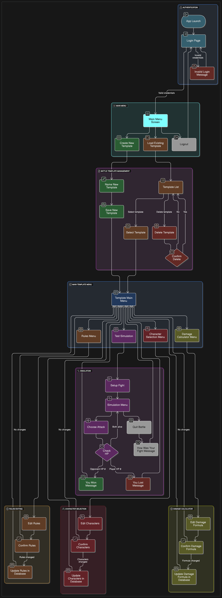

*Note*: This flowchart is based on the 2.5 version of the Kritical Hit project.

### 3.8.3. UI Elements

Thanks to Qt Creator’s built-in UI tools, we can easily integrate essential interface elements that help users set up and simulate a Pokémon battle. These elements are not only simple to add but also fully customizable through stylesheets—allowing adjustments to colors, sizes, font families, and more—to ensure they remain visually distinct and intuitive to use.

#### **Core Components**


- **PushButtons**: Styled with rounded shapes and sometimes icons, these enable user actions and app navigation.

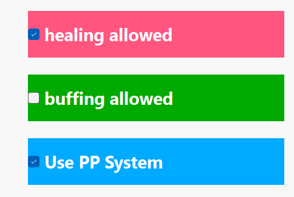

- **Checkboxes**: Allow users to toggle rules or conditions during battle setup.

Here's the simulation interface that also contains important UI components:

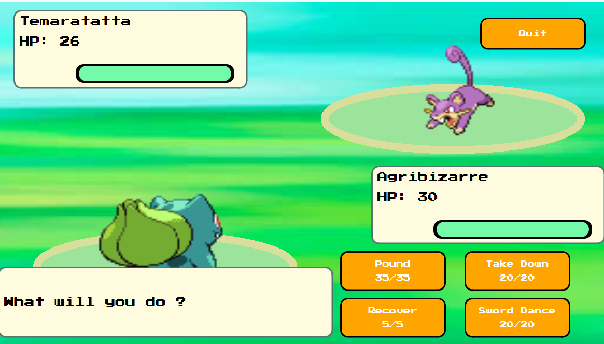

- **Battle Sprites**: 2D characters placed on elliptical battle platforms to separate them from the background.
- **Pokémon Info Panels**: Display entity names and dynamic HP bars that update during battle.
- **Battle Log**: Turn-by-turn summary of the ongoing battle (e.g., actions taken, HP changes).


### 3.8.4. Accessibility and Responsiveness

- The application targets a **general audience**, including casual players and developers. Its interface design emphasizes **clarity, large buttons**, and familiar gaming structures.
- **Keyboard navigation** may be supported in some screens. Mouse-based interaction is prioritized.
- While the app is desktop-focused, future consideration may be given to **touchscreens or tablets**. No minimum touch target size is currently defined.
- Display scaling at **150%** is supported and tested under Windows 11.

### 3.8.5. Visual Feedback and Error Handling

The app is designed to provide clear, simple messages and transitions that help the user understand what’s happening:

- **Error messages** guide users when input is missing or incorrect:
  - *“Wrong email or password. Please try again.”*
  - *“Please, write a valid email/password.”*
- **End-of-battle feedback** offers a personalized, game-inspired experience:
  - *“Congratulations! You won the battle! What were your thoughts on this fight?”*
  - *“Game Over! What were your thoughts on this fight?”*
- **Quit confirmation**:
  - *“Are you sure you want to leave?”*
  - *“What were your thoughts on this fight?”*

A **loading indicator** may be added to visualize progress during processes such as simulation startup or data loading.

# 4. Technical Specifications

## 4.1. Overview

### 4.1.1. Document Purpose

This document has been created to provide the technical specification of a Moonshot Project named Kritical Hit. In fact, the Moonshot Project is a final evaluation imposed by the ALGOSUP school to create our own unique and professional project through the whole scolarity and to validate our Master level in Software development.

Furthemore, it's a complementary document to the Functionnal Specifications while showcasing the technical details required for the project and the strategies planned to accomplish it. 

### 4.1.2. Project Presentation

Kritical Hit is a Desktop Application and Game Development assistant tool designed to support the creation of Combat Design systems for RPG games, with a particular emphasis on the mechanics found in Pokémon-style gameplay.

The application will feature a **user-friendly interface** aimed at providing intuitive navigation across all tools and functionalities. Special attention will be given to ensuring accessibility for both novice and experienced developers. Users will easily access core modules such as battle simulation, character setup, and rule customization through clearly organized menus and visually guided workflows.

A key component of the interface will be the **Simulation Menu**, where users can test and visualize the behavior of an RPG game's combat system in real time. This simulation environment enables immediate feedback and iterative design, allowing developers to fine-tune their systems effectively.

Once users are familiar with the simulation tools, they can dive into the **template customization** system. Kritical Hit will support the creation, modification, and storage of multiple battle templates. These templates include settings for battle rules, character selection, and other RPG assets. The internal database will allow templates to be saved, loaded, and shared, making it easy to manage different combat configurations and test scenarios.

This structure ensures that developers can first explore, test, and refine ideas through the interface and simulation tools, before committing to more advanced template editing.

### 4.1.3. System Overview

The software will be developed as a **desktop application** to guarantee high performance and responsiveness, especially given the significant volume of data involved in RPG combat system design and simulation. This local setup ensures smooth functionality without relying on internet speed, which is essential for maintaining consistency during real-time simulations and UI interactions.

Kritical Hit will be developed using **C++** in combination with the **Qt framework**, leveraging its robust support for graphical user interface (GUI) development. **Qt Creator**, a dedicated IDE for Qt applications, will be used to manage the design and implementation of the interface and underlying logic.

Qt offers cross-platform capabilities and a comprehensive set of software libraries and APIs tailored for scalable desktop and embedded applications. This makes it a strong fit for building an application that is both **modular and maintainable**, while supporting rich UI features and responsive simulation tools essential for Kritical Hit’s goals.

The choice of C++ and Qt ensures that the application can handle complex data structures and intensive simulation processes, all while delivering a seamless and user-friendly interface experience.

## 4.2. System Architecture

### 4.2.1. App Architecture

The application was developed using the **Qt Framework**, specifically as a **Qt Widgets Application**. This format allows for a GUI based on `.ui` files designed visually with **Qt Designer**, while logic and behavior are implemented through **C++ source and header files**.

The project is configured to use:

- **Qt version**: 6.5.2  
- **Compiler**: MinGW 64-bit  
- **Build system**: `qmake` (Qt’s original build tool)

> Although Qt supports both `qmake` and `CMake`, the `qmake` system was selected for its simplicity and ease of use, especially for a first-time Qt-based project. Cross-platform portability was not a priority at this stage, making `qmake` a suitable choice.

The main project file `KriticalHit_App.pro` contains all configuration data required for building the application, including file references, compiler flags, and module dependencies.

---

#### File Structure Overview

The following is the actual **on-disk file organization**, presented as a tree structure:


``` 
/Kritical-Hit
├── .git/                       # Git version control data
├── Dev/
│   ├── KriticalHit_App/        # Main application source directory
│   │   ├── Images/             # Asset folder for image files
│   │   ├── *.cpp               # Source code implementing application logic
│   │   ├── *.h                 # Header files declaring classes and interfaces
│   │   ├── *.ui                # UI layout files created with Qt Designer
│   │   ├── *.ts                # Translation file for internationalization
│   │   ├── *.pro               # qmake project file
│   │   ├── License.txt         # MIT License
│   └── build-KriticalHit_App-Desktop_Qt_6_5_2_MinGW_64_bit-Debug/
│       ├── debug/, release/    # Compiled binaries
│       ├── *.ttf               # Custom font files
│       ├── *.db                # Local database used by the application
│       ├── Makefile.*          # Build instructions generated by qmake
│       ├── ui_*.h              # Auto-generated headers from .ui files
├── Documents/                  # Specifications, test plans, project docs
├── Prototypes/                 # Early Qt prototypes and feature experiments
└── README.md                   # Project overview and setup instructions 
```  

### 4.2.2. Modules and Components

The **Qt Framework** is built around a set of modular libraries that provide specialized, cross-platform functionality. These **Qt modules** come in both source and binary form and are widely applicable across different Qt applications.

Modules with specific functionality (such as testing or database access) are often considered *add-on modules*, even when supported across all platforms.

Below are the main modules used in this project:

| **Module Name** | **Description**                                                                 |
|------------------|----------------------------------------------------------------------------------|
| **Qt Core**       | Provides the core functionality: event loops, signals/slots, object trees, and property management. |
| **Qt GUI**        | Offers classes for windowing, 2D graphics, OpenGL, fonts, and basic imaging.     |
| **Qt Test**       | Enables unit testing with tools like `QTest`, `QSignalSpy`, and model testers.   |
| **Qt SQL**        | Supports SQL-based database integration with various database backends.          |

Some of these modules contain classes with specialized utilities, such as:
- `QDebug` – for easy debugging output  
- `QApplication` – manages the GUI application’s main control flow  
- `QWidget` – base class for all UI objects

In addition to Qt modules, standard **C++ libraries** are also used in this project, including:
- `<string>` – for string management  
- `<random>` – for generating random numbers (e.g., simulating attack variability)

---

### Custom Functional Modules

To implement game-specific logic, several **custom functional modules** were developed. These contain the core functionality of the simulation:

- **`Battle`**: Manages the combat system between two characters, including turn-based logic and damage calculation.
- **`Entity`**: Represents a character (e.g., a Pokémon-like fighter), including its base stats, level, name, and a set of up to 4 `Capacity` objects.
- **`Capacity`**: Defines a move or ability (name, power, PP, type, etc.) used during battles.

Additional helper modules coordinate setup and data integration:

- **`Setup`**: Prepares the battle configuration, rules, and selected characters/movesets.
- **`Database`**: Manages the database connection and queries to store or retrieve character and template data.

---

### User Interface Structure

The project uses several `.ui` files (with associated `.cpp` and `.h` files) to design the user interface:

- **Main Window Menu**: Landing screen where users log in with email and password.
- **Simulation Menu**: Main interface where battles are run and simulated.
- **Template Main Menu**: Central hub that links to other menus and features.
- **Rules Menu**: Allows the user to view, edit, and save the rules applied to battles.

#### Planned UI Menus for Future Versions:

- **New Template Menu**: Allows users to create and customize new battle templates.
- **Template Gallery Menu**: Displays existing templates stored in the database.
- **Character Selection Menu**: Interface to pick 2 characters from a pool of 6.
- **Damage Calculator Menu**: Enables users to modify the damage formula based on stats and selected rules.

### 4.2.3. Other External IT Tools

The development and documentation of the project were supported by a variety of external IT tools. These tools cover a broad range of use cases, from code editing and version control to project management, design, and AI assistance.

| **Tool Name**                     | **Description**                                                                                                                                                   | **Used For**                                                                                          |
| --------------------------------- | ----------------------------------------------------------------------------------------------------------------------------------------------------------------- | ----------------------------------------------------------------------------------------------------- |
| **Visual Studio Code**            | Lightweight yet powerful source code editor with built-in support for JavaScript, TypeScript, Node.js, and extensions for C++, Python, Java, and more.            | Writing code, editing specification documents, and working with external prototypes.                  |
| **GitHub / GitHub Desktop**       | GitHub is a cloud-based platform for hosting and managing code repositories with Git version control. GitHub Desktop provides a user-friendly interface.          | Repository management, group collaboration, version control, creating issues and pull requests.       |
| **DB Browser**                    | A visual tool to create, design, and manage SQLite database files, supporting browsing, querying, and modifying database tables without needing SQL command line. | Managing database connections, executing queries, modifying tables, and inspecting database contents. |
| **ChatGPT (OpenAI)**              | An advanced AI chatbot built on GPT-4o, capable of answering questions, generating content, reviewing text, and even creating code.                               | Spelling checks, rewriting content, AI image generation for personas, brainstorming and ideation.     |
| **ClickUp**                       | A flexible project management tool for organizing tasks, tracking progress, and managing time with boards, lists, and timelines.                                  | Task and time management, sprint planning, collaborative project tracking.                            |
| **Microsoft Office 365 (Online)** | Web-based versions of Word, Excel, PowerPoint, and OneNote for collaborative editing and document management.                                                     | Writing weekly reports, project documentation, surveys (via Microsoft Forms).                         |
| **NinjaAI**                       | AI assistant specialized in rewriting and improving documents, reports, and written content with an emphasis on clarity and quality.                              | Reformulating technical content, improving documentation clarity, rewriting reports.                  |
| **Draw\.io (diagrams.net)**       | A free online diagram tool for creating flowcharts, UML diagrams, ER diagrams, and other graph-based visualizations.                                              | Designing workflows, technical diagrams, and logic flows.                                             |
| **Figma**                         | A collaborative design platform for UI/UX design, wireframes, and prototyping, enabling teams to work together in real time.                                      | UI prototyping, concept art, wireframes for menus and interactions.                                   |
| **Miro**                          | An online collaborative whiteboard platform for ideation, project planning, and team brainstorming.                                                               | Creating personas, team discussions, collaborative design thinking.                                   |
| **Eraser.io**                     | An AI-powered diagram generator that transforms text prompts into diagrams, charts, and visualizations.                                                           | Quickly generating UMLs, flowcharts, system architecture, and technical visuals based on text input.  |

## 4.3. Technologies Used

### 4.3.1. Front End

Kritical Hit’s front end is almost entirely developed using the **Qt framework**, which provides both the core libraries and the Qt Creator IDE for designing and building applications.

Qt allows for both visual design and low-level programming through `.ui` (user interface) files and C++/Python back-end integration. It is ideal for desktop applications with custom UI logic and cross-platform capabilities.

> 💡 To open a project, double-click the `.pro` file. Qt Creator launches and lets you work through different development modes.

---

#### 4.3.1.1 Qt Creator IDE Overview 

Qt Creator is the official IDE for developing Qt-based applications. Here's an example screenshot of Kritical Hit's interface in **Design Mode**:

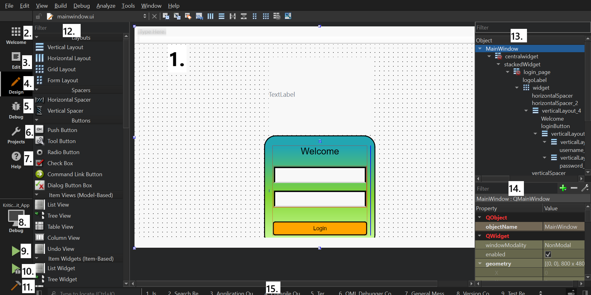

The Qt Creator interface in **Design Mode** is composed of several tools and panes. Here's a quick breakdown of the most important ones:

| **Component**         | **Description** |
|-----------------------|------------------|
| **1. Form Editor**         | Drag-and-drop interface to design windows using Qt Widgets. |
| **2. Welcome Mode**        | Start page for opening projects, viewing examples, or tutorials. |
| **3. Edit Mode**           | Modify source code and project files (`.cpp`, `.h`, `.ui`). |
| **4. Design Mode**         | Visual editing for `.ui` files with live layout previews. |
| **5. Debug Mode**          | Analyze runtime behavior, memory, and breakpoints. |
| **6. Projects Mode**       | Configure how your app is built and run. |
| **7. Help Mode**           | Access Qt framework and Qt Creator documentation. |
| **8. Kit Selector**        | Select the target platform (Debug/Release, Desktop/Embedded). |
| **9. Run Button**          | Build and run the application. |
| **10. Debug Button**       | Run debugger with optional breakpoints. |
| **11. Build Button**       | Compile the application. |
| **12. Widget Box**         | UI component toolbox: Buttons, Layouts, Containers, etc. |
| **13. Object Inspector**   | Hierarchical list of all widgets in the current form. |
| **14. Property Editor**    | Modify widget properties like text, visibility, font, etc. |
| **15. Output View**        | Shows logs from build, debug output, and app status messages. |

---

#### 4.3.1.2 Design Mode and Widget Uses

**Design Mode** is the core feature of Qt Creator. It allows users to drag and drop UI elements directly into the form editor, making interface design intuitive and visual.

One of the primary UI elements is the **PushButton** widget, which provides a clickable command button.

When you select a PushButton and place it on the form editor, the **Object Inspector** automatically updates by adding the new widget as a child of the window widget.

To customize the button’s appearance, right-click it and select **Change StyleSheet**. This lets you modify properties like font family, background color, and dimensions. You can also apply stylesheets to other widgets, including the window itself. This approach allows styling multiple widgets of the same family using inheritance and C++ classes.

---

To set up the button to perform an action, right-click the button and choose: *Go to Slot* -> *QAbstractButton* -> *clicked*.

Qt Creator will automatically generate a new function within the window widget class that executes when the button is clicked. For example:

```cpp
void TemplateMainMenu::on_simulation_Button_clicked()
{
    ui->stackedWidget3->setCurrentIndex(1);
}
```

Additionally, the window widget’s header file is updated to include this new function as a **private slot**.


#### 4.3.1.3 Edit Mode, Project Structure, and Development Tools

When working in **Edit Mode**, Qt Creator organizes files into virtual categories for better readability. This organization does not necessarily reflect the actual file system structure but helps developers quickly find relevant files.

| **Category**  | **Extension** | **Purpose**                                                 |
|---------------|---------------|-------------------------------------------------------------|
| **Headers**   | `.h`          | Define class interfaces, variables, constants, and method declarations. |
| **Sources**   | `.cpp`        | Implement the functionality of methods and logic declared in headers.  |
| **Forms**     | `.ui`         | XML-based layout files created via Design Mode, defining layout and widget properties. |

> ⚙️ `.ui` files are converted into auto-generated C++ code during compilation.

---

Qt Creator also provides many features that enhance development productivity:

- **Code completion**: Suggests class names, functions, and parameters as you type.
- **Semantic highlighting**: Uses color coding to distinguish types, variables, and functions.
- **Syntax error checking**: Displays inline errors while coding to catch mistakes early.
- **Documentation tooltips**: Hover over keywords or functions to view quick descriptions.
- **Live UI preview**: Changes made to `.ui` files instantly update the design view.
- **Git integration**: Commit, push, and track changes directly within the IDE.
- **Keyboard shortcuts**: Enable fast navigation and editing (can be customized or expanded later).

---

#### 4.3.1.4 Signal & Slot System

Qt Creator uses a **Signals and Slots** mechanism to enable seamless communication between objects. This powerful event-driven model allows different widgets and windows to interact efficiently. Slots are essentially private functions tied to widget events, while signals notify other parts of the program when something happens, enabling connections between widgets across different windows.

---

To illustrate, consider the **QStackedWidget** class, which manages a stack of widgets where only one is visible at a time. It works with a system of pages and indexes to display different views within the same container.

For example, if you design **Page 1** with certain UI elements and switch to **Page 2** in Design Mode, Page 2 will initially appear empty until you add widgets to it. You can add a new page by right-clicking the `QStackedWidget` object in the Object Inspector.

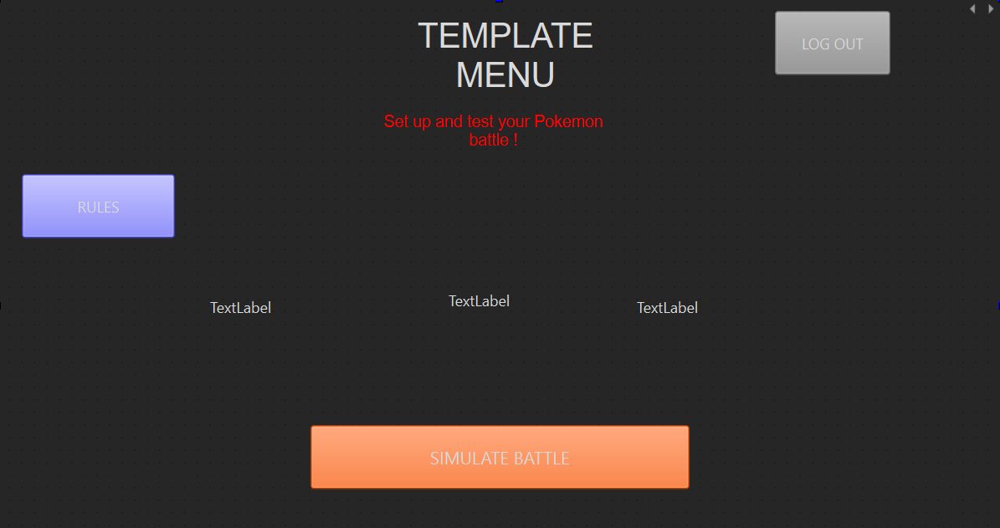

Use the two arrows at the top-right corner of the stacked widget editor to navigate between pages. This lets you update and organize the widget hierarchy across different pages.

You can also programmatically control page navigation. For instance, when the stacked widget reaches a certain page, you can trigger it to switch to another widget or window.

---

##### Example: Navigating Between Menus Using Signals and Slots

Suppose you want to switch from the **Main Template Menu** to a **Simulation Menu**:

1. In `templatemainmenu.h`, include the header for the simulation menu:

    ```cpp
    #include "simulationmenu.h"
    ```

2. Declare a private member instance of `SimulationMenu` and a slot function to handle menu switching:

    ```cpp
    private:
        SimulationMenu _simInfo;
    private slots:
        void moveTemplateMenu();
    ```

3. In `simulationmenu.h`, declare a signal to indicate when the battle is finished:

    ```cpp
    signals:
        void battleFinished();
    ```

4. In `templatemainmenu.cpp` constructor, add the simulation menu widget to the stacked widget and connect the signal to the slot:

    ```cpp
    ui->stackedWidget3->insertWidget(1, &_simInfo);
    connect(&_simInfo, SIGNAL(battleFinished()), this, SLOT(moveTemplateMenu()));
    ```

---

Now, when the simulation button on the main template menu is clicked, the stacked widget index updates to show the simulation menu. When the battle ends (in `simulation.cpp`), you emit the `battleFinished()` signal:

```cpp
emit battleFinished();
```

This triggers *moveTemplateMenu()*, which resets the stacked widget index and returns the user to the main template menu page.

This system of signals and slots combined with stacked widgets provides a flexible and maintainable way to manage complex UI navigation and event handling in Qt applications.

### 4.3.2. Database Specifications

#### Overview

The application utilizes a **SQLite database** as its primary data storage solution.  
While the project does not implement a traditional backend or API architecture, the database serves as a *crucial component* for managing game rules and settings.

---

##### Current Database Implementation

###### Schema

The current database schema is defined as:

```sql
CREATE TABLE RULES_SET1 (
    rulesID INTEGER PRIMARY KEY NOT NULL,
    healingAllowed INTEGER NOT NULL,  -- Boolean (0/1)
    buffingAllowed INTEGER NOT NULL,  -- Boolean (0/1)
    PPSystem INTEGER NOT NULL         -- Boolean (0/1)
);
```


---

###### Error Handling

The application implements **basic error handling** through:

- Return value checking for database operations  
- Console logging via `qDebug()` for error tracking  
- Graceful failure handling with default values  
- Direct SQL error reporting through `QSqlError`  

---

###### Database Access

Database operations are performed using **raw SQL queries** through Qt's SQL modules.  
Example:


```cpp
QSqlQuery query(rules_DB);
query.prepare("UPDATE RULES_SET1 SET buffingAllowed = :val WHERE rulesID = 111");
query.bindValue(":val", value ? 1 : 0);
```

---

##### Setup Instructions

###### 1. Database Creation

- Use *DB Browser for SQLite* to create the initial database  
- Place the database file in the **Qt Project build folder**

###### 2. Project Configuration

- Add SQL module to project file (`.pro`):

```
QT += sql
```

- Include required headers in `mainwindow.h`:

```cpp
#include <QSqlDatabase>
#include <QSqlQuery>
#include <QSqlError>
#include <QDir>
```

###### 3. Connection Setup

- Add database connection variable to `mainwindow.h`:


```cpp
private:
    QSqlDatabase DB_Connection;
```

- Initialize connection in `mainwindow.cpp`:

```cpp
QDir databasePath;
QString path = databasePath.currentPath()+"/NAME.db";
DB_Connection = QSqlDatabase::addDatabase("QSQLITE");
DB_Connection.setDatabaseName(path);
```

---

##### Future Enhancements

The database structure will be expanded to include:

- **Battle template storage**  
- **Entity data management**  
- **Capacity object storage**

This expansion will improve memory efficiency by *moving data from runtime memory to persistent storage*.

---

##### Technical Notes

- SQLite was chosen for its *simplicity and easy integration* with Qt  
- Boolean values are stored as **integers (0/1)** due to SQLite limitations  
- Database file must reside in the **build folder** for runtime access  
- A **single database connection** is maintained throughout the application lifecycle  

---

##### Database Management

*DB Browser for SQLite* is used as the primary tool for:

- Table creation and modification  
- Data viewing and editing  
- SQL query execution  
- Database structure visualization

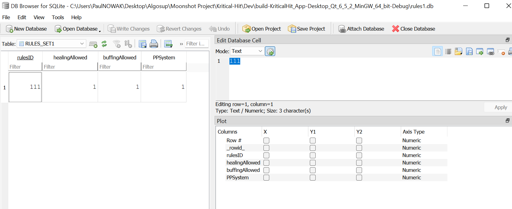

The class diagram below illustrates how the database integration fits into the overall application architecture:

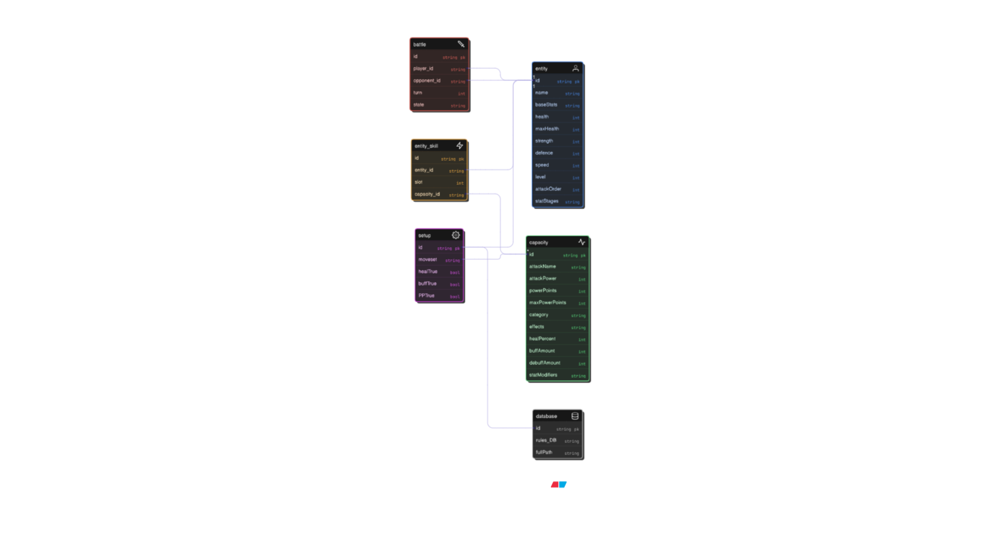

### 4.3.3. Technical Constraints and Limitations

#### Development Environment Specifications
The development environment consists of a Windows 11 Pro (64-bit) system powered by an Intel® Core™ i7-1065G7 processor running at 1.30GHz with boost capabilities up to 1.50 GHz, supported by 16 GB of installed RAM, of which approximately 6 GB is utilized during application testing phases.

#### Current Technical Limitations
The application's development faces several significant constraints, particularly in memory management within the moveLibrary.h component, where attempts to expand beyond approximately 15 capacity objects result in application crashes, indicating a critical need for optimization through improved database implementation strategies.

Development is currently conducted using Qt version 6.5.2 with QMake as the build system, which presents its own set of limitations including reduced flexibility for large-scale projects, lack of support for complex build logic, and challenges in cross-platform dependency management that would be better addressed through CMake, especially for Qt 6+ projects.

#### Database Implementation Constraints
While the current SQLite implementation adequately handles basic rule storage, the database architecture requires significant optimization to manage larger datasets effectively. The setup and configuration process for database tables has proven more complex than anticipated, suggesting a need for streamlined database management procedures and improved architectural design to support future scalability requirements.

#### Development Environment Challenges
A significant technical constraint involves the debugging capabilities of the development environment, where disk management issues currently prevent the effective use of Qt Creator's integrated debugging tools, particularly when accessing the simulation menu. This limitation substantially impacts the development workflow and testing capabilities.

#### Testing and Deployment Limitations
The development and testing processes are currently restricted to a single Windows-based machine, which introduces potential risks in terms of unidentified platform-specific issues and cross-platform compatibility concerns. This single-environment testing limitation could potentially impact the application's reliability across different operating systems and hardware configurations.

#### Build System Considerations
The current utilization of QMake as the build system introduces several operational constraints, including the necessity for manual build process updates and limited integration capabilities with external tools. These limitations particularly affect the project's scalability and maintenance, suggesting that a future migration to CMake might be beneficial for more advanced development requirements.

#### Performance Monitoring Constraints
The current development environment lacks comprehensive tools for monitoring and optimizing memory usage, which has led to difficulties in identifying and resolving performance bottlenecks, particularly in relation to database operations and object management within the application's core functionality.

#### Future Considerations
These identified constraints and limitations are being actively addressed through planned improvements in database implementation, memory management strategies, and potential build system upgrades, with a focus on enhancing the application's stability, scalability, and overall performance characteristics.

### 4.3.4. Non-Functional Requirements - Technical Implementation Details

#### Performance Monitoring

**Current Status**
• No active performance monitoring tools implemented
• Response time requirements (100ms for clicks, 200ms for navigation) not currently measured
• Planning to implement QT Test module for performance testing and monitoring

**Planned Optimizations**
• Database architecture redesign to support larger datasets
• Implementation of performance benchmarking tools
• Integration of QT Test module for systematic testing

#### Configuration Management

**Interface Implementation**
• UI layouts managed through .ui files
• Widget placement, styling, and hierarchy controlled via Qt Designer
• Custom font implementation (PressStart2P-vaV7.ttf) through stylesheet configuration

**Current Limitations**
• Basic authentication system using simple if-else statements
• Limited user settings persistence
• No comprehensive configuration file structure

#### Security Implementation

**Current Status**
• Basic file operations without specific security measures
• Planned implementation of private database access
• No current mechanism for preventing data corruption
• Security measures for file operations to be implemented

**Future Security Enhancements**
• Implementation of file locking mechanisms
• Development of data corruption prevention strategies
• Enhanced database security protocols

#### System Compatibility

**Technical Requirements**
• Qt Version: 6.5.2
• Operating System: Windows 11 Pro
• Hardware Specifications:
* Processor: Intel® Core™ i7-1065G7 or equivalent
* RAM: Minimum 16 GB recommended
* Storage: Sufficient for application and database growth

**Development Approach**
• Platform-independent code implementation
• No OS-specific dependencies
• Designed for compatibility with standard Windows 11 Pro systems

#### Planned Technical Improvements

**Short-term Goals**
• Implementation of performance monitoring tools
• Development of robust configuration system
• Enhancement of file operation security

**Long-term Goals**
• Comprehensive testing framework implementation
• Database optimization and security enhancement
• Cross-platform compatibility testing
• Robust error handling and data corruption prevention

These technical specifications aim to support the non-functional requirements while ensuring system reliability, security, and performance optimization.

## 4.4. Application Features

## 4.4.1. Battle System Rules

The battle system is inspired by the traditional Pokémon mechanics and defines how turn-based encounters between creatures are resolved. This system aims to simulate strategic one-on-one combat with various tactical elements.

#### General Rule

- The primary objective of a battle is to reduce the opponent Pokémon's HP (Hit Points) to 0, resulting in a knockout (KO).

#### Pokémon Attributes

Each Pokémon possesses the following characteristics:

- **Level**: A numerical indicator of experience and power. It affects the damage calculation.
- **Stats (6 total)**:
  - **HP (Hit Points)**: Determines how much damage the Pokémon can receive before fainting.
  - **Attack**: Influences the damage dealt by physical moves.
  - **Defense**: Reduces incoming damage from physical attacks.
  - **Special Attack**: Influences the damage of special (non-physical) moves.
  - **Special Defense**: Reduces incoming damage from special moves.
  - **Speed**: Determines the order of actions in a turn; the faster Pokémon attacks first.

#### Typing System

- Each Pokémon can have **one or two types** (e.g., Fire, Water, Grass), and each move also has a type.
- **Type Effectiveness**:
  - Super effective: 2× damage
  - Not very effective: 0.5× damage
  - No effect (immunity): 0× damage
- **Same-Type Attack Bonus (STAB)**:
  - If a move's type matches one of the user's types, a **1.5× damage bonus** is applied.
- Understanding the **type chart** is critical for maximizing damage output.

#### Moves and Attacks

- A Pokémon can know **up to four different attacks**.
- Most attacks have:
  - **Power**: A base value that contributes to the damage dealt.
  - **PP (Power Points)**: Indicates how many times a move can be used.
    - If a move’s PP is depleted, it cannot be used.
    - If all moves have 0 PP, the Pokémon is considered to have no usable moves and may lose automatically (depending on system rules).
- Some moves are **non-offensive**:
  - **Healing moves** restore a portion of the user’s HP, usually based on a fixed percentage or stat-based formula.
  - **Stat-altering moves** can **buff (increase)** or **nerf (decrease)** stats between **-6 and +6 stages**. These changes are persistent until overridden.

#### Damage Calculation Formula

The damage dealt by an offensive move is calculated using the following base formula:

```text
BaseDamage = (((Level * 0.4 + 2) * Attack * Power) / (Defense * 50)) + 2
```

**Where:**
- `Level`: Level of the attacking Pokémon
- `Attack`: The attacker's stat (Attack or Special Attack, depending on move type)
- `Power`: The base power of the move
- `Defense`: The target's stat (Defense or Special Defense, based on move)
- The `+2` ensures minimum damage output

This base damage is then adjusted with the following multipliers:

```text
BaseDamage = (((Level * 0.4 + 2) * Attack * Power) / (Defense * 50)) + 2
```


**Multipliers:**
- `STAB`: 1.5 if the move type matches one of the attacker's types, otherwise 1
- `Effectiveness`: 2 for super effective, 0.5 for not very effective, 0 for immune
- `CriticalHit`: 1.5 if a critical hit occurs (12.5% or 1/8 chance), otherwise 1

#### Battle Flow

- Battles are **turn-based**, and **each side performs one action per turn**.
- The **faster Pokémon (higher Speed)** acts first.
- At the end of a turn, the player is prompted to choose the next action:
  - Select a move
  - Quit the battle (if permitted by the rules)

#### Strategy Considerations

- Players must find the best strategy to **defeat opponents quickly** or **survive longer**, depending on the situation.
- Understanding typing, move selection, stat advantages, and turn order is key to success.

#### Current Implementation

- The current version includes **2 distinct Pokémon** with different stats.
- Only the Attack, Defence, Speed and HP stats are used.
- All Pokémon use the **same moveset**.
- **Typing system is currently disabled** in this version. All damage calculations are neutral (no STAB, type effectiveness, or immunities applied).

### 4.4.2. Battle Simulation Core

#### Overview
The battle simulation core manages the turn-based combat system through the SimulationMenu widget. Here's a detailed breakdown of its key components and functionality.

#### Widget Initialization and Setup
The SimulationMenu widget is accessed via a pushbutton from the template main menu. During the showEvent(), the widget:

- Initializes the battle through **initializeBattle()**
- Sets up character displays and HP bars
- Configures the battle scene with graphical elements
- Starts a 2-second timer before enabling player input

#### Core Battle Functions

##### Battle Flow Control

- **initializeBattle()**: Creates characters, movesets, and battle instance using the Setup class
- **playerTurn(int move)**: Handles player move execution and result processing
- **enemyTurn()**: Manages AI opponent moves using random selection (25% chance per move)
- **secondCharacterPerform(bool isPlayer, int move)**: Coordinates second character's turn
- **goToNextTurn()**: Advances turn counter and updates battle state

##### Move Resolution System

- **handleMoveResult()**: Processes move outcomes including:
  - Damage calculation and HP updates
  - Healing effects
  - Stat modifications
  - Battle continuation checks
  - PP (Power Points) management

##### Status Management

- Dynamic status messages display battle events through:
  - showStatusMessage() for fixed states
  - showDynamicStatusMessage() for action-specific updates
- Battle state tracking using the **MoveResultState** struct:

```cpp
struct MoveResultState {
    bool continueBattle;
    bool hasHealing;
    bool hasBuffing;
    Entity* character;
    std::shared_ptr<capacity> moveUsed;
};
```

##### UI and Control Management
- Attack buttons are disabled during move animations
- Battle completion triggers **battleFinished()** signal
- Memory management includes proper cleanup of battle objects
- HP bars update in real-time using percentage calculations

### 4.4.3. Main Battle Functions

#### Core Combat Mechanics

- **calculateDamage()**: Computes damage using the formula:

```cpp
damage = (((level * 0.4 + 2) * attack * power) / (defense * 50)) + 2
```

- **performMove()**: Executes moves and applies their effects
- **applyEffect()**: Processes different effect types (Attack, Heal, Buff)

#### State Management
- Battle progression tracked through **BattleState** enum:

```cpp
enum class BattleState {
    Start,
    WaitingForPlayer,
    Animating,
    Finished
};
```
- Turn order determined by **checkAttackOrder()** based on speed stats

#### Effect System

- **EffectResult** struct tracks move outcomes:

```cpp
struct EffectResult {
    int damageDealt;
    int hpHealed;
    short int attackBoost;
    short int defenceBoost;
    short int speedBoost;
};
```

- Stat modifications handled through **getStatMultiplier()**:
  - Positive stages: (2 + stage) / 2
  - Negative stages: 2 / (2 - stage)
  - Clamped between -6 and +6

#### AI Implementation
- Enemy moves selected using **randomMoveIndex()**
- Utilizes C++'s std::mt19937 random number generator
- Each move has equal 25% selection probability

### 4.4.4. Rules Implementation


The rules system implementation involves several key components working together:

#### Database Initialization

The database connection is initially established in **templateMainMenu.cpp** when its constructor is called. This is a crucial first step as all rule operations depend on having an active database connection.

#### Navigation to Rules Menu

When a user clicks the rules button in the template main menu, the stackedWidget index is updated to display the rules menu widget. This transition is handled through Qt's widget stacking system.

#### Rules State Management

The rulesMenu class interacts with the database class to manage rule states:

1. When the rules menu is displayed, the `showEvent` method is triggered and:
- Calls `database::getAllRules()` to retrieve the current state of all rules
- Updates the UI checkboxes to reflect the current rule states:

  ```cpp
  QMap<QString, bool> rules = database::getAllRules();
  ui->healing_checkBox->setChecked(rules["healingAllowed"]);
  ui->buffing_checkBox->setChecked(rules["buffingAllowed"]);
  ui->PP_checkBox->setChecked(rules["PPSystem"]);
  ```

2. When the user clicks the Confirm button:
- The current state of all checkboxes is captured
- `database::setAllRules()` is called to update all rules simultaneously:
  ```cpp
  bool newHealValue = ui->healing_checkBox->isChecked();
  bool newBuffValue = ui->buffing_checkBox->isChecked();
  bool newPPValue = ui->PP_checkBox->isChecked();
  database::setAllRules(newHealValue, newBuffValue, newPPValue);
  ```
- The `rulesConfirmed` signal is emitted to trigger the return to the template main menu


This implementation ensures efficient rule state management with minimal database operations by using batch updates instead of individual rule updates. The signal-slot mechanism handles the navigation flow, maintaining a clean separation between the UI and business logic.

### 4.4.5. Characters Implementation


#### Entity Class Overview

The Entity class serves as the foundation for all characters in the game, implementing core functionality for managing character stats and abilities. It represents any creature that can participate in battles, with comprehensive stat management and skill systems.


#### Stats Management System

##### Base Stats

The base stats are stored in a vector `_baseStats` and represent the character's innate, unchangeable attributes:

```cpp
void Entity::setBaseStats(int health, int strength, int defence, int speed) {
    _baseStats[0] = health;    // Base HP
    _baseStats[1] = strength;  // Base Strength
    _baseStats[2] = defence;   // Base Defence
    _baseStats[3] = speed;     // Base Speed
}
```

##### Dynamic Stats

While base stats remain constant, the actual battle stats (`_health`, `_strength`, `_defence`, `_speed`) can be modified during gameplay:

• Initially set to match their corresponding base stats:
```cpp
_maxHealth = _baseStats[0];
_health = _baseStats[0];
_strength = _baseStats[1];
_defence = _baseStats[2];
_speed = _baseStats[3];
```

• Can be temporarily modified through buffs/nerfs using the stat stage system:

```cpp
void Entity::setStatStage(StatType stat, int stage) {
    if (stage > 6) stage = 6;      // Cap maximum buff
    if (stage < -6) stage = -6;    // Cap maximum nerf
    _statStages[static_cast<int>(stat)] = stage;
}
```


#### Health Management

The `checkHealth()` function ensures health values remain within valid bounds:

```cpp
void Entity::checkHealth() {
    if (getHealth() > getMaxHealth()) {
        setHealth(getMaxHealth());    // Prevent overhealing
    } else if (getHealth() < 0) {
        setHealth(0);                 // Prevent negative health
    }
}
```

This function is crucial for maintaining game balance by:
• Preventing health from exceeding maximum health after healing
• Ensuring health doesn't go below zero when taking damage
• Maintaining consistent health state throughout battle

This implementation creates a robust system where characters have permanent base attributes while allowing for dynamic stat modifications during gameplay, all while maintaining proper boundaries for health values.

### 4.4.6. Capacities Implementation


#### Core Structure and Enumerations

The capacity system is built around several key enumerations that define the fundamental types of moves and effects:

```cpp
enum class MoveCategory {
    Physical,
    Special,
    Status
};

enum class EffectType {
    Attack,
    Buff,
    Debuff,
    Heal
};

enum class StatType {
    Strength,
    Defence,
    Speed
};
```

#### Stat Modification System

The `StatModifier` struct provides a robust way to define stat changes:

```cpp
struct StatModifier {
    StatType stat;    // Which stat to modify
    int amount;       // Modification magnitude (+/-)
};
```

This structure is crucial for implementing buff/debuff mechanics, allowing precise control over:
• Which stat is being modified (Strength/Defence/Speed)
• The magnitude and direction of the modification
• Multiple modifications from a single capacity


#### Capacity Class Implementation

The capacity class maintains several key attributes:

```cpp
protected:
    std::string _attackName;
    int _attackPower;
    int _powerPoints;
    int _maxPowerPoints;
    MoveCategory _category;
    std::vector<EffectType> _effects;
    std::vector<StatModifier> _statModifiers;
```

#### Power Point (PP) Management

The PP system is implemented through the `useCapacity()` function:

```cpp
bool capacity::useCapacity() {
    if (_powerPoints > 0) {
        _powerPoints--;
        return true;
    }
    return false;
}
```

This ensures:
• Moves can only be used if PP is available
• PP decrements after each use
• Moves become unusable when PP reaches 0

#### Integration with Entity System

Each Entity maintains a moveset of 4 capacities:

```cpp
std::array<capacity, 4> _skillList;
```

This allows:
• Each entity to have a unique set of moves
• Moves to be accessed and modified individually
• PP tracking for each move separately


#### Stat Modification Tracking

The system includes comprehensive stat tracking:

```cpp
std::vector<int> capacity::getStatChangeSummary() const {
    std::vector<int> summary(3, 0);  // Tracks all stat changes
    for (const auto& modifier : _statModifiers) {
        switch (modifier.stat) {
            case StatType::Strength: summary[0] += modifier.amount; break;
            case StatType::Defence:  summary[1] += modifier.amount; break;
            case StatType::Speed:    summary[2] += modifier.amount; break;
        }
    }
    return summary;
}
```
This implementation provides a robust foundation for complex battle mechanics while maintaining clear separation of concerns and efficient resource management.

### 4.4.7. Setting Up Battle


#### Rule Management System

The Setup class serves as the battle initialization controller, managing game rules and move configurations. It interfaces with the database to retrieve rule states:

```cpp
Setup::Setup() {
    healTrue = database::getHealingRule();
    buffTrue = database::getBuffingRule();
    PPTrue = database::getPPRule();
    
    initializeMoveset();
    filterMoveset();
}
```

#### Rule Implementation

Three core gameplay rules are managed:
1. `healingAllowed` (healTrue): Controls whether healing moves are permitted
2. `buffingAllowed` (buffTrue): Determines if stat-boosting moves are allowed
3. `PPSystem` (PPTrue): Enables/disables the Power Point system for move usage

#### Moveset Management

The moveset system implements rule-based move filtering through two key functions:

```cpp
void Setup::initializeMoveset() {
    moveset = {
        MoveLibrary::Pound,
        MoveLibrary::TakeDown,
        MoveLibrary::Recover,    // Healing move
        MoveLibrary::SwordDance  // Buff move
    };
}

void Setup::filterMoveset() {
    for (auto& move : moveset) {
        const std::vector<EffectType>& effects = move.getEffects();
        
        // Rule-based move replacement
        if (!healTrue && hasHealEffect(effects)) {
            move = MoveLibrary::VineWhip;
        }
        else if (!buffTrue && hasBuffEffect(effects)) {
            move = MoveLibrary::Bite;
        }
    }
}
```

#### PP System Integration

The PP system is integrated into the battle mechanics through the attack button handlers:

```cpp
void SimulationMenu::on_attackButton_1_clicked() {
    if (battleSetup->getPPRule() == false || player->getNewSkill(0).useCapacity()) {
        newCheckAttack(0);
    } else {
        QMessageBox::warning(this, "No PP Left", "This move cannot be used anymore.");
    }
}
```

This implementation:
• Checks if PP system is enabled
• Verifies PP availability before allowing move usage
• Provides user feedback when moves are depleted
• Maintains move usage tracking throughout the battle

The Setup class is always instantiated before battle initiation, ensuring all rules and movesets are properly configured before combat begins. This creates a robust foundation for rule-based gameplay mechanics while maintaining clean separation of concerns.

### 4.4.8. Future Features


#### Planned Database Extensions

The current implementation lays the groundwork for several advanced features that would require more sophisticated database structures:


##### Character Selection System

```sql
-- Character Base Table
CREATE TABLE Characters (
    characterID INTEGER PRIMARY KEY,
    name TEXT NOT NULL,
    baseHP INTEGER,
    baseStrength INTEGER,
    baseDefense INTEGER,
    baseSpeed INTEGER
);

-- Team Configuration Table
CREATE TABLE Teams (
    teamID INTEGER PRIMARY KEY,
    userID INTEGER,
    slot1_characterID INTEGER,
    slot2_characterID INTEGER,
    FOREIGN KEY (slot1_characterID) REFERENCES Characters(characterID),
    FOREIGN KEY (slot2_characterID) REFERENCES Characters(characterID)
);

-- Character Movesets Table
CREATE TABLE CharacterMovesets (
    characterID INTEGER,
    moveID INTEGER,
    slot INTEGER CHECK (slot BETWEEN 1 AND 4),
    PRIMARY KEY (characterID, slot),
    FOREIGN KEY (characterID) REFERENCES Characters(characterID)
);
```

##### Damage Calculator Database

```sql
-- Damage Formula Configuration
CREATE TABLE DamageCalculator (
    calculatorID INTEGER PRIMARY KEY,
    formulaVersion TEXT,
    baseMultiplier FLOAT,
    criticalHitModifier FLOAT,
    effectivenessModifier FLOAT
);

-- or for text-based algorithm storage:
CREATE TABLE DamageAlgorithms (
    algorithmID INTEGER PRIMARY KEY,
    algorithmText TEXT,
    inputParameters TEXT,
    lastModified TIMESTAMP
);
```

##### Battle Template System

```sql
-- Master Template Table
CREATE TABLE BattleTemplates (
    templateID INTEGER PRIMARY KEY,
    templateName TEXT,
    rulesSetID INTEGER,
    characterSetID INTEGER,
    calculatorID INTEGER,
    FOREIGN KEY (rulesSetID) REFERENCES RULES_SET1(rulesID),
    FOREIGN KEY (characterSetID) REFERENCES Teams(teamID),
    FOREIGN KEY (calculatorID) REFERENCES DamageCalculator(calculatorID)
);
```

#### Integration Points

The system would require several key integration components:

1. Character Management:

```cpp
class CharacterManager {
    QSqlDatabase characterDB;
    std::vector<Entity*> availableCharacters;
    
    void loadCharacterFromDB(int characterID);
    void updateMovesetWithRules(Entity* character, const RuleSet& rules);
};

```

2. Dynamic Damage Calculation:

```cpp
class DamageCalculator {
    QSqlDatabase formulaDB;
    
    float calculateDamage(const Attack& attack, const Entity& attacker, const Entity& defender);
    void loadFormulaParameters();
};
```

3. Template Management:

```cpp
class BattleTemplateManager {
    QSqlDatabase templateDB;
    
    void loadTemplate(int templateID);
    void saveTemplate(const BattleConfiguration& config);
    void applyTemplateRules(int templateID);
};
```

These planned features would significantly expand the system's capabilities while maintaining the current architecture's modularity and rule-based approach. The database structure would support complex relationships between different game elements while allowing for flexible configuration and easy expansion.

## 4.5. Product Deployment

### 4.5.1. Deployment Environment


#### Build Configuration
1. Project Configuration:
- Switch build configuration from Debug to Release mode in Qt Creator
- Optimize compilation settings for release deployment
- Remove debug symbols and assertions

#### Package Creation

```bash
# Directory structure for deployment
KriticalHit/
├── KriticalHit.exe        # Main executable
├── rules1.db             # Database file
├── qt6core.dll          # Qt dependencies
├── qt6gui.dll
├── qt6widgets.dll
└── platforms/           # Qt platform plugins
    └── qwindows.dll
```

#### Distribution Process
1. Create deployment package:
- Compress project folder and build folder into ZIP archive
- Include all necessary DLL files and dependencies
- Ensure database file is properly packaged

2. User Installation:
- Extract ZIP file to desired location
- Run KriticalHit.exe directly
- No additional framework installation required
- All dependencies included in package

3. Documentation:
- Installation instructions available in README.md
- Download links provided in project repository
- System requirements listed in documentation

### 4.5.2. Release Schedule


| Version | Release Date | Status      | Key Features                                                                 |
|---------|--------------|-------------|------------------------------------------------------------------------------|
| 1.0     | June 9, 2025 | ✅ Confirmed | - Basic battle system<br>- Rule customization<br>- Initial moveset           |
| 1.5     | TBD          | 🔄 Planned   | - Type System<br>- Nerfing Moves <br>- Custom movesets           |
| 2.0     | TBD          | 🔄 Planned   | - Character Selection<br>- Expanded Stats<br>  |
| 2.5     | TBD          | 🔄 Planned   | - Battle Template Management<br>- Damage Calculator Menu<br>  |

Each release will undergo thorough testing and quality assurance before deployment. Version numbers reflect significant feature additions and improvements to the core gameplay experience.

### 5. Test Plan

## 5.1. Introduction

### 5.1.1. Document Purpose

### 5.1.2. Objectives

## 5.2. Testing Strategy

### 5.2.1. Functional Testing

### 5.2.2. Non-Functional Testing

### 5.2.3. Regression Testing

## 5.3. Testing Process

### 5.3.1. Environment Setup

### 5.3.2. Test Development Structure

### 5.3.3. Test Execution Flow

### 5.3.4. External Testing Protocol

### 5.3.5. Bug Tracking System

### 5.3.6. Test Execution Checklist

### 5.4. Main Features to Test

### 5.4.1. Battle System Configuration

### 5.4.2. Simulation Interface

### 5.4.3. User Interface

## 5.5 Out of Scope Features

### 5.5.1. Feature Exclusion Overview

### 5.5.2. Future Implementation Possibilities

### 5.5.3. Testing Impact Analysis

### 5.5.4. Documentation and Communication

### 5.5.5. Testing Preparation for Future Features

## 5.6. Hardware Requirements

### 5.6.1. Testing Environment Specifications

### 5.6.2. Test Environment Variations

### 5.6.3. Input Device Testing

### 5.6.4. Performance Testing Tools

### 5.6.5. Testing Metrics

## 5.7. Environment Requirements

### 5.7.1. Development Environment Setup

### 5.7.2. Testing Framework Configuration

### 5.7.3. Version Control Strategy

### 5.7.4. Test Environment Management

### 5.7.5. Quality Assurance Procedures

## 5.8. External User Testing

### 5.8.1. Participant Selection

### 5.8.2. Test Environment Setup

### 5.8.3. Testing Protocol

### 5.8.4. Data Collection and Analysis

### 5.8.5. Testing Management

## 5.9. Problem Reporting

### 5.9.1. Bug Classification System

### 5.9.2. Documentation Process

### 5.10. Risks and Assumptions

### 5.10.1. Testing Risk Matrix

### 5.10.2. Testing Assumptions

### 6. Test Cases

## 6.1. Battle Simulation

### 6.1.1. Unit Tests

### 6.1.2. Integration Tests

### 6.1.3. System Tests

### 6.1.4. Performance Tests

## 6.2. Interface

### 6.2.1. Unit Tests

### 6.2.2. Integration Tests

### 6.2.3. System Tests

### 6.2.4. Performance Tests

## 6.3. Template Configuration

### 6.3.1. Unit Tests

### 6.3.2. Integration Tests

### 6.3.3. System Tests

### 6.3.4. Performance Tests

# 7 Bug Tracking

## 7.1. Bug Template

## 7.2. Unit Testing Bugs

## 7.3. Interface Testing Bugs

## 7.4. System Testing Bugs

## 7.5. Performance Testing Bugs

# 8. Glossary

## 8.1. RPG Lexical Field

| **Terms**                         | **Definitions**                                                                                                                                              |
| --------------------------------- | ------------------------------------------------------------------------------------------------------------------------------------------------------------ |
| **Ability**                       | Also called "Trait", it's a specific characteristic of a character, generally allowing him to provide advantages during certain situations in battle.        |
| **Accuracy**                      | A stat that determines how likely a move is to hit the target. Can be affected by buffs or debuffs.                                                          |
| **Battle Template**               | A predefined configuration in the application that includes two characters, their movesets, and battle rules. Used to simulate a custom RPG battle scenario. |
| **Buff**                          | A skill, ability or other game mechanic that improves a character’s capabilities to increase his effectiveness.                                              |
| **Capacity**                      | Another term for “Move” or “Skill” used in battle. Each character has up to four capacities they can use during a simulation.                                |
| **Character**                     | Persona created with characteristics embodied by a player within the context of the game.                                                                    |
| **Critical Hit**                  | Successful attack dealing greater damage than a normal attack which occurs generally depending on the player's luck. Also nicknamed "Crit".                  |
| **Damage**                        | In game, any form of pain that decreases a character’s life due to an attack is expressed as damage.                                                         |
| **Defend**                        | Also called "Guard", action performed by a character to protect himself from an oncoming attack, generally to reduce the damage received.                    |
| **Effectiveness**                 | A mechanic that determines how effective a move is based on the types of the user and the opponent. For example, water > fire.                               |
| **Element**                       | An attribute given to a character or move that can create strengths and weaknesses (e.g., fire, water, grass types).                                         |
| **Evasion**                       | A stat representing a character’s ability to avoid being hit. Higher evasion = lower chance of receiving an attack.                                          |
| **H.P.**                          | Hit Points — how much damage a character can take before being knocked out.                                                                                  |
| **Hazard**                        | Passive effect on the battlefield that can hinder or benefit all characters.                                                                                 |
| **HP Bar**                        | A visual UI element representing remaining health.                                                                                                           |
| **K.O.**                          | Knocked Out — a state when a character’s HP reaches zero.                                                                                                    |
| **Modifiers**                     | Factors influencing battle outcomes (e.g., damage calculation, stat changes).                                                                                |
| **Move**                          | Action used in battle — may cause damage, heal, or apply effects.                                                                                            |
| **Move Set**              | The list of up to 4 capacities assigned to an Entity.                          |
| **Nerf**                          | Also called "debuff" — lowers effectiveness of a character.                                                                                                  |
| **Party**                         | Group of characters teaming up in a role-playing game.                                                                                                       |
| **Pokemon**                       | Refers to either the Pokémon franchise or the creatures themselves with abilities, types, and evolutions.                                                    |
| **PP (Power Points)**             | Number of times a move can be used. Decreases with each use.                                                                                                 |
| **RPG (Role-Playing Game)**       | A game genre where players take on roles in a fictional setting, often with quests and character progression.                                                |
| **S.P.**                          | Skill Points or mana — used to perform special actions.                                                                                                      |
| **Skill**                         | Action used during battle that provides a specific effect, often costing SP.                                                                                 |
| **Special Ability**               | Passive effect that gives a character an advantage (e.g., immunity to a type).                                                                               |
| **STAB (Same-Type Attack Bonus)** | Bonus applied when move type matches character type.                                                                                                         |
| **Stat**                          | Numeric value tied to character performance (Attack, Speed, etc.).                                                                                           |
| **Status**                        | Condition applied to a character (e.g., poison, paralysis).                                                                                                  |
| **Turn**                          | One cycle of actions where each combatant makes a move.                                                                                                      |

## 8.2. Miscallenous

| **Term**                  | **Definition**                                                                 |
|---------------------------|--------------------------------------------------------------------------------|
| **API**                   | Application Programming Interface — rules for software-to-software communication. |
| **Backend**               | The server-side system that manages data and logic.                            |
| **Bar**                   | Graphical element in UI (e.g., health bar, progress bar).                      |
| **Battle State**          | Enum representing the different stages of battle (e.g., Start, Finished).      |
| **Battle System**         | The rules and logic governing turn-based combat between entities.              |
| **Database**              | A structured data system (SQLite) used for storing rules, entities, and templates. |
| **EffectResult**          | A structure capturing the outcome of a move, including damage or stat changes. |
| **EffectType**            | The category of effect applied by a move (e.g., Attack, Heal, Buff, Debuff).   |
| **Framework**             | A foundation for software development providing reusable components and tools. |
| **Frontend**              | The client-facing part of the app users directly interact with.                |
| **Game Design**           | Process of defining a game's structure, systems, and user experience.          |
| **Game Engine**           | Framework used to develop and run games (e.g., Unity, Unreal Engine).          |
| **GUI**                   | Graphical User Interface — menus, buttons, and other interactive elements.     |
| **Layout**                | Arrangement of UI components for usability and design.                         |
| **Log**                   | Record of events or errors used for debugging.                                 |
| **Mechanics**             | Rules and systems that define how the game plays and reacts.                   |
| **MoSCoW**                | Prioritization model: Must, Should, Could, Won’t.                              |
| **MoveCategory**          | Classification of a move: Physical, Special, or Status.                        |
| **MoveResultState**       | A structure used to track the outcome of a turn and whether the battle continues. |
| **Object Inspector**      | Qt Designer panel that shows all widgets in a UI hierarchy.                    |
| **Plugin**                | Extension to an application that adds specific functionality.                  |
| **Prototype**             | Early working version used to test ideas.                                      |
| **QStackedWidget**        | A Qt widget that displays one child widget at a time, used for menu navigation. |
| **Qt Creator**            | The official IDE used to develop Qt-based applications.                        |
| **Qt Designer**           | A visual tool within Qt Creator used to design `.ui` files.                    |
| **Qt Framework**          | The C++ framework used to develop the application and UI.                      |
| **QWidget**               | A base class for all UI components in Qt.                                      |
| **Responsive Design**     | Design approach that adapts to different screen sizes and devices.             |
| **RuleSet**               | A collection of gameplay rules (e.g., whether healing or buffing is allowed).  |
| **Setup Module**          | Initializes the simulation, loading rules and configuring entities.            |
| **Signal & Slot**         | Qt’s event system allowing widgets to communicate.                             |
| **Sprite**                | 2D image used to represent a character or object in a game.                    |
| **SQLite**                | Lightweight relational database used in the project.                           |
| **Template**              | A predefined set of rules and entities used to quickly set up battles.         |
| **Turn-based**            | Game structure where players take alternating turns.                           |
| **U.I. (User Interface)** | Visual components for user interaction.                                        |
| **U.X. (User Experience)**| Overall quality of interaction with the app, including ease of use and satisfaction. |
| **Unit Testing**          | Testing individual parts of code for correctness.                              |
| **Version Control**       | System for tracking changes to files and code over time (e.g., Git).           |


